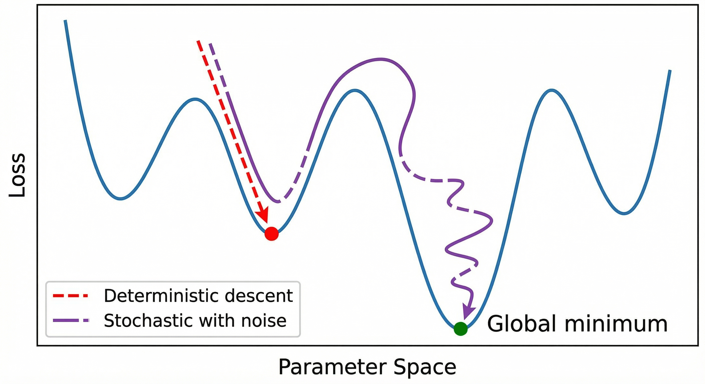

# Demystifying Stochastic Processes in Machine Learning

**Article ID:** 005  
**Topic:** Machine Learning Theory, Probability, Algorithms  
**Status:**  Published  
**Author:** Harshitha Manjunatha  
**Date:** February 2, 2026

---

## Executive Summary

Understanding stochasticity is fundamental to grasping how modern machine learning systems actually work. This article breaks down what "stochastic" means in practical terms, why randomness is a feature rather than a bug in ML algorithms, and how it impacts everything from training neural networks to evaluating model performance.

**Key Takeaways:**
- Stochastic processes involve inherent randomness and uncertainty in outcomes
- Many ML algorithms deliberately inject randomness to escape local optima and improve generalization
- The stochastic nature of training means you must evaluate models statistically, not on single runs
- Understanding the difference between stochastic, deterministic, and non-deterministic is critical for system design

---

## Table of Contents

1. [What Does "Stochastic" Actually Mean?](#what-does-stochastic-actually-mean)
2. [The Terminology Landscape](#the-terminology-landscape)
3. [Why Machine Learning Embraces Randomness](#why-machine-learning-embraces-randomness)
4. [Stochastic Algorithms in Practice](#stochastic-algorithms-in-practice)
5. [Practical Implications for Engineers](#practical-implications-for-engineers)
6. [Reproducibility vs. Stochasticity](#reproducibility-vs-stochasticity)
7. [Conclusion](#conclusion)

---

## What Does "Stochastic" Actually Mean?

At its core, **stochastic** describes any variable or process where outcomes involve uncertainty or randomness. The term comes from the Greek word "stokhastikos," meaning "proceeding by guesswork."

Think of it this way: If you can predict the next state with absolute certainty, the process is deterministic. If you can only describe the *probability* of different outcomes, the process is stochastic.

### Real-World Analogy

Consider two scenarios:

**Deterministic:** A ball rolling down a smooth ramp will always reach the bottom at the same speed (assuming no external factors).

**Stochastic:** The exact path of a leaf falling from a tree cannot be predicted precisely, though we can describe the probability distribution of where it might land.


**Figure 1:** Deterministic processes (left) lead to predictable outcomes, while stochastic processes (right) involve multiple possible outcomes with associated probabilities.

---

## The Terminology Landscape

Understanding stochastic requires distinguishing it from related terms that often get used interchangeably but have subtle differences.

### Stochastic vs. Random

**In practice, these are near-synonyms.** Both describe processes with uncertain outcomes. However:

- **Random** typically emphasizes *independence* between events (e.g., successive coin flips)
- **Stochastic** often implies *some structure* in the randomness (e.g., Markov chains where the next state depends on the current state)

```python
# Random: Each draw is independent
import random
random_sequence = [random.randint(1, 6) for _ in range(10)]

# Stochastic: Next value depends on current state
def stochastic_walk(start, steps):
    position = start
    path = [position]
    for _ in range(steps):
        position += random.choice([-1, 1])  # Depends on current position
        path.append(position)
    return path
```

### Stochastic vs. Probabilistic

Again, largely interchangeable, but with nuance:

- **Probabilistic** emphasizes that outcomes can be described with probability distributions
- **Stochastic** emphasizes the *process* that generates those outcomes

When we say a neural network training process is stochastic, we mean the algorithm itself uses randomness. When we say model predictions are probabilistic, we mean they output probability distributions.

### Stochastic vs. Non-Deterministic

This distinction is crucial for system design:


**Figure 2:** Classification of processes by predictability and quantifiability of outcomes.

**Key insight:** Stochastic processes are a *stronger* claim than non-deterministic because we can apply probability theory to analyze and optimize them. This is why we prefer stochastic algorithms in ML—we can reason about their expected behavior.

---

## Why Machine Learning Embraces Randomness

Counterintuitively, adding controlled randomness to algorithms often *improves* performance. Here's why:

### 1. Escaping Local Optima

Optimization landscapes in machine learning are notoriously non-convex. Deterministic gradient descent can get stuck in local minima.



**Figure 3:** Stochastic algorithms can escape local minima through random perturbations, while deterministic methods get trapped.

### 2. Better Generalization

Injecting noise during training acts as a regularizer, preventing overfitting:

```python
# Dropout: Randomly "drops" neurons during training
class StochasticLayer:
    def forward(self, x, dropout_rate=0.5, training=True):
        if training:
            # Stochastic mask: each neuron has dropout_rate chance of being zeroed
            mask = np.random.binomial(1, 1-dropout_rate, size=x.shape)
            return x * mask / (1 - dropout_rate)
        return x  # Deterministic during inference
```

### 3. Computational Efficiency

Stochastic Gradient Descent (SGD) is faster than batch gradient descent because it updates parameters using random mini-batches rather than the entire dataset.


**Figure 4:** Stochastic Gradient Descent makes more frequent updates using random subsets of data, leading to faster (though noisier) convergence.

---

## Stochastic Algorithms in Practice

Let's examine how stochasticity manifests in popular ML algorithms:

### Stochastic Gradient Descent (SGD)

The workhorse of deep learning. Instead of computing the gradient over the entire dataset, SGD randomly samples mini-batches:

```python
def stochastic_gradient_descent(X, y, learning_rate=0.01, batch_size=32, epochs=100):
    n_samples = len(X)
    weights = np.random.randn(X.shape[1])  # Random initialization (stochastic)
    
    for epoch in range(epochs):
        # Shuffle data each epoch (stochastic)
        indices = np.random.permutation(n_samples)
        X_shuffled = X[indices]
        y_shuffled = y[indices]
        
        # Process mini-batches
        for i in range(0, n_samples, batch_size):
            X_batch = X_shuffled[i:i+batch_size]
            y_batch = y_shuffled[i:i+batch_size]
            
            # Compute gradient on random batch (stochastic)
            gradient = compute_gradient(X_batch, y_batch, weights)
            weights -= learning_rate * gradient
    
    return weights
```

**Stochastic elements:**
1. Random weight initialization
2. Random shuffling of training data
3. Random mini-batch sampling

### Random Forest

An ensemble method that introduces randomness at multiple levels:

```python
class RandomForest:
    def __init__(self, n_trees=100):
        self.n_trees = n_trees
        self.trees = []
    
    def fit(self, X, y):
        for _ in range(self.n_trees):
            # 1. Bootstrap sampling (random subset with replacement)
            indices = np.random.choice(len(X), size=len(X), replace=True)
            X_sample = X[indices]
            y_sample = y[indices]
            
            # 2. Random feature selection at each split
            tree = DecisionTree(max_features='sqrt')  # Random subset of features
            tree.fit(X_sample, y_sample)
            self.trees.append(tree)
```

**Stochastic elements:**
1. Bootstrap sampling for each tree
2. Random feature selection at each node split
3. Random tie-breaking when splits have equal information gain

### Dropout Regularization

Randomly "kills" neurons during training:


**Figure 5:** Dropout randomly deactivates neurons during training (stochastic) but uses all neurons during inference (deterministic).

---

## Practical Implications for Engineers

Understanding stochasticity has concrete engineering implications:

### 1. Performance Evaluation Must Be Statistical

Never evaluate a model based on a single training run:

```python
# WRONG: Single run
model = train_model(X_train, y_train)
accuracy = evaluate(model, X_test, y_test)
print(f"Accuracy: {accuracy:.2%}")  # Misleading!

# CORRECT: Multiple runs with statistical summary
accuracies = []
for seed in range(30):  # 30+ runs recommended
    set_random_seed(seed)
    model = train_model(X_train, y_train)
    acc = evaluate(model, X_test, y_test)
    accuracies.append(acc)

print(f"Mean accuracy: {np.mean(accuracies):.2%}")
print(f"Std deviation: {np.std(accuracies):.2%}")
print(f"95% CI: [{np.percentile(accuracies, 2.5):.2%}, {np.percentile(accuracies, 97.5):.2%}]")
```

### 2. Hyperparameter Tuning Is More Complex

Stochastic variance can mask real performance differences:


**Figure 6:** Even when Config D has the highest mean accuracy, overlapping confidence intervals mean we need more samples to conclude it's truly better.

### 3. Seed Management for Reproducibility

```python
import random
import numpy as np
import torch

def set_seed(seed=42):
    """Set seed for reproducibility across libraries."""
    random.seed(seed)
    np.random.seed(seed)
    torch.manual_seed(seed)
    torch.cuda.manual_seed_all(seed)
    
    # Make cuDNN deterministic (slower but reproducible)
    torch.backends.cudnn.deterministic = True
    torch.backends.cudnn.benchmark = False
```

⚠️ **Warning:** Even with seed setting, some operations (especially GPU operations) may still introduce non-determinism due to floating-point arithmetic and parallel execution.

### 4. The Train/Test Variance Problem

A model trained on one random seed might perform differently on the same test set:

```python
results = []
for seed in range(50):
    set_seed(seed)
    
    # Even with fixed train/test split, training is stochastic
    model = NeuralNetwork()
    model.train(X_train, y_train)
    test_acc = model.evaluate(X_test, y_test)
    results.append(test_acc)

# You might see variance of ±2-5% just from training randomness!
print(f"Test accuracy range: {min(results):.2%} to {max(results):.2%}")
```

---

## Reproducibility vs. Stochasticity

There's a tension between leveraging stochasticity for performance and ensuring reproducible results:


**Figure 7:** The reproducibility spectrum—most production systems should use controlled stochasticity with fixed seeds.

### Best Practices

1. **Development:** Use fixed seeds for debugging and reproducibility
2. **Evaluation:** Run multiple seeds to get statistical confidence
3. **Production:** Consider fixing seeds for consistent behavior, but test robustness across seeds first
4. **Research:** Always report results with confidence intervals from multiple runs

---

## Conclusion

Stochasticity is not a limitation of machine learning—it's a fundamental feature that enables modern ML systems to:

- Escape local optima during optimization
- Generalize better to unseen data
- Train more efficiently on large datasets
- Explore solution spaces more effectively

**Key takeaways for practitioners:**

1. **Embrace randomness:** Don't fight the stochastic nature of ML algorithms
2. **Think statistically:** Always evaluate models across multiple runs
3. **Control what you can:** Use seeds for reproducibility when needed
4. **Understand the tradeoffs:** Determinism ≠ better performance

The next time you see "stochastic" in an algorithm name or paper, you'll understand it's signaling that the algorithm harnesses controlled randomness to achieve something a deterministic approach cannot. That's not a bug—it's engineering wisdom.

---

## Further Reading

### Foundational Concepts
- [Stochastic Processes on Wikipedia](https://en.wikipedia.org/wiki/Stochastic_process)
- [Random Variables and Probability Distributions](https://en.wikipedia.org/wiki/Random_variable)
- [Monte Carlo Methods](https://en.wikipedia.org/wiki/Monte_Carlo_method)

### Machine Learning Applications
- Bottou, L. (2010). "Large-Scale Machine Learning with Stochastic Gradient Descent"
- Goodfellow, I. et al. (2016). "Deep Learning" - Chapter 8: Optimization
- Srivastava, N. et al. (2014). "Dropout: A Simple Way to Prevent Neural Networks from Overfitting"

### Reproducibility
- [Reproducible Machine Learning (ACM)](https://dl.acm.org/doi/10.1145/3446776)
- [The Role of Randomness in Deep Learning](https://arxiv.org/abs/2006.05531)

---

## About This Article

This article is part of the **Tech Demystified** series—empirical analyses of modern software architecture and localized intelligence. For more deep-dives into ML systems, distributed infrastructure, and developer tooling, visit the [full repository](https://github.com/harshitha-8/Tech-Demystified).

**Author:** Harshitha Manjunatha  
**Date:** February 2, 2026  
**License:** MIT

**Feedback?** Open an issue or submit a pull request on GitHub.
