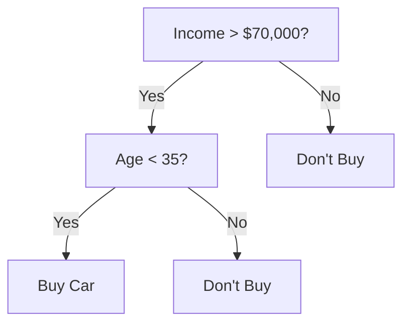
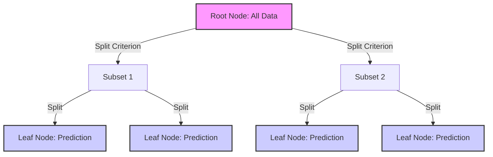

# Crash Course to Crack Machine Learning Interview – Part 4: Decision Trees

### Understanding splitting criteria, preventing overfitting, and interview questions

If you’ve ever been through a machine learning interview, chances are you’ve been asked something about **Decision Trees**. They’re one of the most fundamental yet versatile algorithms in a data scientist’s toolkit — simple enough to explain, yet powerful enough to serve as the foundation for advanced models like **Random Forests** and **Gradient Boosting Machines (GBMs)**.

At its heart, a decision tree is all about **breaking a complex problem into smaller, simpler ones**. Instead of trying to fit one big equation to the entire dataset, it asks a series of **yes/no questions** that gradually separate the data into more homogeneous groups. Each question — or _split_ — aims to make the resulting groups as “pure” as possible, meaning that each subset mostly contains data points from a single class (in classification) or has similar values (in regression).

For example, suppose we’re predicting whether a customer will buy a car. The tree might first ask:

> “Is the customer’s income greater than $70,000?”  
> If yes, the next question could be:  
> “Is the customer’s age less than 35?”  
> From here, the model keeps branching until it reaches a small group of data points where almost everyone behaves the same — say, they all bought the car.



Each internal node represents a **decision rule**, each branch a **possible outcome**, and each leaf node a **final prediction**. This structure makes decision trees highly **interpretable** — you can literally trace a model’s reasoning path from top to bottom.

Another key insight is that decision trees **don’t assume any particular shape** of the data distribution. Unlike linear models that try to fit straight lines or planes, trees can naturally model **nonlinear relationships** and **feature interactions**. That’s why they perform well even when the relationship between input features and output labels is complex or irregular.

However, this flexibility comes with a risk: without proper control, a tree can keep growing until it memorizes every detail of the training data — a classic case of **overfitting**. We’ll explore how this happens and how to prevent it later when we discuss **optimization and pruning**.

In this post, we’ll explore the assumptions behind decision trees, how they’re optimized, what metrics are used to evaluate them, and common pitfalls to watch out for. We’ll also cover popular **interview questions** that test your understanding of how trees actually work under the hood.

## Assumptions of Decision Trees

Unlike linear models, decision trees don’t make strong mathematical assumptions about how data is distributed. They’re **non-parametric models**, meaning they don’t assume a specific form for the underlying function that maps inputs to outputs. That said, there are still a few **implicit assumptions** that guide how decision trees behave and what they need to perform well.

#### 1. Feature Relevance

Decision trees assume that the input features contain useful information to separate classes or explain the target. If most features are noisy or irrelevant, the model may build weak or misleading splits. Feature selection or feature importance analysis can help identify which attributes actually drive the predictions.

#### 2. Independent and Identically Distributed (i.i.d.) Samples

The data samples are expected to be independent of each other and drawn from the same distribution. If, for example, your training and test data come from different time periods or regions, the tree’s learned rules might not generalize well — a common real-world pitfall.

#### 3. Sufficient Data for Each Split

Decision trees rely on having enough samples to confidently decide where to split. Small datasets or rare categories can lead to unreliable thresholds, which in turn create unstable models. That’s why parameters like `min_samples_split` or `min_samples_leaf` are important — they enforce a minimum data size for decision-making.

#### 4. Axis-Aligned Decision Boundaries

Decision trees make splits **along one feature at a time** — meaning the decision boundaries are axis-aligned. For example, a tree might split at “Age < 35” or “Income > 70k,” but not at a diagonal combination of features. This can sometimes limit how well a single tree captures complex, multidimensional relationships — though ensemble methods like Random Forests can overcome this limitation.

#### 5. Monotonic Relationships Within Splits

Each branch of the tree assumes that a single, monotonic condition (like “greater than” or “less than”) can effectively divide the data. This means trees work best when there are threshold-based differences between groups, rather than subtle continuous variations that require fine-grained modeling.

While these assumptions are mild compared to those in linear or logistic regression, understanding them helps you know when decision trees are likely to perform well — and when they might struggle. This can prove helpful when you analyze model errors and figure out how to improve the model

## How a Decision Tree is Built and Optimized

A decision tree doesn’t just randomly decide where to split the data — it carefully chooses the most **informative** questions at each step. The goal is to create branches that **reduce uncertainty** and make the resulting groups as **pure** as possible. Let’s break down how this process works.



#### The Splitting Criteria

At every node, the tree searches through all available features and possible split points to find the one that best separates the data. The “best” split depends on how we measure **impurity** — how mixed the classes (or values) are within a node.

**Entropy and Information Gain (Classification Trees)**

Entropy measures the level of disorder in a dataset. For a dataset S with c classes, entropy is defined as:

$$H(S) = - \sum_{i=1}^{c} p_i \log_2(p_i)$$

Here, $p_i$ is the proportion of samples belonging to class $i$. A node with perfectly mixed classes (e.g., 50% A and 50% B) has high entropy, while a node containing only one class has entropy 0.

When we split a node based on a feature A, we calculate **Information Gain (IG)** — the reduction in entropy after the split:

$$IG(S, A) = H(S) - \sum_{v \in Values(A)} \frac{|S_v|}{|S|} H(S_v)$$

The higher the information gain, the better the feature and threshold for splitting.

**Gini Impurity (CART Algorithm)**

Another popular metric used in the CART (Classification and Regression Trees) algorithm is **Gini impurity**, which measures how often a randomly chosen sample would be misclassified if it were labeled randomly according to the class distribution in the node.

$$Gini = 1 - \sum_{i=1}^{c} p_i^2$$

Like entropy, Gini impurity is 0 for a pure node and higher for mixed ones. It’s computationally simpler and often performs comparably to information gain.

**Variance Reduction (Regression Trees)**

For regression tasks, decision trees use variance reduction instead of class impurity. The goal is to minimize the variability of target values in each split:

$$Var(S) = \frac{1}{|S|} \sum_{i=1}^{|S|} (y_i - \bar{y})^2$$

The algorithm selects the split that leads to the largest reduction in variance across the child nodes.

#### Stopping Criteria

If we let the tree keep splitting, it can easily memorize the training data. To prevent this, we define **stopping criteria**, such as:

* **Maximum depth** – Limits how deep the tree can grow.
* **Minimum samples per split/leaf** – Ensures each decision is supported by enough data.
* **Minimum impurity decrease** – Requires a certain level of improvement to justify further splits.

These constraints act as **regularization**, helping control overfitting and improving generalization.

#### Pruning to Avoid Overfitting

Even with stopping criteria, trees can still become overly complex. Pruning helps simplify them without sacrificing too much accuracy.

* **Pre-pruning (Early Stopping):** Stop growing the tree once certain conditions are met (like reaching a maximum depth or minimum leaf size).
* **Post-pruning (Cost Complexity Pruning):** Grow the full tree first, then trim back branches that add little predictive power.

Post-pruning uses a penalty term for complexity, balancing accuracy and simplicity. The cost-complexity function is:

$$R_\alpha(T) = R(T) + \alpha |T|$$

Here, $R(T)$ is the training error of the tree $T$, $|T|$ is the number of leaves, and $\alpha$ controls the trade-off between model fit and simplicity. A higher $\alpha$ leads to a smaller, more general tree.

## Evaluation Metrics

Once a decision tree is trained, we need to evaluate how well it performs. The choice of evaluation metric depends on whether we’re solving a **classification** or a **regression** problem. Trees can easily overfit, so using the right metric is critical to judge both their **accuracy** and **generalization**.

#### Classification Trees

For classification tasks, the model predicts discrete labels such as “spam” or “not spam.” Here are the most common metrics used to evaluate such models:

**Accuracy**

The simplest metric — the fraction of correctly classified samples out of all predictions.

$$Accuracy = \frac{TP + TN}{TP + TN + FP + FN}$$

While intuitive, accuracy can be misleading for **imbalanced datasets**, where one class dominates.

**Precision, Recall, and F1-Score**

These metrics provide a deeper view of performance, especially when the cost of false positives and false negatives differs.

* **Precision** (positive predictive value) measures how many predicted positives are actually correct.  
$$Precision = \frac{TP}{TP + FP}$$
* **Recall** (sensitivity) measures how many actual positives the model correctly identifies.  
$$Recall = \frac{TP}{TP + FN}$$
* **F1-Score** is the harmonic mean of precision and recall, balancing both in one metric.  
$$F1 = 2 \times \frac{Precision \times Recall}{Precision + Recall}$$

**ROC Curve and AUC (Area Under Curve)**

For probabilistic classifiers, the **ROC curve** plots the true positive rate (TPR) against the false positive rate (FPR) at different thresholds.  
The **AUC** score summarizes the model’s ability to distinguish between classes — a perfect classifier has an AUC of 1.0, while a random one scores around 0.5.

#### Regression Trees

When predicting continuous values — like house prices or customer spending — the metrics shift toward measuring **error magnitudes** and **fit quality**.

**Mean Squared Error (MSE)**

Measures the average squared difference between actual and predicted values. It penalizes large errors more heavily.

$$MSE = \frac{1}{n} \sum_{i=1}^{n} (y_i - \hat{y}_i)^2$$

**Mean Absolute Error (MAE)**

Gives the average absolute difference between predictions and actual values. It’s more robust to outliers compared to MSE.

$$MAE = \frac{1}{n} \sum_{i=1}^{n} |y_i - \hat{y}_i|$$

**R² Score (Coefficient of Determination)**

Indicates how much of the target’s variance is explained by the model.

$$R^2 = 1 - \frac{\sum (y_i - \hat{y}_i)^2}{\sum (y_i - \bar{y})^2}$$

An R2 value close to 1 means the model fits the data well; a value near 0 means it performs no better than a simple mean predictor.

#### Why These Metrics Matter in Interviews

Interviewers often ask you to justify **why** you’d choose one metric over another. A strong answer connects the metric to the **business context** — for example:

* “I’d use Precision/Recall for fraud detection because false positives/negatives are costly.”
* “For house price prediction, I’d use MAE since it’s more interpretable in the original currency.”

Showing this awareness signals that you understand not just the math, but also the **real-world implications** of model performance.

## Practical Tips and Common Pitfalls

Decision trees are often the first “real” machine learning models many data scientists implement — simple to interpret, fast to train, and surprisingly powerful. But beneath that simplicity lies a model that’s easy to misuse. The difference between a well-tuned tree and an overfitted one can mean the difference between a system that generalizes — and one that memorizes. Let’s go over the most important practices to build decision trees that perform well in production and stand up to interview scrutiny.

#### Controlling Overfitting by Managing Tree Complexity

A decision tree’s strength — its ability to capture fine-grained patterns — is also its biggest weakness. If left unchecked, the tree keeps splitting until every leaf perfectly fits the training data. This usually means it has learned noise instead of structure.

To control this, constrain the tree’s growth through hyperparameters:

* `max_depth` limits how deep the tree can go. Shallower trees tend to generalize better.
* `min_samples_split` specifies the minimum number of samples needed to split a node.
* `min_samples_leaf` ensures that each leaf has enough data to represent a reliable pattern.
* `max_leaf_nodes` caps the number of terminal leaves.

In practice, you rarely know the ideal depth upfront. A common workflow is to start with a fully grown tree and then prune it back using **cost-complexity pruning** in scikit-learn:

```python
path = clf.cost_complexity_pruning_path(X_train, y_train)
ccp_alphas = path.ccp_alphas
```

You can then retrain the model for different `ccp_alpha` values and select the one that yields the best cross-validation performance. This approach balances simplicity and predictive power — a trade-off that almost always comes up in interviews.

#### Using Cross-Validation to Ensure Model Stability

Decision trees are inherently high-variance models. A small change in training data can lead to a completely different structure — different features at the top, different thresholds, different leaves. To build trust in your model’s performance, always evaluate using **k-fold cross-validation**.

For example:

```python
from sklearn.model_selection import cross_val_score
scores = cross_val_score(clf, X, y, cv=5)
print(scores.mean(), scores.std())
```

If your scores vary wildly across folds, that’s a sign your model is unstable — perhaps it’s too deep or your dataset is too small. Cross-validation smooths out this variability and gives you a more realistic view of how your model will perform on unseen data.

When explaining this in an interview, mention that **Random Forests** reduce this instability by averaging predictions from multiple de-correlated trees, making them much less sensitive to data noise.

#### Handling Imbalanced Data Intelligently

Decision trees tend to favor majority classes when class distributions are skewed, because impurity-based splits like Gini or entropy are biased toward features that separate large groups.

If your model shows high accuracy but poor recall for minority classes, that’s a red flag. To correct for this, you can:

* Use `class_weight=’balanced’` in `DecisionTreeClassifier`, which automatically adjusts weights based on class frequency.
* Apply **resampling techniques** like SMOTE (for oversampling the minority class) or RandomUnderSampler (for downsampling the majority class).
* Focus on metrics like **F1-score** or **ROC-AUC** instead of raw accuracy.

In practice, these adjustments can dramatically shift model performance on unbalanced tasks like fraud detection or churn prediction.

#### Feature Scaling Isn’t Needed — But Encoding Is Critical

One of the perks of decision trees is that they are **scale-invariant**. Whether your “Income” feature is in dollars or thousands of dollars, the tree only cares about order — not magnitude. This saves preprocessing effort compared to models like SVMs or logistic regression.

However, trees can’t handle **raw categorical features** directly. You need to encode them numerically before training:

* **One-hot encoding** works best for nominal categories (like color or city).
* **Ordinal encoding** fits ordered categories (like education level).

Be cautious with **high-cardinality features** (e.g., ZIP codes or user IDs). These can create a massive number of tiny splits that don’t generalize. Combine rare categories into an “Other” group or use **target encoding** with proper cross-validation to avoid leakage.

#### Making the Most of Model Interpretability

Interpretability is one of the biggest advantages of decision trees. Each prediction can be traced through a clear path of conditions, making the model ideal for regulated industries like finance, insurance, and healthcare.

You can visualize and interpret trees easily in scikit-learn:

```python
from sklearn.tree import plot_tree, export_text
plot_tree(clf, filled=True)
print(export_text(clf, feature_names))
```

For deeper insights, especially in ensemble models, use **SHAP (SHapley Additive Explanations)** to quantify how each feature influences a specific prediction. Explaining model logic in human terms is a powerful skill in interviews — it shows you understand both the math and the meaning.

#### Using Ensembles to Overcome Tree Limitations

A single decision tree is a high-variance learner — it captures fine details but can be unstable. Ensemble methods like **Random Forests** and **Gradient Boosting** take this weakness and turn it into a strength.

* **Random Forests** reduce variance by averaging many trees trained on random subsets of data and features.
* **Gradient Boosting** reduces bias by sequentially training trees that correct errors made by earlier ones.

Both techniques dramatically improve predictive performance while preserving the interpretability of individual trees. In an interview, mention that ensembles effectively _balance bias and variance_, which demonstrates a mature understanding of model design.

#### Checking and Interpreting Feature Importance

Decision trees naturally compute **feature importance** based on how much each variable reduces impurity across all splits. In scikit-learn:

```python
importances = clf.feature_importances_
```

These values are great for **feature selection** — they help identify which inputs actually drive predictions. However, impurity-based importance can be biased toward continuous or high-cardinality features. To mitigate this, use **permutation importance**, which measures how randomizing each feature affects model accuracy.

In production, combining both measures gives a robust view of what’s influencing your model most.

#### Avoiding Data Leakage and Temporal Bias

Because decision trees can memorize patterns so effectively, even subtle leakage can lead to inflated performance. Leakage happens when information from outside the training phase sneaks into the model — for instance:

* Using features that depend on the target (like future sales data).
* Randomly splitting time-series data where the future leaks into the past.

Always use **time-based validation** for temporal data, and build preprocessing pipelines (`sklearn.pipeline`) to ensure identical transformations between training and testing.

## Common Interview Questions and Answers

Decision Trees are one of the most frequently discussed topics in ML interviews because they test your understanding of both **modeling fundamentals** and **applied reasoning**. Below are ten common questions you’re likely to encounter — with clear, technically grounded answers that interviewers appreciate.

#### 1. How does a decision tree decide where to split?

A decision tree chooses the feature and threshold that result in the **largest reduction in impurity** (for classification) or **variance** (for regression).  
The algorithm evaluates each possible split using metrics like **Information Gain**, **Gini Impurity**, or **Variance Reduction**, depending on the problem type. The split that most improves the purity of the resulting subsets is selected.

#### 2. What’s the difference between Gini Impurity and Entropy?

Both measure how mixed the classes are within a node.

* **Entropy** is derived from information theory and measures uncertainty using logarithms.
* **Gini Impurity** measures how often a randomly chosen sample would be incorrectly labeled.

In practice, both usually lead to similar trees. Gini is slightly faster to compute, while entropy has a more theoretical interpretation.

#### 3. Why do decision trees overfit easily?

Decision trees can keep splitting until every sample is perfectly classified — including noise. This creates overly specific rules that don’t generalize to unseen data. Overfitting is controlled through **pruning**, **maximum depth limits**, or **minimum samples per split/leaf**. Interviewers often expect you to mention **cross-validation** as part of your strategy to detect and prevent overfitting.

#### 4. What’s the difference between pre-pruning and post-pruning?

* **Pre-pruning (early stopping):** Stop growing the tree when conditions like maximum depth or minimum impurity decrease are reached.
* **Post-pruning:** Grow the full tree first, then remove branches that contribute little to predictive performance, typically using **cost complexity pruning** with parameter $\alpha$.

Post-pruning often yields simpler, more generalizable models.

#### 5. How do decision trees handle continuous and categorical features?

For **continuous features**, the tree finds optimal threshold values (e.g., “Age < 30”).  
For **categorical features**, it splits based on groupings of categories (e.g., “Color is Red or Blue”).  
Most implementations require categorical features to be **encoded numerically**, such as through one-hot encoding.

#### 6. How do decision trees handle missing values?

Approaches vary by implementation. Some trees:

* Use **surrogate splits** (alternative rules when data is missing),
* Or treat “missing” as a separate category.  
In libraries like scikit-learn, missing values must typically be **imputed** beforehand, using strategies like mean or median filling.

#### 7. Why are decision trees considered non-parametric models?

Non-parametric models do not assume a specific form (like linear or polynomial) for the relationship between input features and the target. Decision trees learn flexible, data-driven structures that adapt to any pattern — no fixed parameters define their shape.

#### 8. What’s the computational complexity of building a decision tree?

The training complexity is roughly $O(n \cdot d \cdot \log n)$ where $n$ is the number of samples and $d$ is the number of features.  
At each node, the algorithm sorts samples to find the best split, which dominates the computational cost. Prediction, however, is fast — $O(\text{depth of tree})$, since it only involves traversing a few decision nodes.

#### 9. How do decision trees handle correlated features?

When features are correlated, a decision tree may arbitrarily pick one for splitting and ignore the other. This can make the model unstable — small data changes might cause a different tree structure. Ensemble methods like **Random Forests** mitigate this by averaging results across multiple trees built on random feature subsets.

#### 10. What are the limitations of decision trees?

Key limitations include:

* **High variance** (sensitive to small data changes)
* **Overfitting** on noisy datasets
* **Axis-aligned splits** that struggle with diagonal or curved decision boundaries
* **Instability** when data is small or unbalanced

Despite these, trees remain highly valuable for their interpretability, speed, and role as building blocks for ensemble methods.

Decision trees are one of the most intuitive yet powerful algorithms in machine learning. They bridge the gap between simple rule-based systems and complex predictive models, offering a way to **visualize decisions**, **understand feature importance**, and **build interpretable models** without heavy mathematical assumptions.

For interviews, mastering decision trees helps you demonstrate both your conceptual depth and your practical judgment. Questions about splitting criteria, overfitting, and pruning aren’t just theoretical — they test whether you understand how models learn and generalize in real-world data.

In practice, decision trees rarely work alone. Their true strength shines when they’re combined into ensembles like **Random Forests**, **AdaBoost**, or **Gradient Boosting Machines**. These methods take the simple logic of a single tree and turn it into a powerful predictive engine — one that balances bias and variance more effectively.
