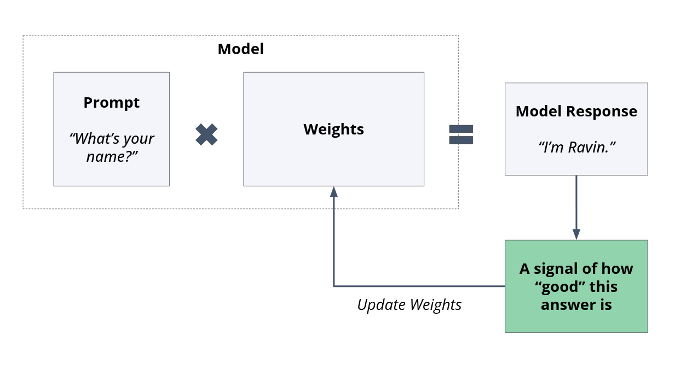
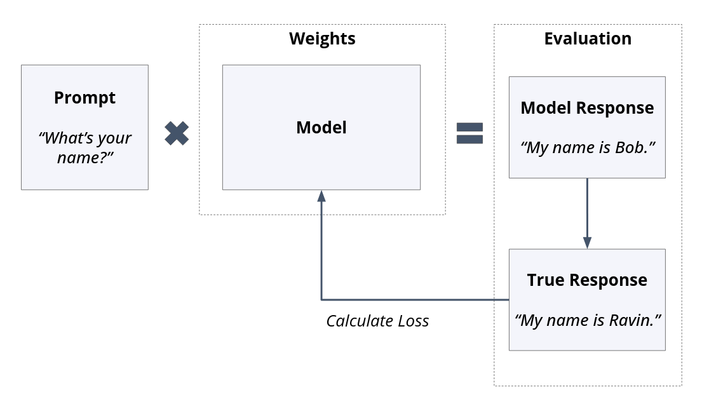
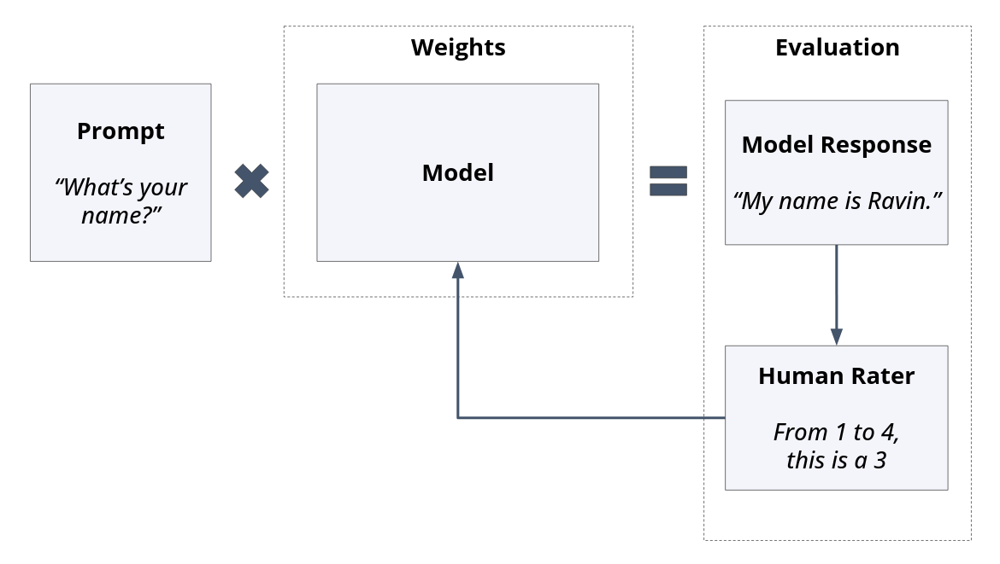
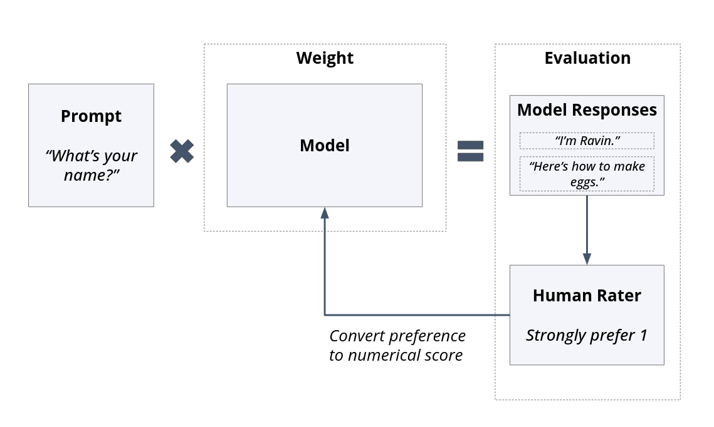
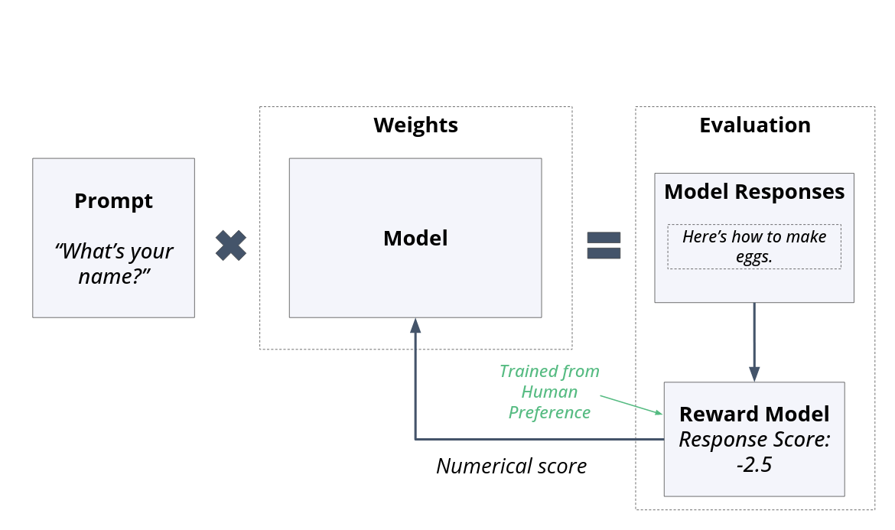
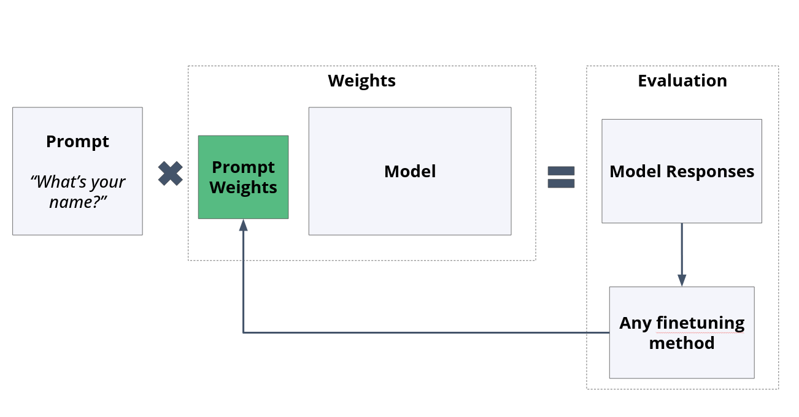
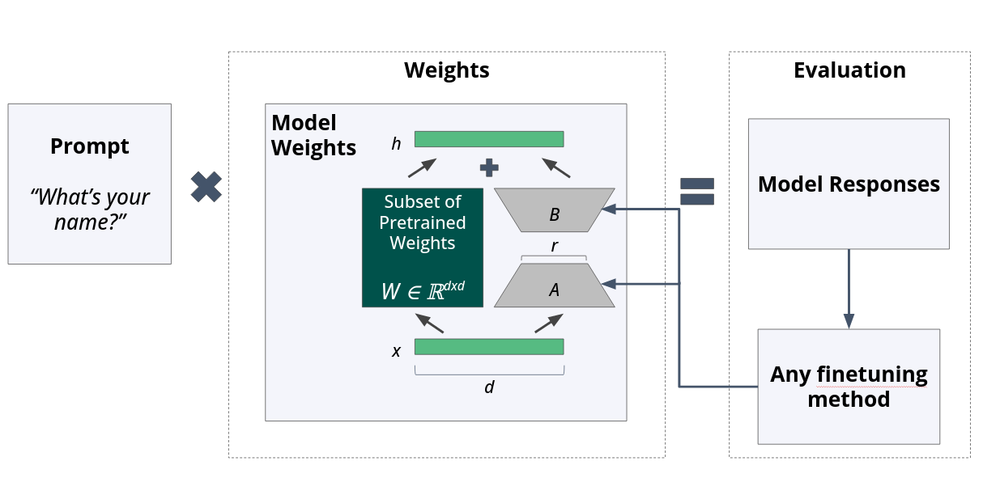

# Adaptive Weight Optimization in Large Language Models: A Technical Examination of Fine-Tuning Paradigms

## Abstract

The emergence of transformer-based language models has fundamentally altered the computational linguistics landscape, yet raw pretrained architectures remain insufficient for practical deployment. This technical report examines the methodological foundations underlying model adaptation through weight modification—commonly termed fine-tuning—and provides a rigorous analysis of contemporary approaches spanning supervised learning, preference optimization, and parameter-efficient strategies. We explore the theoretical underpinnings, practical trade-offs, and empirical considerations that inform the selection of appropriate fine-tuning methodologies for diverse application contexts.

---

## 1. Introduction: The Imperative for Post-Pretraining Adaptation

Language models trained through self-supervised objectives on massive corpora acquire remarkable linguistic competencies, yet these capabilities alone prove inadequate for real-world deployment scenarios. The distinction between a pretrained foundation model and its fine-tuned counterpart represents perhaps the most consequential transformation in the modern machine learning pipeline.

Consider the fundamental limitations inherent to pretrained architectures:

- **Instruction adherence deficiencies**: Base models exhibit poor compliance with user directives, often continuing text in unpredictable directions rather than responding to queries
- **Safety and alignment gaps**: Without explicit behavioral constraints, models readily generate harmful, biased, or factually incorrect content
- **Task-specific performance variance**: General-purpose pretraining does not guarantee proficiency in specialized domains such as code synthesis or mathematical reasoning
- **Identity and behavioral consistency**: Commercial deployment necessitates predictable personality characteristics and response patterns

The transformation from pretrained weights to deployable systems—exemplified by the progression from GPT-3 to ChatGPT or from LLaMA base to LLaMA-Chat—constitutes the central focus of this examination.


*Fig 1: A pretrained LLM (left) compared to a fine-tuned LLM (right). The pretrained model lacks the "finishing touches" that make it usable—analogous to a car without bodywork, safety systems, or steering wheel.*

### 1.1 The Economic Rationale for Fine-Tuning Expertise

From a practical standpoint, fine-tuning operations occur with substantially greater frequency than pretraining procedures. While perhaps a dozen organizations globally possess the computational resources and expertise to pretrain frontier models from initialization, thousands of entities engage in fine-tuning activities daily. 

Even within organizations conducting pretraining, the fine-tuning phase dominates the development cycle. Meta's [LLaMA 2 technical report](https://arxiv.org/abs/2307.09288) reveals over ten distinct fine-tuning iterations across multiple model variants (Chat, Instruction-tuned, and two reward models) and four parameter scales (70B, 30B, 13B, and 7B), compared to a single pretraining run.

This asymmetry suggests that practitioners seeking to contribute meaningfully to the field would benefit disproportionately from mastering adaptation techniques over pretraining methodologies.

---

## 2. Foundational Principles of Weight Adaptation

Fine-tuning, at its core, involves the systematic modification of model parameters to elicit desired behavioral characteristics. The procedural framework mirrors that of initial training:

1. The model generates output given some input stimulus
2. A quantitative measure of deviation from desired behavior is computed
3. Gradient-based optimization adjusts weights to minimize this deviation


*Fig 2: The universal fine-tuning pipeline. Regardless of methodology, all approaches follow this generate-evaluate-update cycle.*

What distinguishes fine-tuning from pretraining lies not in the optimization mechanics but in the nature of the training signal and the scope of parameter modification.

### 2.1 Divergence from Pretraining Objectives

Pretraining employs self-supervised objectives—typically next-token prediction—where training examples emerge automatically from the corpus structure. Fine-tuning, by contrast, typically involves:

- **Curated input-output pairs**: Human-crafted or synthetically generated examples demonstrating desired behavior
- **Preference signals**: Comparative judgments indicating which outputs are superior
- **Constitutional constraints**: High-level principles guiding model behavior
- **Reward functions**: Learned or rule-based scoring mechanisms

Furthermore, fine-tuning often operates on complete responses rather than individual tokens, and may selectively update only subsets of the parameter space.

### 2.2 Selection Criteria for Methodology Choice

The appropriate fine-tuning strategy depends on multiple intersecting considerations:

| Factor | Consideration |
|--------|---------------|
| **Behavioral delta** | How substantially must outputs change from baseline? |
| **Computational budget** | What GPU-hours and memory constraints exist? |
| **Human expertise availability** | Can domain experts provide training signal? |
| **Temporal constraints** | How quickly must adaptation complete? |
| **Reusability requirements** | Should the investment transfer across tasks? |
| **Implementation complexity** | What engineering resources are available? |

---

## 3. Supervised Fine-Tuning: Direct Behavioral Specification

Supervised fine-tuning (SFT) represents the most conceptually straightforward adaptation approach, drawing directly from classical machine learning paradigms. The methodology constructs explicit input-output mappings that demonstrate desired model behavior.

### 3.1 Procedural Framework

The SFT pipeline proceeds as follows:

1. **Dataset construction**: Human annotators or automated systems generate prompt-response pairs exemplifying target behavior
2. **Forward propagation**: The model processes training prompts and generates predicted responses
3. **Loss computation**: Cross-entropy or similar metrics quantify divergence between predicted and target responses
4. **Backward propagation**: Gradients flow through the network, updating weights to reduce loss


*Fig 3: In Supervised Fine-Tuning, a prompt and "ground truth" response pair is used to calculate loss for weight updates.*

The loss function typically operates over the entire response sequence rather than individual tokens, encouraging coherent multi-token generation patterns.

### 3.2 Advantages and Limitations

**Strengths of supervised approaches:**

- Explicit behavioral specification enables precise control over model outputs
- Datasets can be archived, versioned, and shared across organizations
- The methodology enjoys broad adoption in open-source communities
- Implementation complexity remains manageable for practitioners with standard ML backgrounds

**Inherent constraints:**

- High-quality examples require substantial human effort and expertise
- Annotation costs scale linearly with dataset size
- Output quality is bounded by annotator capabilities
- Single "correct" responses may not capture the full space of acceptable outputs

### 3.3 Empirical Observations and Resources

Research from major laboratories suggests that supervised fine-tuning, while effective, may face diminishing returns at scale. Meta's LLaMA 2 documentation (Section 3, Table 5) indicates that AI-generated examples may soon supplant human-authored training data entirely, suggesting that the bottleneck lies not in the methodology but in the data generation process.

**Key Resources:**
- [WizardLM Fine-Tuning Dataset](https://huggingface.co/datasets/WizardLM/WizardLM_evol_instruct_70k) — An open dataset of 70,000 SFT examples
- [Hugging Face SFT Trainer](https://huggingface.co/docs/trl/main/en/sft_trainer) — A well-documented and feature-rich SFT library
- [Undoing Fine-Tuning with More Fine-Tuning](https://erichartford.com/uncensored-models) — An end-to-end example explaining why companies fine-tune and how to reverse it

---

## 4. Reinforcement Learning from Human Feedback: Preference-Based Optimization

RLHF represents a paradigm shift from demonstrating correct behavior to indicating preferred outcomes. Rather than specifying what the model should say, human evaluators indicate which outputs they prefer among alternatives.

### 4.1 Conceptual Foundation

The core insight underlying RLHF is that preference judgments are cognitively easier and faster for humans than generating ideal responses. A domain expert can quickly identify which of two code snippets is superior without necessarily being able to write optimal code themselves.

### 4.2 Evaluation Architectures

Two primary evaluation structures exist:

**Single-sided evaluation**: Raters assess individual model outputs on absolute scales (e.g., helpfulness from 1-5, safety binary classification). This approach enables high throughput but may suffer from rater calibration inconsistencies.


*Fig 4: In a single-sided setup, raters evaluate a single response on various dimensions.*

**Comparative evaluation**: Raters view multiple outputs for identical prompts and indicate preferences or rankings. This side-by-side methodology reduces calibration issues but requires generating multiple responses per prompt.


*Fig 5: In a side-by-side setup, raters choose between two or more different response versions.*

### 4.3 Advantages of Preference-Based Learning

- **Reduced cognitive load**: Comparison is easier than generation
- **Ceiling elevation**: Models can potentially exceed annotator writing ability by learning from preferences over AI-generated candidates
- **Output diversity preservation**: Multiple acceptable responses receive positive signal
- **Simultaneous comparison**: Side-by-side evaluation enables nuanced quality distinctions
- **Empirical effectiveness**: For reasons not fully understood, RLHF produces remarkably strong results

### 4.4 Implementation Challenges

- **Scale requirements**: Effective RLHF typically demands thousands to millions of preference judgments
- **Infrastructure overhead**: Rating collection necessitates purpose-built annotation platforms (e.g., [Scale AI](https://www.scale.ai/), [Surge AI](https://www.surge.ai/))
- **Consistency maintenance**: Large annotator pools introduce variance in judgment criteria

**Key Resources:**
- [InstructGPT Paper](https://openai.com/research/instruction-following) — The foundational OpenAI paper establishing RLHF as a core strategy (pre-ChatGPT precursor)
- [RLHF Shortcomings Analysis](https://arxiv.org/pdf/2307.15217.pdf) — A balanced perspective on challenges with the technique
- [LLaMA 2 Paper, Section 3.2](https://arxiv.org/abs/2307.09288) — Extensive details on RLHF implementation including data collection and preference ranking schemes

---

## 5. Reward Model Architectures: Automating Preference Prediction

To amortize the cost of human preference collection, organizations train auxiliary models—reward models—that predict human preferences from model outputs. These learned scoring functions enable automated fine-tuning at scale.

### 5.1 Architectural Considerations

Reward models typically derive from the same pretrained foundation as the target model, with the language modeling head replaced by a regression head outputting scalar scores. This architectural similarity ensures the reward model possesses sufficient representational capacity to evaluate outputs from the target model.

**Terminology clarification:**
- **User model**: Models that will be shipped to end users
- **Reward model**: Models trained specifically to provide reward signals to other models

### 5.2 Training Methodology

Reward model training proceeds through supervised learning on collected preference data:

1. Human preferences over model outputs are collected
2. The reward model learns to predict which outputs humans preferred
3. The trained reward model then scores new outputs during target model fine-tuning


*Fig 6: A reward model provides a preference score. This single-sided example shows how models can automate human preference prediction.*

For [GPT-4 training](https://arxiv.org/pdf/2303.08774.pdf), OpenAI configured GPT-4 instances into *rule-based reward models* that used multiple information sources (prompts, policy model outputs, and human rules) to calculate scores.

### 5.3 Strategic Value and Limitations

**Benefits:**
- Enables fine-tuning at scales infeasible with direct human evaluation
- Provides continuous numerical signal for optimization
- Captures learned representations of human preference
- Signal can measure training progress during fine-tuning

**Constraints:**
- Introduces additional model management complexity (training, checkpointing, evaluation)
- Reward model quality bounds fine-tuning effectiveness
- Organizations typically withhold reward model weights even when releasing fine-tuned models (e.g., LLaMA 2 reward models were not open-sourced)
- Reward modeling practices remain more secretive than other techniques

**Key Resources:**
- [Hugging Face Reward Trainer](https://huggingface.co/docs/trl/main/en/reward_trainer) — Open-source implementation with Anthropic RLHF dataset example
- [DeepMind Sparrow Paper](https://storage.googleapis.com/deepmind-media/DeepMind.com/Authors-Notes/sparrow/sparrow-final.pdf) — Section 2.5 and Appendix D detail reward modeling
- [GPT-4 Technical Report](https://arxiv.org/pdf/2303.08774.pdf) — "Model-Assisted Safety Pipeline" section

---

## 6. Constitutional AI: Principle-Based Self-Improvement

Constitutional AI, pioneered by [Anthropic](https://www.anthropic.com/index/constitutional-ai-harmlessness-from-ai-feedback), addresses the scalability limitations of human feedback by enabling models to critique and improve their own outputs based on high-level principles.

### 6.1 Methodological Innovation

Rather than requiring humans to evaluate individual outputs, Constitutional AI provides models with a "constitution"—a set of principles articulating desired behavior. Models then:

1. Generate initial responses to prompts
2. Critique their own responses against constitutional principles
3. Revise responses to better align with stated principles
4. Train on the improved responses

This self-improvement loop dramatically reduces human annotation requirements while maintaining alignment with specified values. The process involves more than five distinct models working in concert.

### 6.2 Practical Implications

The approach shifts human effort from output evaluation to principle articulation—a potentially more tractable task requiring fewer person-hours while enabling broader behavioral coverage.

**Benefits:**
1. Writing a small set of principles is less daunting than rating thousands of responses
2. Humans are exposed to fewer harms during the training process
3. The training process scales more effectively

Anthropic demonstrates this method's effectiveness through their AI assistant [Claude](https://www.anthropic.com/index/introducing-claude).

**Key Resources:**
- [Constitutional AI Paper](https://www.anthropic.com/index/constitutional-ai-harmlessness-from-ai-feedback) — Original publication
- [Collective Constitution Blog Post](https://www.anthropic.com/index/collective-constitutional-ai-aligning-a-language-model-with-public-input) — Effort to create constitutions with broader audience input
- [Constitution Examples Repository](https://github.com/anthropics/ConstitutionalHarmlessnessPaper) — Sample constitutions and model response revisions

---

## 7. Parameter-Efficient Fine-Tuning: Computational Pragmatism

As model scales expand into the hundreds of billions of parameters, full weight updates become computationally prohibitive for most organizations. Parameter-efficient fine-tuning (PEFT) methods address this constraint by modifying only small subsets of the parameter space.

These methods are particularly appealing to open-source and individual practitioners as they enable significant behavioral changes with minimal computational investment.

**Key Resources:**
- [Hugging Face PEFT Library](https://github.com/huggingface/peft) — 11+ fine-tuning methods implemented in code
- [Parameter-Efficient Prompt Tuning Paper](https://arxiv.org/pdf/2104.08691.pdf) — Original paper introducing the concept (see Figure 1 for performance, Figure 2 for architecture)

### 7.1 Prompt Tuning: Learned Input Transformations

Prompt tuning introduces a small set of learnable parameters between the input and the frozen model. During fine-tuning, only these additional parameters update while the original model weights remain fixed.

The efficiency gains are substantial: the original prompt tuning paper demonstrated comparable performance to full fine-tuning while training only **20,400 parameters** against an **11 billion parameter** base model—a reduction of over five orders of magnitude.


*Fig 7: In prompt tuning, the original model weights remain frozen while a smaller set of learned prompt parameters are tuned.*

#### 7.1.1 Prompt Engineering vs. Prompt Tuning

**Prompt engineering** (system prompts, persona instructions) represents zero-parameter adaptation—no weights change. While accessible and effective for behavior modification, research from both [Anthropic's red teaming work](https://arxiv.org/abs/2202.03286) and Meta's LLaMA 2 paper demonstrates that prompt-based safety measures prove insufficient against determined adversaries.

Limitations of prompt-only approaches:
- **Context window consumption**: Lengthy system prompts reduce available space for user content
- **Behavioral decay**: Prompt influence diminishes over extended conversations
- **Robustness concerns**: Adversarial prompts can override system instructions
- **Leaked system prompts**: Even hidden prompts are [often exposed through clever prompting](https://github.com/jujumilk3/leaked-system-prompts)

**Key Resources:**
- [Blog Post on Prompt Tuning](https://cobusgreyling.medium.com/prompt-tuning-hard-prompts-soft-prompts-49740de6c64c) — Overview of hard and soft prompt tuning
- [Hugging Face Prompt Tuning Guide](https://huggingface.co/docs/peft/conceptual_guides/prompting) — Comparisons to prefix tuning and p-tuning

### 7.2 Low-Rank Adaptation (LoRA): Dimensionality Reduction for Weight Updates

LoRA exploits the observation that weight updates during fine-tuning often occupy a low-dimensional subspace of the full parameter space. By decomposing weight updates into low-rank matrices, LoRA achieves substantial parameter reduction while maintaining adaptation effectiveness.

#### 7.2.1 Mathematical Foundation

The key insight derives from linear algebra and [Singular Value Decomposition](https://en.wikipedia.org/wiki/Singular_value_decomposition): matrices can be decomposed into products of lower-rank matrices that capture essential structure while discarding redundant dimensions.

Consider this intuitive example:

```python
matrix_1 = [[1, 2],
            [3, 6]]  # Rank 1: row 2 = 3 × row 1

matrix_2 = [[1, 2],
            [3, 5]]  # Rank 2: no linear relationship

# Verify with numpy:
np.linalg.matrix_rank(matrix_1)  # Returns 1
np.linalg.matrix_rank(matrix_2)  # Returns 2
```

For a weight matrix W with update ΔW, LoRA approximates:

**ΔW ≈ BA**

where B and A are low-rank matrices with inner dimension r << min(input_dim, output_dim).


*Fig 8: LoRA architecture adapted from the original paper. A and B are the low-rank weights added to the LLM system. The dimension `x` is the original input dimension and `r` is the reduced dimension.*

#### 7.2.2 Practical Advantages

Beyond training efficiency, LoRA offers compelling deployment properties:

- **Modularity**: LoRA weights can be swapped at inference time for task-specific behavior
- **Storage efficiency**: Multiple task-specific adaptations require storing only small LoRA matrices rather than full model copies
- **Composability**: Multiple LoRA adaptations can potentially be combined
- **Active development**: Methods like QLoRA and DyLoRA provide further improvements

**Key Resources:**
- [Original LoRA Paper](https://arxiv.org/abs/2106.09685) — Complete methodology details (2021)
- [Hugging Face LoRA Guide](https://huggingface.co/docs/peft/conceptual_guides/lora) — Summary of method and library usage
- [Google Cloud LoRA Implementation](https://cloud.google.com/vertex-ai/docs/model-garden/lora-qlora) — Practical advice on memory and processing savings
- [Databricks LoRA Fine-Tuning Guide](https://www.databricks.com/blog/efficient-fine-tuning-lora-guide-llms) — Extended guide with code implementations
- [Stanford SVD Lecture](https://web.stanford.edu/class/cs168/l/l9.pdf) — Mathematical theory and details
- [LoRA from Scratch Tutorial](https://lightning.ai/lightning-ai/studios/code-lora-from-scratch?view=public&section=all) — PyTorch layer implementation
- [Fine-Tuning Mistral 7B in Colab](https://medium.com/@codersama/fine-tuning-mistral-7b-in-google-colab-with-qlora-complete-guide-60e12d437cca) — End-to-end guide with code

---

## 8. Knowledge Distillation: Cross-Model Transfer

Distillation techniques enable knowledge transfer between models, typically from larger "teacher" models to smaller "student" models. Two primary variants exist:

**Context distillation**: A model is prompted with behavioral instructions (e.g., "respond formally"), generates outputs, and then trains on those outputs without the original prompt. This embeds prompted behavior into weights, saving inference-time tokens while retaining learned behavior.

**Knowledge distillation**: A large, capable model generates training data that a smaller model learns to replicate. This enables deployment of compact models that approximate the behavior of computationally expensive alternatives.

**Key Resources:**
- [Context Distillation Paper](https://arxiv.org/pdf/2209.15189.pdf) — Methodology for embedding prompt behavior into weights
- [Knowledge Distillation Paper](https://arxiv.org/abs/2306.08543) — How larger models can train smaller models

---

## 9. Synthesis and Practical Recommendations

The fine-tuning landscape presents practitioners with a rich methodological toolkit, each approach offering distinct trade-offs:

| Method | Data Requirements | Compute Cost | Implementation Complexity | Behavioral Control |
|--------|-------------------|--------------|---------------------------|-------------------|
| **Supervised FT** | High-quality pairs | High | Moderate | Precise |
| **RLHF** | Preference judgments | High | High | Flexible |
| **Reward Models** | Preference data + compute | Very High | Very High | Scalable |
| **Constitutional AI** | Principle articulation | Moderate | High | Principle-based |
| **LoRA** | Task examples | Low | Low | Task-specific |
| **Prompt Tuning** | Task examples | Very Low | Low | Limited |

For most practitioners, a pragmatic approach combines multiple methods:

1. **Begin with prompt engineering** to establish baseline behavior
2. **Apply LoRA or similar PEFT methods** for task-specific adaptation
3. **Consider full fine-tuning** only when PEFT proves insufficient
4. **Reserve RLHF and reward modeling** for production systems requiring extensive behavioral refinement

---

## 10. Conclusion

Fine-tuning transforms raw language modeling capability into deployable, aligned, task-appropriate systems. The field continues to evolve rapidly, with new methodologies emerging regularly and existing approaches undergoing continuous refinement. Practitioners must balance theoretical understanding with empirical pragmatism, selecting approaches that match their specific constraints and objectives.

The most effective fine-tuning strategies typically combine multiple methods iteratively, as demonstrated by frontier model developers who apply supervised fine-tuning, RLHF, and reward modeling in sequence across multiple training iterations. Understanding the strengths and limitations of each approach enables informed methodology selection and effective resource allocation.

---

## References

1. Ouyang, L., et al. "[Training language models to follow instructions with human feedback](https://openai.com/research/instruction-following)." *Advances in Neural Information Processing Systems* 35 (2022).

2. Touvron, H., et al. "[Llama 2: Open foundation and fine-tuned chat models](https://arxiv.org/abs/2307.09288)." *arXiv preprint* arXiv:2307.09288 (2023).

3. Hu, E. J., et al. "[LoRA: Low-rank adaptation of large language models](https://arxiv.org/abs/2106.09685)." *International Conference on Learning Representations* (2022).

4. Bai, Y., et al. "[Constitutional AI: Harmlessness from AI feedback](https://www.anthropic.com/index/constitutional-ai-harmlessness-from-ai-feedback)." *arXiv preprint* arXiv:2212.08073 (2022).

5. Lester, B., Al-Rfou, R., and Constant, N. "[The power of scale for parameter-efficient prompt tuning](https://arxiv.org/pdf/2104.08691.pdf)." *Proceedings of the 2021 Conference on Empirical Methods in Natural Language Processing* (2021).

6. OpenAI. "[GPT-4 Technical Report](https://arxiv.org/pdf/2303.08774.pdf)." *arXiv preprint* arXiv:2303.08774 (2023).

7. Perez, E., et al. "[Red teaming language models with language models](https://arxiv.org/abs/2202.03286)." *arXiv preprint* arXiv:2202.03286 (2022).

8. DeepMind. "[Sparrow: Improving alignment of dialogue agents via targeted human judgements](https://storage.googleapis.com/deepmind-media/DeepMind.com/Authors-Notes/sparrow/sparrow-final.pdf)." (2022).

9. Askell, A., et al. "[A General Language Assistant as a Laboratory for Alignment](https://arxiv.org/pdf/2209.15189.pdf)." *arXiv preprint* (2022).

10. Hugging Face. "[PEFT: Parameter-Efficient Fine-Tuning](https://github.com/huggingface/peft)." GitHub Repository.
