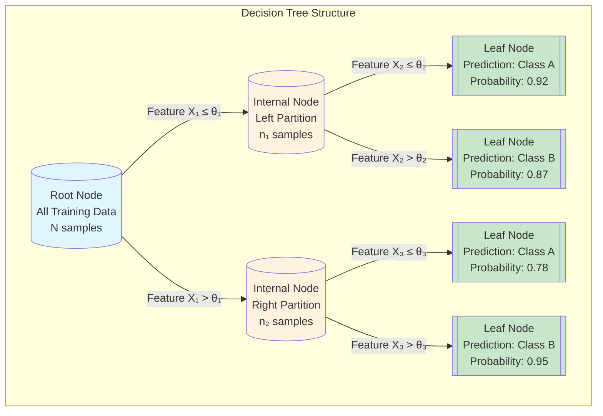
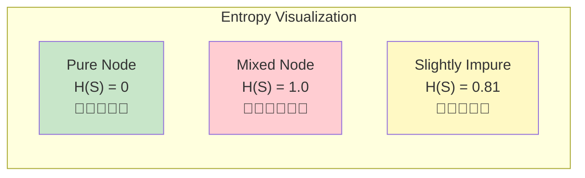
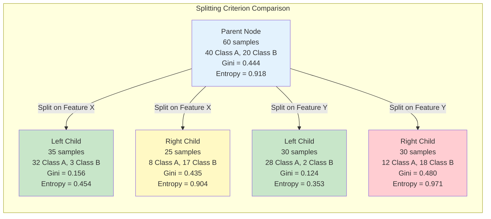
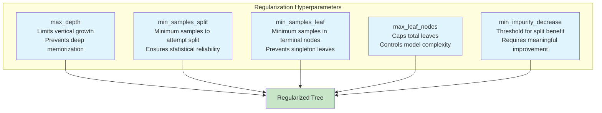
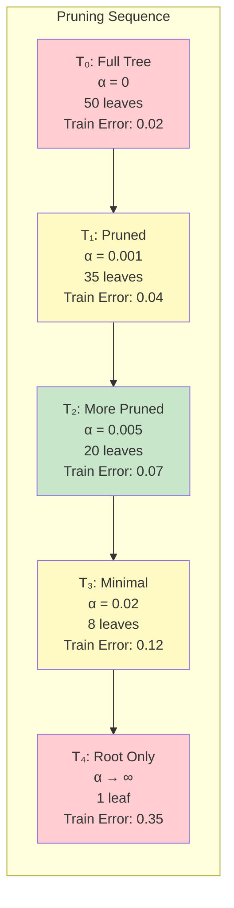
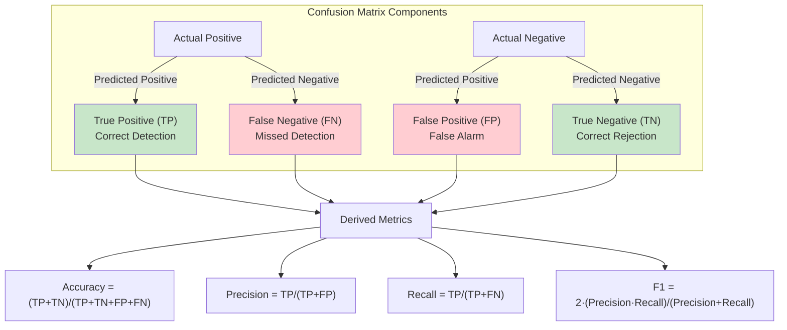
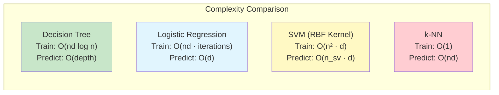
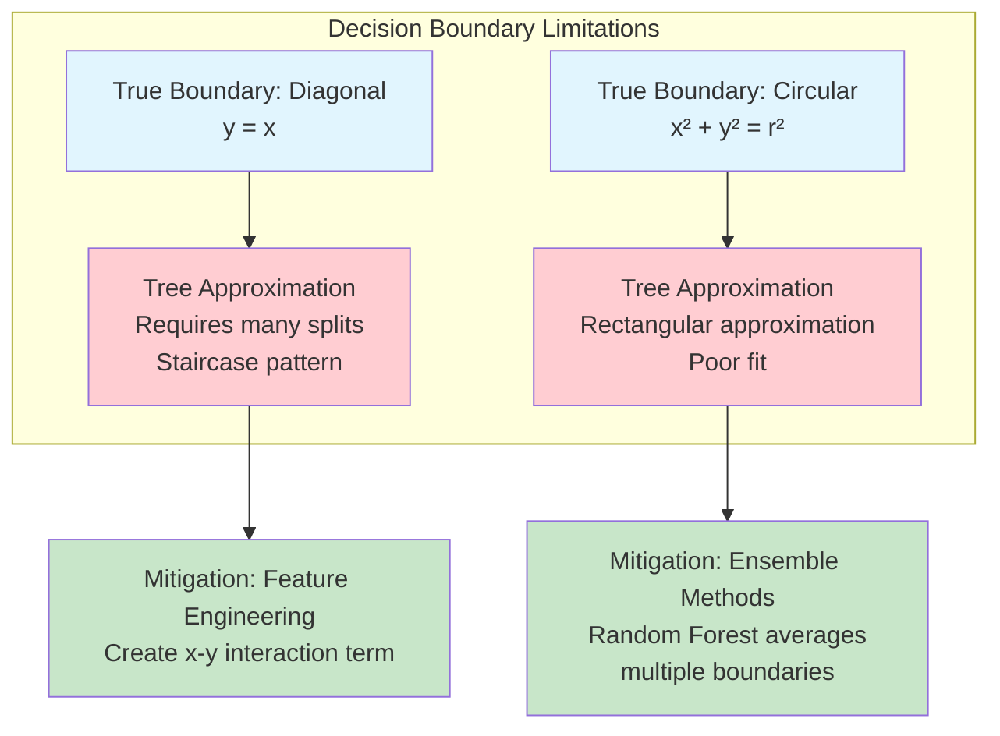
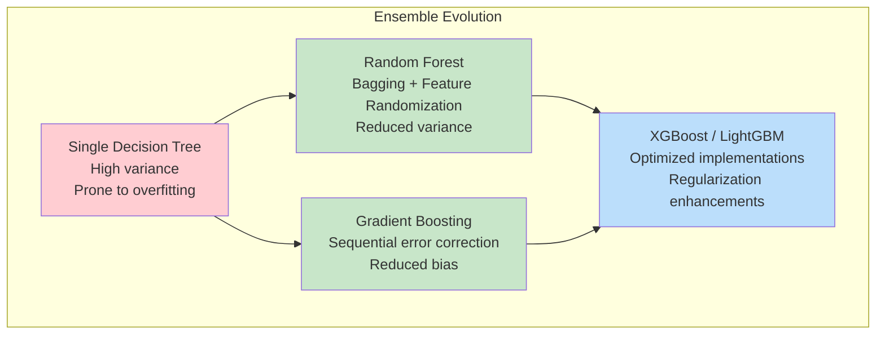

# Recursive Partitioning in Supervised Learning: A Comprehensive Analysis of Decision Tree Architectures

## Abstract

Decision trees constitute one of the most foundational yet remarkably versatile algorithmic frameworks in contemporary machine learning practice. This technical report provides an exhaustive examination of tree-based learning methodologies, encompassing the mathematical underpinnings of splitting criteria, regularization strategies for preventing model overfitting, and rigorous evaluation paradigms. We present formal derivations of information-theoretic measures, analyze computational complexity considerations, and explore the theoretical foundations that enable decision trees to serve as building blocks for sophisticated ensemble architectures. The exposition bridges theoretical rigor with practical implementation guidance, offering insights valuable for both academic research and industrial deployment contexts.

---

## 1. Introduction: Hierarchical Decision Structures in Machine Learning

The decision tree algorithm represents a paradigmatic example of divide-and-conquer methodology applied to predictive modeling. Rather than attempting to construct a single global approximation function mapping input features to target variables, decision trees recursively partition the feature space into increasingly homogeneous regions, each associated with a localized prediction rule.

Consider the fundamental intuition: when predicting whether a customer will purchase a particular product, a decision tree might first inquire about annual income, subsequently examine age demographics, and finally consider geographic location. Each interrogation bifurcates the data into subsets exhibiting greater target variable consistency than the parent population.



*Figure 1: Canonical decision tree architecture illustrating the hierarchical partitioning of feature space. Root and internal nodes encode decision rules based on feature thresholds, while leaf nodes contain final predictions with associated confidence measures.*

This architectural paradigm confers several distinctive advantages:

1. **Interpretability**: The decision pathway from root to leaf constitutes an explicit, human-readable rule chain
2. **Non-parametric flexibility**: No assumptions regarding data distribution or functional form are imposed
3. **Automatic feature interaction**: Higher-order relationships emerge naturally through successive partitioning
4. **Computational efficiency**: Prediction requires only O(depth) comparisons

---

## 2. Mathematical Foundations of Node Splitting

The efficacy of decision tree learning hinges critically upon the criterion employed for selecting optimal split points. At each internal node, the algorithm must determine which feature and threshold combination maximally reduces uncertainty in the child partitions.

### 2.1 Information-Theoretic Formulation: Entropy and Information Gain

Drawing from Shannon's foundational work in information theory, we quantify the uncertainty inherent in a probability distribution through the entropy functional.

**Definition 2.1 (Shannon Entropy)**: For a discrete random variable Y with probability mass function p(y), the entropy is defined as:

$$H(Y) = -\sum_{y \in \mathcal{Y}} p(y) \log_2 p(y)$$

In the classification context, where a node S contains samples from C distinct classes with proportions $p_1, p_2, \ldots, p_C$, the node entropy becomes:

$$H(S) = -\sum_{i=1}^{C} p_i \log_2(p_i)$$

**Interpretation**: Entropy achieves its maximum value of $\log_2(C)$ when all classes are equally represented (maximum uncertainty), and attains zero when all samples belong to a single class (complete certainty).



*Figure 2: Entropy values for nodes with varying class distributions. Pure nodes (single class) have zero entropy, while maximally mixed nodes exhibit highest entropy.*

**Definition 2.2 (Information Gain)**: When splitting node S on feature A with possible values $\{v_1, v_2, \ldots, v_k\}$, the information gain quantifies the expected reduction in entropy:

$$IG(S, A) = H(S) - \sum_{v \in Values(A)} \frac{|S_v|}{|S|} H(S_v)$$

where $S_v$ denotes the subset of samples for which feature A takes value v.

The algorithm selects the feature-threshold pair $(A^*, \theta^*)$ maximizing information gain:

$$(A^*, \theta^*) = \arg\max_{A, \theta} IG(S, A, \theta)$$

### 2.2 Gini Impurity: The CART Criterion

The Classification and Regression Trees (CART) algorithm employs an alternative impurity measure with favorable computational properties.

**Definition 2.3 (Gini Impurity)**: For a node with class distribution $(p_1, p_2, \ldots, p_C)$:

$$Gini(S) = 1 - \sum_{i=1}^{C} p_i^2 = \sum_{i=1}^{C} p_i(1 - p_i)$$

**Probabilistic Interpretation**: Gini impurity represents the expected misclassification rate when randomly labeling samples according to the empirical class distribution. If we randomly select a sample and randomly assign it a label based on class proportions, Gini measures the probability of incorrect assignment.



*Figure 3: Comparison of candidate splits evaluated using both Gini impurity and entropy. The optimal split minimizes weighted average impurity across child nodes.*

### 2.3 Variance Reduction for Regression Trees

When the target variable is continuous, impurity measures based on class distributions become inapplicable. Instead, regression trees minimize the variance of target values within each partition.

**Definition 2.4 (Variance Reduction)**: For a regression node S with target values $\{y_1, y_2, \ldots, y_n\}$:

$$Var(S) = \frac{1}{|S|} \sum_{i=1}^{|S|} (y_i - \bar{y})^2$$

where $\bar{y} = \frac{1}{|S|}\sum_{i} y_i$ is the mean target value.

The optimal split maximizes variance reduction:

$$\Delta Var = Var(S) - \frac{|S_L|}{|S|}Var(S_L) - \frac{|S_R|}{|S|}Var(S_R)$$

---

## 3. Regularization and Overfitting Prevention

Decision trees possess remarkable representational capacity—given sufficient depth, a tree can perfectly memorize any training dataset by creating individual leaves for each sample. This flexibility, while powerful, renders trees susceptible to overfitting: learning spurious patterns that fail to generalize.

### 3.1 Structural Constraints (Pre-Pruning)

Pre-pruning strategies impose constraints during tree construction, preventing excessive growth before it occurs.



*Figure 4: Pre-pruning hyperparameters that constrain tree growth during construction, each addressing different aspects of model complexity.*

**Key Hyperparameters**:

| Parameter | Effect | Typical Range |
|-----------|--------|---------------|
| `max_depth` | Maximum tree depth | 3-20 |
| `min_samples_split` | Minimum samples to split a node | 2-50 |
| `min_samples_leaf` | Minimum samples in leaf nodes | 1-20 |
| `max_leaf_nodes` | Maximum number of leaves | 10-1000 |
| `min_impurity_decrease` | Minimum impurity reduction for split | 0.0-0.1 |

### 3.2 Cost-Complexity Pruning (Post-Pruning)

Post-pruning grows the complete tree first, then systematically removes branches that provide insufficient predictive benefit relative to their complexity cost.

**Definition 3.1 (Cost-Complexity Criterion)**: For a tree T with leaf set $\tilde{T}$, define the cost-complexity measure:

$$R_\alpha(T) = R(T) + \alpha|\tilde{T}|$$

where:
- $R(T)$ = training error (misclassification rate or MSE)
- $|\tilde{T}|$ = number of terminal nodes (complexity penalty)
- $\alpha \geq 0$ = regularization parameter

The pruning algorithm identifies the sequence of subtrees $T_0 \supset T_1 \supset \cdots \supset T_k$ (where $T_0$ is the full tree and $T_k$ is the root alone) that are optimal for increasing values of $\alpha$.



*Figure 5: Cost-complexity pruning generates a sequence of nested subtrees. Cross-validation selects the optimal complexity level (often T₂ in this illustration) balancing fit and generalization.*

**Implementation**:

```python
from sklearn.tree import DecisionTreeClassifier

# Obtain pruning path
clf = DecisionTreeClassifier(random_state=42)
path = clf.cost_complexity_pruning_path(X_train, y_train)
ccp_alphas = path.ccp_alphas

# Cross-validate to find optimal alpha
from sklearn.model_selection import cross_val_score

best_alpha, best_score = 0, 0
for alpha in ccp_alphas:
    clf_pruned = DecisionTreeClassifier(ccp_alpha=alpha, random_state=42)
    scores = cross_val_score(clf_pruned, X_train, y_train, cv=5)
    if scores.mean() > best_score:
        best_score = scores.mean()
        best_alpha = alpha

# Train final model with optimal regularization
final_clf = DecisionTreeClassifier(ccp_alpha=best_alpha, random_state=42)
final_clf.fit(X_train, y_train)
```

---

## 4. Evaluation Metrics and Model Assessment

Rigorous model evaluation requires metrics aligned with the specific prediction task and business objectives.

### 4.1 Classification Metrics



*Figure 6: Confusion matrix decomposition and derived evaluation metrics. The choice of metric depends on the relative costs of different error types.*

**Metric Selection Guidelines**:

| Scenario | Recommended Metric | Rationale |
|----------|-------------------|-----------|
| Balanced classes | Accuracy | All errors equally costly |
| Imbalanced classes | F1-Score, AUC-ROC | Accuracy misleading when majority class dominates |
| High false positive cost | Precision | Minimize incorrect positive predictions |
| High false negative cost | Recall | Minimize missed positive cases |
| Ranking/threshold selection | AUC-ROC | Evaluates discrimination across all thresholds |

### 4.2 Regression Metrics

For continuous target prediction:

$$MSE = \frac{1}{n}\sum_{i=1}^{n}(y_i - \hat{y}_i)^2$$

$$MAE = \frac{1}{n}\sum_{i=1}^{n}|y_i - \hat{y}_i|$$

$$R^2 = 1 - \frac{\sum(y_i - \hat{y}_i)^2}{\sum(y_i - \bar{y})^2}$$

**Interpretation**: $R^2$ represents the proportion of target variance explained by the model. Values approaching 1.0 indicate strong predictive performance; values near 0 suggest the model performs no better than predicting the mean.

---

## 5. Computational Complexity Analysis

Understanding algorithmic complexity informs decisions about scalability and resource allocation.

### 5.1 Training Complexity

**Theorem 5.1**: The time complexity for constructing a decision tree using greedy recursive partitioning is $O(n \cdot d \cdot \log n)$, where n is the number of training samples and d is the number of features.

**Proof Sketch**: At each node, the algorithm must:
1. Sort samples along each feature dimension: $O(n \log n)$ per feature
2. Evaluate all possible split points: $O(n)$ per feature
3. Select the optimal split: $O(d)$ comparisons

With $O(\log n)$ levels in a balanced tree, total complexity becomes $O(d \cdot n \log n \cdot \log n) = O(d \cdot n \log^2 n)$. Optimized implementations achieve $O(d \cdot n \log n)$ through efficient data structures.

### 5.2 Prediction Complexity

**Theorem 5.2**: Prediction for a single sample requires $O(depth)$ operations, where depth is the tree height.

This efficiency makes decision trees attractive for latency-sensitive applications, as prediction involves only a sequence of threshold comparisons along a single root-to-leaf path.



*Figure 7: Computational complexity comparison across common classification algorithms. Decision trees offer favorable training-prediction trade-offs for many practical scenarios.*

---

## 6. Limitations and Mitigation Strategies

### 6.1 Axis-Aligned Decision Boundaries

Decision trees partition feature space using hyperplanes perpendicular to coordinate axes. This constraint limits their ability to capture diagonal or curved decision boundaries efficiently.



*Figure 8: Axis-aligned splitting constraints and mitigation strategies. Complex boundaries require either feature engineering or ensemble approaches.*

### 6.2 High Variance and Instability

Small perturbations in training data can produce dramatically different tree structures—a manifestation of high model variance.

**Mitigation**: Ensemble methods aggregate predictions from multiple trees trained on bootstrapped samples (Random Forest) or sequential error correction (Gradient Boosting), substantially reducing variance while preserving the benefits of tree-based learning.

### 6.3 Handling Imbalanced Data

When class distributions are severely skewed, impurity-based splitting criteria favor majority class separation, potentially ignoring minority class patterns.

**Strategies**:
1. **Class weighting**: `class_weight='balanced'` adjusts split criteria
2. **Resampling**: SMOTE oversampling or random undersampling
3. **Threshold adjustment**: Optimize decision threshold for F1 or other metrics
4. **Cost-sensitive learning**: Incorporate asymmetric misclassification costs

---

## 7. From Single Trees to Ensemble Architectures

Individual decision trees serve as fundamental building blocks for sophisticated ensemble methods that achieve state-of-the-art performance across diverse domains.



*Figure 9: Evolution from single decision trees to modern ensemble architectures. Each advancement addresses specific limitations of predecessor methods.*

### 7.1 Random Forests

Random Forests construct an ensemble of decorrelated trees through:
1. **Bootstrap aggregating (Bagging)**: Each tree trained on a random sample with replacement
2. **Feature randomization**: Each split considers only a random subset of features

The ensemble prediction averages (regression) or votes (classification) across all trees, dramatically reducing variance while maintaining low bias.

### 7.2 Gradient Boosting

Gradient Boosting builds trees sequentially, with each tree fitting the residual errors of the ensemble thus far. This additive approach progressively reduces bias, though careful regularization (learning rate, tree depth) prevents overfitting.

---

## 8. Practical Implementation Guidelines

### 8.1 Feature Preprocessing

Decision trees are **scale-invariant**—feature normalization is unnecessary since splits depend only on value ordering, not magnitude. However, categorical encoding remains essential:

```python
from sklearn.preprocessing import OneHotEncoder, OrdinalEncoder

# Nominal categories: one-hot encoding
ohe = OneHotEncoder(sparse=False, handle_unknown='ignore')
X_nominal = ohe.fit_transform(df[['color', 'city']])

# Ordinal categories: preserve ordering
oe = OrdinalEncoder(categories=[['low', 'medium', 'high']])
X_ordinal = oe.fit_transform(df[['priority']])
```

### 8.2 Cross-Validation for Hyperparameter Selection

```python
from sklearn.model_selection import GridSearchCV

param_grid = {
    'max_depth': [3, 5, 7, 10, 15],
    'min_samples_split': [2, 5, 10, 20],
    'min_samples_leaf': [1, 2, 5, 10],
    'ccp_alpha': [0.0, 0.001, 0.005, 0.01]
}

grid_search = GridSearchCV(
    DecisionTreeClassifier(random_state=42),
    param_grid,
    cv=5,
    scoring='f1_weighted',
    n_jobs=-1
)
grid_search.fit(X_train, y_train)

print(f"Best parameters: {grid_search.best_params_}")
print(f"Best CV score: {grid_search.best_score_:.4f}")
```

### 8.3 Model Interpretation

```python
from sklearn.tree import plot_tree, export_text
import matplotlib.pyplot as plt

# Visual representation
plt.figure(figsize=(20, 10))
plot_tree(clf, feature_names=feature_names, class_names=class_names, 
          filled=True, rounded=True, fontsize=10)
plt.tight_layout()
plt.savefig('decision_tree_visualization.png', dpi=150)

# Text representation
tree_rules = export_text(clf, feature_names=feature_names)
print(tree_rules)

# Feature importance analysis
importances = pd.DataFrame({
    'feature': feature_names,
    'importance': clf.feature_importances_
}).sort_values('importance', ascending=False)
```

---

## 9. Common Interview Questions and Analytical Responses

### Q1: How does a decision tree determine optimal split points?

The algorithm exhaustively evaluates all feature-threshold combinations, selecting the pair that maximizes impurity reduction (information gain or Gini decrease for classification; variance reduction for regression). This greedy optimization proceeds recursively until stopping criteria are satisfied.

### Q2: Compare Gini impurity and entropy as splitting criteria.

Both measure class distribution heterogeneity. Entropy derives from information theory and involves logarithmic computation; Gini measures expected misclassification probability under random labeling. Empirically, they produce similar trees, though Gini offers slight computational advantages. The choice rarely impacts practical performance significantly.

### Q3: Why are decision trees prone to overfitting?

Trees can recursively partition until each leaf contains a single sample, perfectly memorizing training data including noise. This excessive flexibility captures spurious patterns that fail to generalize. Regularization through depth limits, minimum sample constraints, or pruning constrains this tendency.

### Q4: Explain the bias-variance tradeoff in decision trees.

Deep trees exhibit low bias (can approximate complex functions) but high variance (sensitive to training data perturbations). Shallow trees show opposite characteristics. Optimal depth balances these competing factors, typically determined through cross-validation.

### Q5: How do ensemble methods address single-tree limitations?

Random Forests reduce variance through averaging decorrelated trees trained on bootstrapped samples with feature randomization. Gradient Boosting reduces bias through sequential residual fitting. Both leverage the interpretable, efficient nature of individual trees while mitigating their instability.

---

## 10. Conclusion

Decision trees embody an elegant synthesis of intuitive reasoning and mathematical rigor. Their hierarchical partitioning strategy transforms complex prediction problems into sequences of simple threshold comparisons, yielding models that are simultaneously interpretable, efficient, and surprisingly powerful.

The theoretical foundations—information gain, Gini impurity, variance reduction—provide principled criteria for constructing optimal partitions. Regularization techniques, from pre-pruning constraints to cost-complexity optimization, address the inherent overfitting tendency without sacrificing representational flexibility.

Perhaps most significantly, decision trees serve as the architectural foundation for ensemble methods that dominate contemporary machine learning practice. Random Forests, Gradient Boosting Machines, and their optimized variants (XGBoost, LightGBM, CatBoost) inherit the core tree-building mechanics while achieving predictive performance competitive with deep learning approaches across tabular data domains.

Mastery of decision tree fundamentals thus provides not merely understanding of a single algorithm, but insight into an entire family of methods that remain indispensable tools in the modern machine learning practitioner's repertoire.

---

## References

1. Breiman, L., Friedman, J., Stone, C. J., & Olshen, R. A. (1984). *Classification and Regression Trees*. CRC Press.

2. Quinlan, J. R. (1986). "Induction of Decision Trees." *Machine Learning*, 1(1), 81-106.

3. Quinlan, J. R. (1993). *C4.5: Programs for Machine Learning*. Morgan Kaufmann.

4. Breiman, L. (2001). "Random Forests." *Machine Learning*, 45(1), 5-32.

5. Friedman, J. H. (2001). "Greedy Function Approximation: A Gradient Boosting Machine." *Annals of Statistics*, 29(5), 1189-1232.

6. Chen, T., & Guestrin, C. (2016). "XGBoost: A Scalable Tree Boosting System." *Proceedings of KDD*, 785-794.

7. Ke, G., et al. (2017). "LightGBM: A Highly Efficient Gradient Boosting Decision Tree." *Advances in Neural Information Processing Systems*, 30.

8. Hastie, T., Tibshirani, R., & Friedman, J. (2009). *The Elements of Statistical Learning* (2nd ed.). Springer.

9. Murphy, K. P. (2012). *Machine Learning: A Probabilistic Perspective*. MIT Press.

10. Pedregosa, F., et al. (2011). "Scikit-learn: Machine Learning in Python." *Journal of Machine Learning Research*, 12, 2825-2830.
