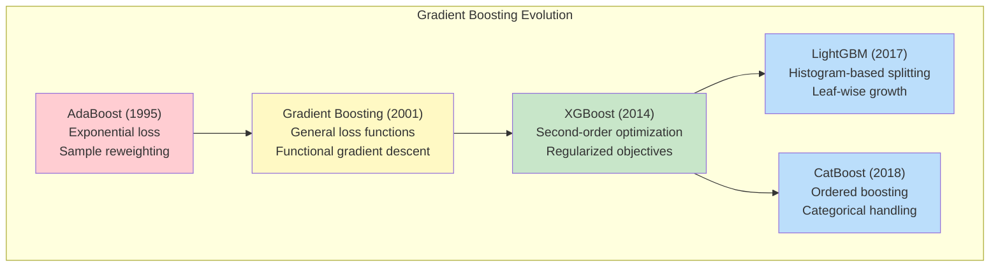
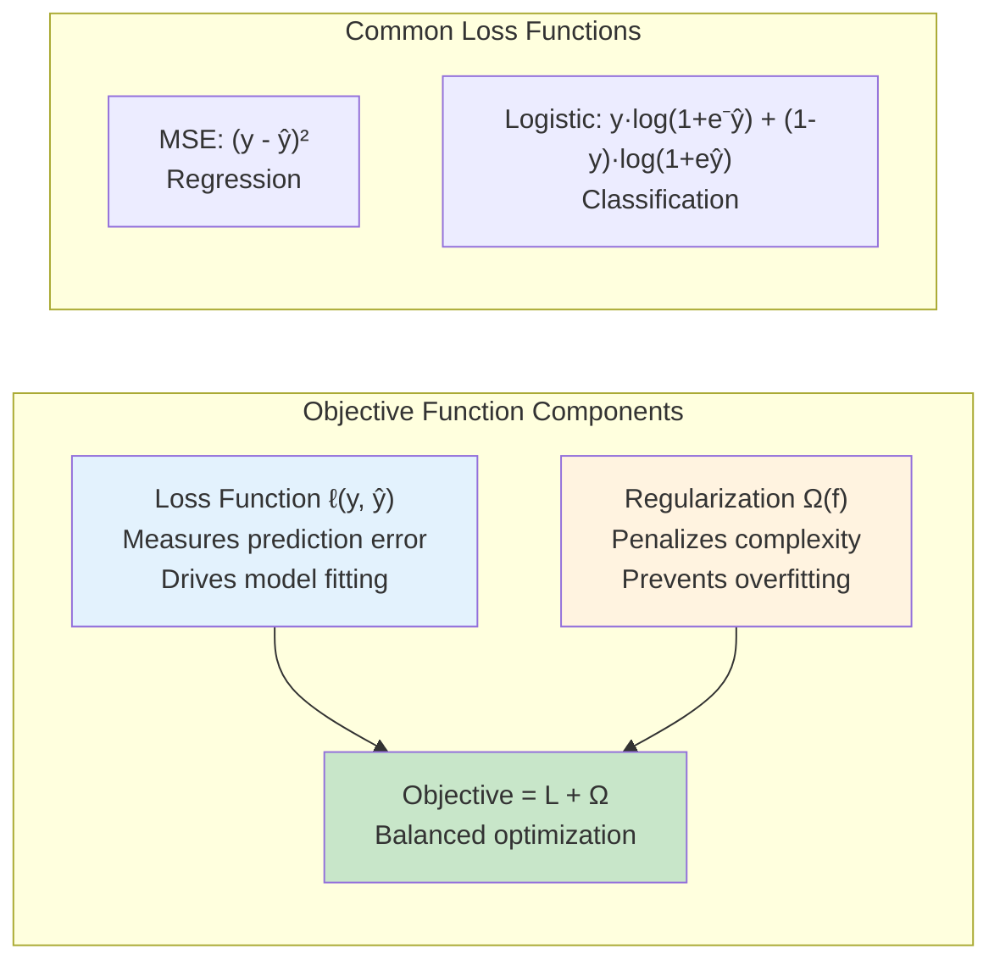
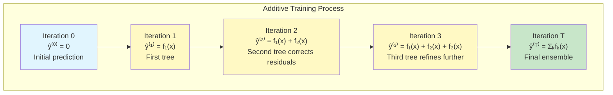
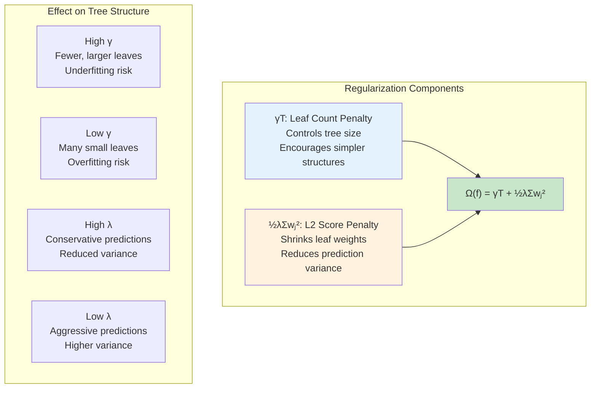
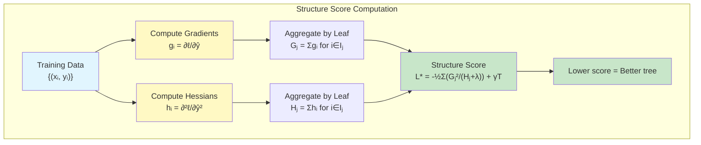
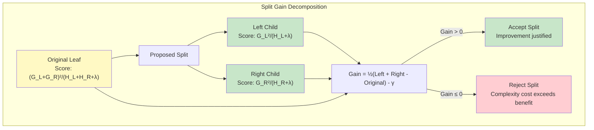
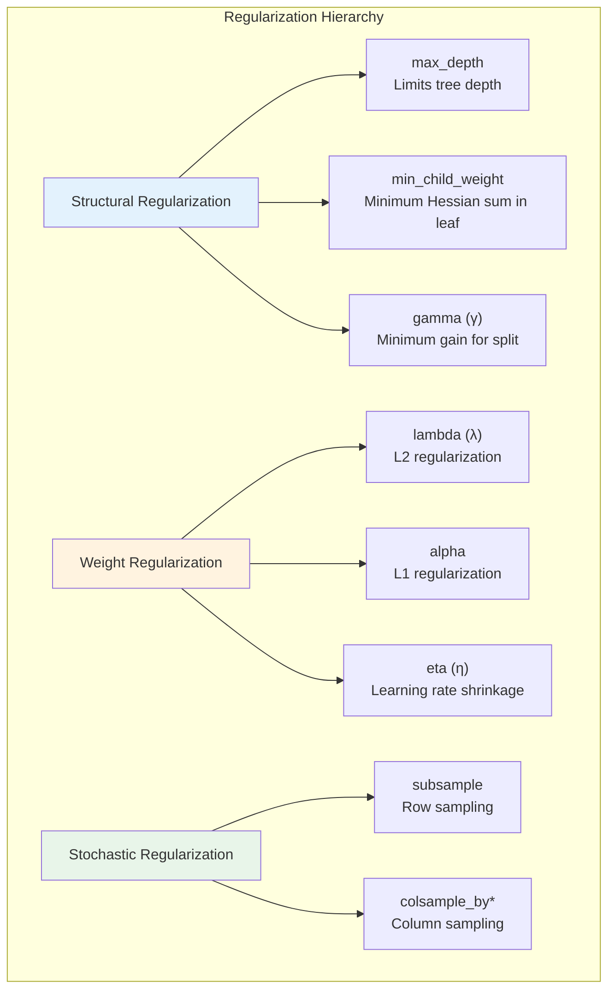
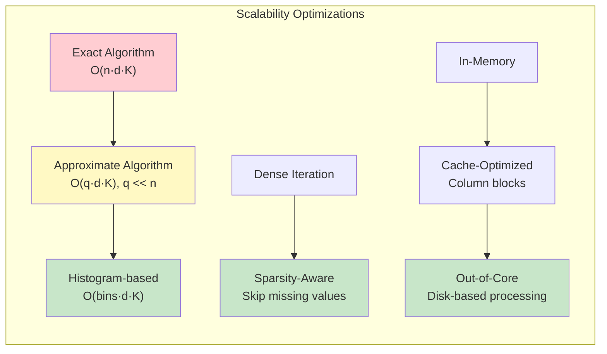

# Extreme Gradient Boosting: A Rigorous Examination of Second-Order Optimization in Ensemble Learning

## Abstract

The proliferation of gradient boosting methodologies has fundamentally transformed predictive modeling across computational domains, with XGBoost emerging as the preeminent implementation for structured data analysis. This technical exposition provides a mathematically rigorous treatment of the algorithmic foundations underlying extreme gradient boosting, encompassing second-order Taylor approximations, regularized objective formulations, and the structural scoring mechanisms that enable efficient tree construction. We derive the closed-form solutions for optimal leaf weights, analyze the gain computation framework governing split decisions, and examine the systems-level optimizations that distinguish XGBoost from conventional boosting implementations. The presentation synthesizes theoretical foundations with practical implementation considerations, offering insights pertinent to both research advancement and industrial deployment.

---

## 1. Introduction: The Gradient Boosting Paradigm

Ensemble learning represents one of the most consequential developments in modern machine learning, predicated on the principle that aggregating multiple weak learners yields predictive performance substantially exceeding that of individual constituents. Within this paradigm, gradient boosting occupies a distinguished position—constructing ensembles through sequential optimization where each successive model explicitly corrects the residual errors of its predecessors.

The foundational work of Friedman (2001) established gradient boosting as a functional gradient descent procedure in prediction space, wherein new base learners are fitted to the negative gradient of the loss function with respect to current predictions. XGBoost, introduced by Chen and Guestrin (2016), extends this framework through several critical innovations:

1. **Second-order approximation**: Incorporating Hessian information for more accurate loss surface modeling
2. **Regularized objectives**: Explicit complexity penalties preventing overfitting
3. **Structural scoring**: Closed-form evaluation of tree quality enabling efficient construction
4. **Systems optimization**: Algorithmic enhancements for computational scalability



*Figure 1: Evolutionary trajectory of boosting algorithms. XGBoost represents a pivotal advancement through its integration of second-order optimization with explicit regularization, spawning subsequent innovations in histogram-based and categorical-aware implementations.*

---

## 2. Mathematical Foundations: The Supervised Learning Framework

### 2.1 Model Formulation

Consider a supervised learning scenario with training data $\{(x_i, y_i)\}_{i=1}^{n}$ where $x_i \in \mathbb{R}^d$ represents feature vectors and $y_i$ denotes target values. The gradient boosting ensemble constructs predictions through additive combination of $K$ base learners:

$$\hat{y}_i = \sum_{k=1}^{K} f_k(x_i), \quad f_k \in \mathcal{F}$$

where $\mathcal{F}$ denotes the hypothesis space of regression trees. Each tree $f_k$ maps input features to real-valued scores, with the ensemble prediction emerging as the cumulative sum across all constituent trees.

### 2.2 The Regularized Objective Function

The training objective balances predictive fidelity against model complexity through a composite formulation:

$$\mathcal{L}(\phi) = \sum_{i=1}^{n} \ell(y_i, \hat{y}_i) + \sum_{k=1}^{K} \Omega(f_k)$$

where $\ell(\cdot, \cdot)$ quantifies prediction error and $\Omega(\cdot)$ penalizes tree complexity. This dual-component structure embodies the fundamental bias-variance tradeoff—the loss term drives model expressiveness while regularization constrains capacity to prevent overfitting.



*Figure 2: The regularized objective function decomposes into loss and complexity components. This explicit formulation enables principled control over the bias-variance tradeoff during training.*

---

## 3. Additive Training: Sequential Ensemble Construction

### 3.1 The Greedy Approximation Strategy

Direct optimization over all trees simultaneously proves computationally intractable. Instead, XGBoost employs an additive strategy—fixing previously learned trees and optimizing only the newest addition at each iteration.

Let $\hat{y}_i^{(t)}$ denote the prediction after $t$ boosting rounds:

$$\hat{y}_i^{(t)} = \hat{y}_i^{(t-1)} + f_t(x_i)$$

The objective at iteration $t$ becomes:

$$\mathcal{L}^{(t)} = \sum_{i=1}^{n} \ell(y_i, \hat{y}_i^{(t-1)} + f_t(x_i)) + \Omega(f_t) + \text{constant}$$



*Figure 3: Sequential ensemble construction through additive training. Each iteration adds a single tree optimized to correct the cumulative errors of all preceding trees.*

### 3.2 Second-Order Taylor Approximation

For general loss functions lacking convenient closed-form derivatives, XGBoost employs a second-order Taylor expansion around the current prediction:

$$\ell(y_i, \hat{y}_i^{(t-1)} + f_t(x_i)) \approx \ell(y_i, \hat{y}_i^{(t-1)}) + g_i f_t(x_i) + \frac{1}{2} h_i f_t^2(x_i)$$

where the gradient and Hessian statistics are defined as:

$$g_i = \frac{\partial \ell(y_i, \hat{y})}{\partial \hat{y}} \bigg|_{\hat{y}=\hat{y}_i^{(t-1)}}$$

$$h_i = \frac{\partial^2 \ell(y_i, \hat{y})}{\partial \hat{y}^2} \bigg|_{\hat{y}=\hat{y}_i^{(t-1)}}$$

**Gradient and Hessian for Common Loss Functions:**

| Loss Function | Application | Gradient $g_i$ | Hessian $h_i$ |
|--------------|-------------|----------------|---------------|
| Squared Error | Regression | $2(\hat{y}_i - y_i)$ | $2$ |
| Logistic | Binary Classification | $\sigma(\hat{y}_i) - y_i$ | $\sigma(\hat{y}_i)(1 - \sigma(\hat{y}_i))$ |
| Softmax | Multiclass | $p_k - \mathbb{1}[y_i = k]$ | $p_k(1 - p_k)$ |

where $\sigma(\cdot)$ denotes the sigmoid function and $p_k$ represents class probability.

Removing constant terms, the simplified objective becomes:

$$\tilde{\mathcal{L}}^{(t)} = \sum_{i=1}^{n} \left[ g_i f_t(x_i) + \frac{1}{2} h_i f_t^2(x_i) \right] + \Omega(f_t)$$

This formulation reveals a critical insight: **the optimization depends only on gradient and Hessian statistics**, enabling a unified solver applicable to arbitrary differentiable loss functions.

---

## 4. Tree Complexity and Regularization

### 4.1 Formal Tree Representation

A regression tree $f_t$ partitions the input space into $T$ disjoint regions, assigning a constant score to each leaf. Formally:

$$f_t(x) = w_{q(x)}$$

where:
- $q: \mathbb{R}^d \rightarrow \{1, 2, \ldots, T\}$ maps inputs to leaf indices
- $w \in \mathbb{R}^T$ contains the leaf scores

### 4.2 The XGBoost Regularization Term

XGBoost defines tree complexity through a combination of leaf count and score magnitude:

$$\Omega(f) = \gamma T + \frac{1}{2}\lambda \sum_{j=1}^{T} w_j^2$$

where:
- $\gamma$ penalizes the number of leaves (structural complexity)
- $\lambda$ penalizes leaf score magnitudes (L2 regularization)



*Figure 4: XGBoost's regularization framework combines structural penalties (leaf count) with weight magnitude constraints (L2 norm). These hyperparameters provide fine-grained control over model complexity.*

---

## 5. The Structure Score: Optimal Leaf Weights and Tree Quality

### 5.1 Derivation of Optimal Leaf Weights

Substituting the tree representation into the simplified objective:

$$\tilde{\mathcal{L}}^{(t)} = \sum_{i=1}^{n} \left[ g_i w_{q(x_i)} + \frac{1}{2} h_i w_{q(x_i)}^2 \right] + \gamma T + \frac{1}{2}\lambda \sum_{j=1}^{T} w_j^2$$

Grouping terms by leaf assignment (let $I_j = \{i : q(x_i) = j\}$ denote samples in leaf $j$):

$$\tilde{\mathcal{L}}^{(t)} = \sum_{j=1}^{T} \left[ \left(\sum_{i \in I_j} g_i\right) w_j + \frac{1}{2}\left(\sum_{i \in I_j} h_i + \lambda\right) w_j^2 \right] + \gamma T$$

Defining aggregate statistics $G_j = \sum_{i \in I_j} g_i$ and $H_j = \sum_{i \in I_j} h_i$:

$$\tilde{\mathcal{L}}^{(t)} = \sum_{j=1}^{T} \left[ G_j w_j + \frac{1}{2}(H_j + \lambda) w_j^2 \right] + \gamma T$$

Since leaf weights are independent, we minimize each quadratic term separately. Taking the derivative with respect to $w_j$ and setting to zero:

$$\frac{\partial}{\partial w_j} \left[ G_j w_j + \frac{1}{2}(H_j + \lambda) w_j^2 \right] = G_j + (H_j + \lambda) w_j = 0$$

**Optimal Leaf Weight:**

$$\boxed{w_j^* = -\frac{G_j}{H_j + \lambda}}$$

### 5.2 The Structure Score

Substituting optimal weights back into the objective yields the **structure score**—a measure of tree quality for a given partition:

$$\boxed{\mathcal{L}^* = -\frac{1}{2} \sum_{j=1}^{T} \frac{G_j^2}{H_j + \lambda} + \gamma T}$$



*Figure 5: Structure score computation workflow. Gradient and Hessian statistics are aggregated per leaf, enabling closed-form evaluation of tree quality without iterative optimization.*

This closed-form scoring mechanism represents a fundamental advantage of XGBoost—tree quality can be evaluated directly from gradient statistics without requiring iterative weight optimization.

---

## 6. Split Finding: The Gain Formula

### 6.1 Evaluating Split Quality

When considering splitting leaf $j$ into left ($L$) and right ($R$) children, the improvement in objective (gain) is computed as:

$$\text{Gain} = \frac{1}{2}\left[ \frac{G_L^2}{H_L + \lambda} + \frac{G_R^2}{H_R + \lambda} - \frac{(G_L + G_R)^2}{H_L + H_R + \lambda} \right] - \gamma$$

**Interpretation of Components:**
1. $\frac{G_L^2}{H_L + \lambda}$: Score contribution from left child
2. $\frac{G_R^2}{H_R + \lambda}$: Score contribution from right child  
3. $\frac{(G_L + G_R)^2}{H_L + H_R + \lambda}$: Score of original (unsplit) leaf
4. $\gamma$: Penalty for adding a new leaf



*Figure 6: Split gain computation and decision logic. A split is accepted only when the combined improvement from child nodes exceeds the original leaf score plus the complexity penalty γ.*

### 6.2 Efficient Split Enumeration

For continuous features, XGBoost employs a linear-time algorithm:

1. Sort samples by feature value
2. Scan left-to-right, maintaining cumulative gradient/Hessian sums
3. At each potential split point, compute gain in $O(1)$ using running totals
4. Select the split maximizing gain

**Algorithm: Exact Greedy Split Finding**

```python
def find_best_split(feature_values, gradients, hessians, lambda_reg, gamma):
    """
    Find optimal split point for a single feature.
    
    Returns: (best_threshold, best_gain)
    """
    # Sort by feature value
    sorted_indices = np.argsort(feature_values)
    
    # Initialize cumulative sums
    G_total = np.sum(gradients)
    H_total = np.sum(hessians)
    G_left, H_left = 0.0, 0.0
    
    best_gain = -np.inf
    best_threshold = None
    
    # Linear scan
    for i in sorted_indices[:-1]:  # Exclude last (no right child)
        G_left += gradients[i]
        H_left += hessians[i]
        G_right = G_total - G_left
        H_right = H_total - H_left
        
        # Compute gain
        gain = 0.5 * (
            G_left**2 / (H_left + lambda_reg) +
            G_right**2 / (H_right + lambda_reg) -
            G_total**2 / (H_total + lambda_reg)
        ) - gamma
        
        if gain > best_gain:
            best_gain = gain
            best_threshold = (feature_values[i] + feature_values[sorted_indices[i+1]]) / 2
    
    return best_threshold, best_gain
```

---

## 7. Regularization Mechanisms and Hyperparameters

### 7.1 Shrinkage (Learning Rate)

Even after computing optimal leaf weights, XGBoost applies a shrinkage factor $\eta \in (0, 1]$:

$$\hat{y}_i^{(t)} = \hat{y}_i^{(t-1)} + \eta \cdot f_t(x_i)$$

Shrinkage reduces the contribution of each tree, requiring more iterations but improving generalization by preventing early trees from dominating the ensemble.

### 7.2 Subsampling Strategies

XGBoost supports multiple randomization techniques:

| Strategy | Parameter | Effect |
|----------|-----------|--------|
| Row Subsampling | `subsample` | Random fraction of samples per tree |
| Column Subsampling (tree) | `colsample_bytree` | Random features per tree |
| Column Subsampling (level) | `colsample_bylevel` | Random features per depth level |
| Column Subsampling (node) | `colsample_bynode` | Random features per split |



*Figure 7: XGBoost's multi-layered regularization framework. Structural constraints limit tree complexity, weight penalties shrink predictions, and stochastic sampling introduces beneficial randomization.*

### 7.3 Comprehensive Hyperparameter Reference

| Parameter | Description | Typical Range | Effect of Increase |
|-----------|-------------|---------------|-------------------|
| `n_estimators` | Number of boosting rounds | 100-10000 | More capacity, longer training |
| `max_depth` | Maximum tree depth | 3-12 | More complex trees |
| `learning_rate` (η) | Step size shrinkage | 0.01-0.3 | Faster convergence, overfitting risk |
| `min_child_weight` | Minimum sum of Hessians | 1-10 | More conservative splits |
| `gamma` (γ) | Minimum split gain | 0-5 | Fewer splits, simpler trees |
| `lambda` (λ) | L2 regularization | 0-10 | Smaller leaf weights |
| `alpha` | L1 regularization | 0-10 | Sparser leaf weights |
| `subsample` | Row sampling ratio | 0.5-1.0 | More randomization |
| `colsample_bytree` | Feature sampling ratio | 0.5-1.0 | More randomization |

---

## 8. Systems-Level Optimizations

### 8.1 Approximate Split Finding

For large datasets, exact enumeration becomes prohibitive. XGBoost implements approximate algorithms using **quantile sketches**:

1. Compute feature quantiles (percentiles) as candidate split points
2. Aggregate gradient statistics into histogram bins
3. Evaluate splits only at quantile boundaries

This reduces complexity from $O(n \cdot d)$ to $O(q \cdot d)$ where $q \ll n$ is the number of quantiles.

### 8.2 Sparsity-Aware Algorithms

Real-world data frequently contains missing values or sparse features. XGBoost handles sparsity through:

1. **Default direction learning**: For each split, learn whether missing values should go left or right
2. **Sparse-aware iteration**: Skip missing entries during gradient aggregation

### 8.3 Cache-Aware and Out-of-Core Computation

- **Block structure**: Data stored in compressed column format for cache efficiency
- **Prefetching**: Asynchronous data loading during computation
- **External memory**: Disk-based processing for datasets exceeding RAM



*Figure 8: XGBoost's systems optimizations enable scaling from laptop-sized datasets to distributed clusters processing billions of examples.*

---

## 9. Practical Implementation Patterns

### 9.1 Basic Training Pipeline

```python
import xgboost as xgb
from sklearn.model_selection import train_test_split
from sklearn.metrics import mean_squared_error, accuracy_score

# Prepare data
X_train, X_test, y_train, y_test = train_test_split(X, y, test_size=0.2)

# Create DMatrix (XGBoost's optimized data structure)
dtrain = xgb.DMatrix(X_train, label=y_train)
dtest = xgb.DMatrix(X_test, label=y_test)

# Define parameters
params = {
    'objective': 'reg:squarederror',  # or 'binary:logistic'
    'max_depth': 6,
    'learning_rate': 0.1,
    'lambda': 1.0,
    'gamma': 0.1,
    'subsample': 0.8,
    'colsample_bytree': 0.8,
    'eval_metric': 'rmse'
}

# Train with early stopping
evallist = [(dtrain, 'train'), (dtest, 'eval')]
model = xgb.train(
    params,
    dtrain,
    num_boost_round=1000,
    evals=evallist,
    early_stopping_rounds=50,
    verbose_eval=100
)

# Predict
predictions = model.predict(dtest)
```

### 9.2 Cross-Validation for Hyperparameter Tuning

```python
from sklearn.model_selection import GridSearchCV

# Scikit-learn compatible interface
xgb_model = xgb.XGBRegressor(
    objective='reg:squarederror',
    n_estimators=1000,
    early_stopping_rounds=50
)

param_grid = {
    'max_depth': [3, 5, 7],
    'learning_rate': [0.01, 0.05, 0.1],
    'min_child_weight': [1, 3, 5],
    'gamma': [0, 0.1, 0.2],
    'subsample': [0.7, 0.8, 0.9],
    'colsample_bytree': [0.7, 0.8, 0.9]
}

grid_search = GridSearchCV(
    xgb_model,
    param_grid,
    cv=5,
    scoring='neg_root_mean_squared_error',
    n_jobs=-1,
    verbose=1
)

grid_search.fit(X_train, y_train, eval_set=[(X_test, y_test)], verbose=False)
print(f"Best parameters: {grid_search.best_params_}")
```

### 9.3 Feature Importance Analysis

```python
import matplotlib.pyplot as plt

# Built-in importance types
importance_types = ['weight', 'gain', 'cover']

fig, axes = plt.subplots(1, 3, figsize=(15, 5))
for ax, imp_type in zip(axes, importance_types):
    xgb.plot_importance(model, importance_type=imp_type, ax=ax, title=f'Importance ({imp_type})')
plt.tight_layout()

# SHAP values for detailed interpretation
import shap
explainer = shap.TreeExplainer(model)
shap_values = explainer.shap_values(X_test)
shap.summary_plot(shap_values, X_test, feature_names=feature_names)
```

---

## 10. Comparative Analysis: XGBoost vs. Alternatives

### 10.1 Gradient Boosting Implementations

| Framework | Split Strategy | Categorical Handling | Key Advantage |
|-----------|---------------|---------------------|---------------|
| **XGBoost** | Level-wise or Leaf-wise | Requires encoding | Mature, well-optimized |
| **LightGBM** | Leaf-wise (best-first) | Native support | Faster training |
| **CatBoost** | Symmetric trees | Native ordered encoding | Best categorical handling |

### 10.2 When to Choose XGBoost

**Strengths:**
- Extensive documentation and community support
- Robust handling of missing values
- Flexible regularization options
- GPU acceleration support

**Considerations:**
- LightGBM often faster for very large datasets
- CatBoost superior for high-cardinality categoricals
- Deep learning may outperform for unstructured data

---

## 11. Interview Questions and Technical Responses

### Q1: Explain how XGBoost differs from traditional gradient boosting.

XGBoost extends gradient boosting through three principal innovations. First, it employs second-order Taylor approximation of the loss function, incorporating Hessian information for more accurate optimization. Second, it introduces explicit regularization terms penalizing both leaf count and weight magnitudes, providing principled overfitting control. Third, it derives closed-form solutions for optimal leaf weights and split gains, enabling efficient tree construction without iterative optimization.

### Q2: Derive the optimal leaf weight formula.

Starting from the regularized objective grouped by leaves:
$$\tilde{\mathcal{L}} = \sum_{j=1}^{T} \left[ G_j w_j + \frac{1}{2}(H_j + \lambda) w_j^2 \right] + \gamma T$$

Taking the derivative with respect to $w_j$ and setting to zero:
$$\frac{\partial \tilde{\mathcal{L}}}{\partial w_j} = G_j + (H_j + \lambda) w_j = 0$$

Solving: $w_j^* = -\frac{G_j}{H_j + \lambda}$

The regularization parameter $\lambda$ appears in the denominator, shrinking weights toward zero and preventing extreme predictions.

### Q3: What role does the gamma parameter play?

Gamma ($\gamma$) represents the minimum gain required to make a split. In the gain formula:
$$\text{Gain} = \frac{1}{2}\left[ \frac{G_L^2}{H_L + \lambda} + \frac{G_R^2}{H_R + \lambda} - \frac{(G_L + G_R)^2}{H_L + H_R + \lambda} \right] - \gamma$$

If the improvement from splitting doesn't exceed $\gamma$, the split is rejected. This provides built-in pruning—higher $\gamma$ values produce simpler trees with fewer leaves.

### Q4: How does XGBoost handle missing values?

XGBoost learns an optimal default direction for missing values at each split. During training, it evaluates gain for both scenarios (missing goes left vs. right) and selects the direction maximizing gain. This learned default is then applied during prediction, making XGBoost robust to missing data without requiring imputation.

### Q5: Explain the bias-variance tradeoff in XGBoost hyperparameters.

- **Reducing bias** (more complex models): Increase `max_depth`, `n_estimators`; decrease `gamma`, `lambda`
- **Reducing variance** (simpler models): Decrease `max_depth`, `learning_rate`; increase `gamma`, `lambda`, `min_child_weight`; enable subsampling

The learning rate (`eta`) provides a direct tradeoff—lower values require more trees but typically generalize better by preventing early trees from overfitting.

---

## 12. Conclusion

XGBoost represents a sophisticated synthesis of statistical learning theory and systems engineering, transforming gradient boosting from an academic algorithm into a practical tool capable of processing massive datasets with remarkable predictive accuracy. The second-order optimization framework provides both theoretical elegance and computational efficiency, while the regularized objective formulation offers principled control over model complexity.

The closed-form derivations for optimal leaf weights and split gains constitute perhaps the most significant theoretical contribution—enabling tree construction through direct computation rather than iterative optimization. Combined with systems-level innovations in approximate algorithms, sparsity handling, and distributed computation, these foundations explain XGBoost's dominance in structured data competitions and industrial applications.

Understanding these mathematical underpinnings proves essential not merely for effective hyperparameter tuning, but for recognizing when gradient boosting approaches are appropriate and how they might be extended or combined with other methodologies. As the machine learning landscape continues evolving, the principles embodied in XGBoost—balancing expressiveness with regularization, leveraging second-order information, and optimizing for computational efficiency—remain foundational to algorithmic advancement.

---

## References

1. Chen, T., & Guestrin, C. (2016). "[XGBoost: A Scalable Tree Boosting System](https://arxiv.org/abs/1603.02754)." *Proceedings of the 22nd ACM SIGKDD International Conference on Knowledge Discovery and Data Mining*, 785-794.

2. Friedman, J. H. (2001). "[Greedy Function Approximation: A Gradient Boosting Machine](https://projecteuclid.org/journals/annals-of-statistics/volume-29/issue-5/Greedy-function-approximation-A-gradient-boosting-machine/10.1214/aos/1013203451.full)." *Annals of Statistics*, 29(5), 1189-1232.

3. Friedman, J. H. (2002). "[Stochastic Gradient Boosting](https://www.sciencedirect.com/science/article/abs/pii/S0167947301000652)." *Computational Statistics & Data Analysis*, 38(4), 367-378.

4. Ke, G., et al. (2017). "[LightGBM: A Highly Efficient Gradient Boosting Decision Tree](https://papers.nips.cc/paper/2017/hash/6449f44a102fde848669bdd9eb6b76fa-Abstract.html)." *Advances in Neural Information Processing Systems*, 30.

5. Prokhorenkova, L., et al. (2018). "[CatBoost: Unbiased Boosting with Categorical Features](https://arxiv.org/abs/1706.09516)." *Advances in Neural Information Processing Systems*, 31.

6. XGBoost Documentation. "[Introduction to Boosted Trees](https://xgboost.readthedocs.io/en/stable/tutorials/model.html)." XGBoost Developers.

7. Hastie, T., Tibshirani, R., & Friedman, J. (2009). *The Elements of Statistical Learning* (2nd ed.). Springer. Chapter 10: Boosting and Additive Trees.

8. Schapire, R. E., & Freund, Y. (2012). *Boosting: Foundations and Algorithms*. MIT Press.

9. Natekin, A., & Knoll, A. (2013). "[Gradient Boosting Machines: A Tutorial](https://www.frontiersin.org/articles/10.3389/fnbot.2013.00021/full)." *Frontiers in Neurorobotics*, 7, 21.

10. Nielsen, D. (2016). "[Tree Boosting with XGBoost: Why Does XGBoost Win Every Machine Learning Competition?](https://ntnuopen.ntnu.no/ntnu-xmlui/handle/11250/2433761)" Master's Thesis, NTNU.
