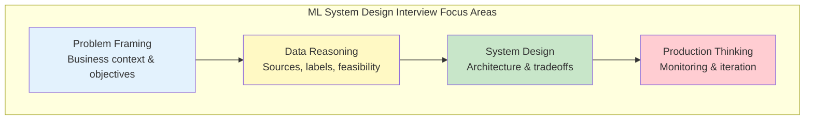
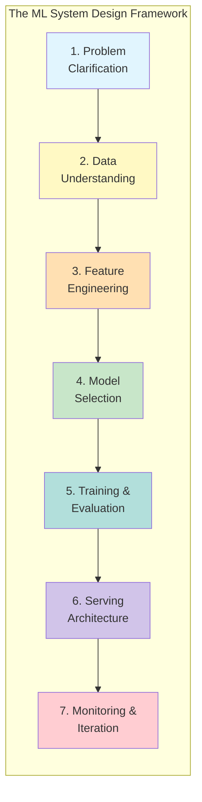
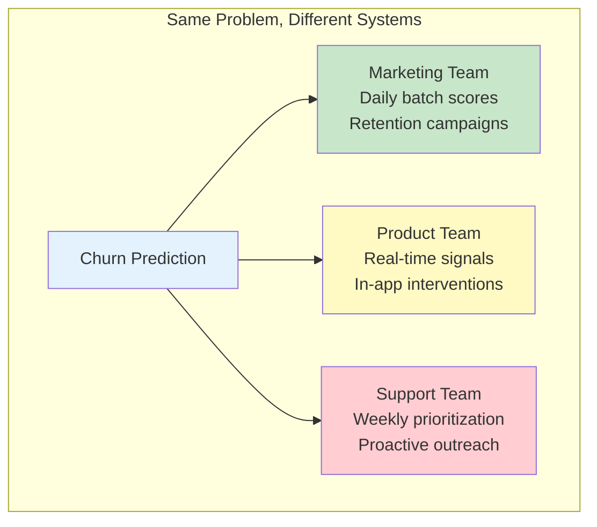
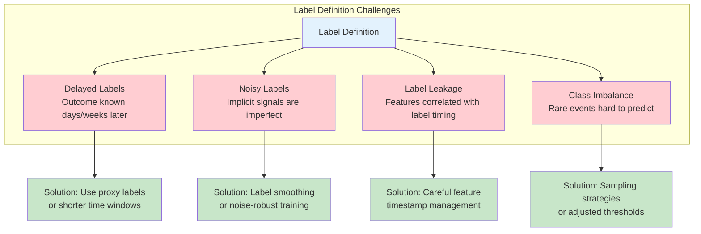
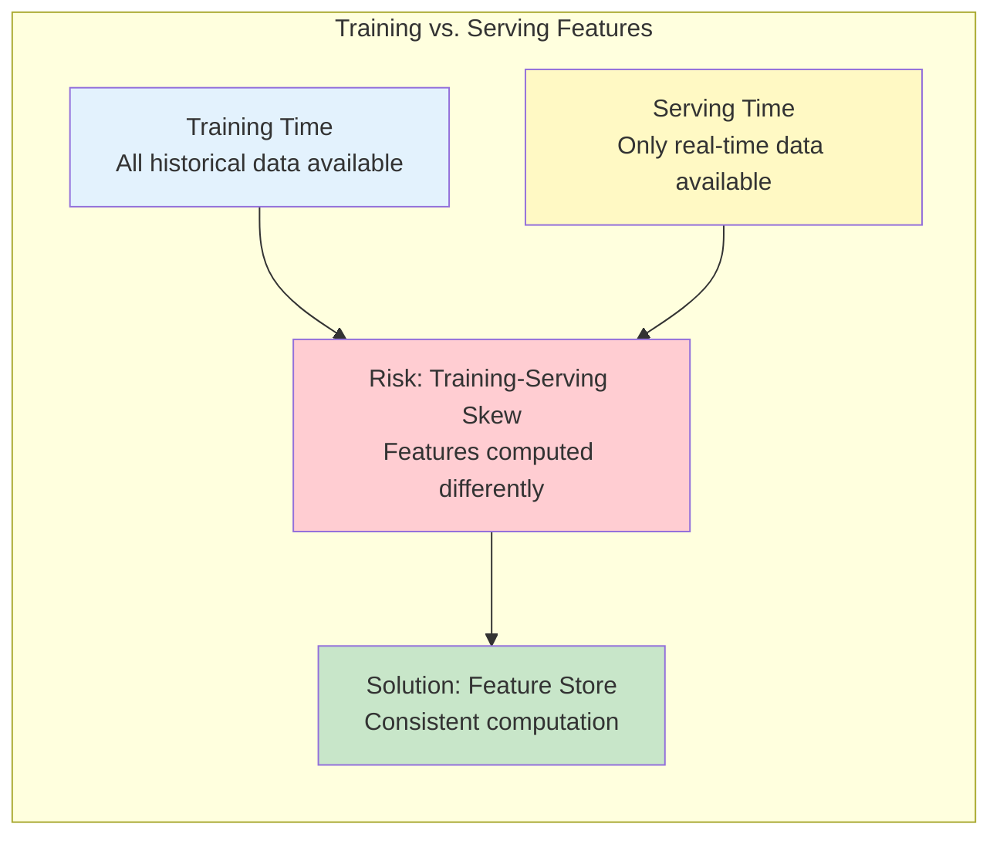
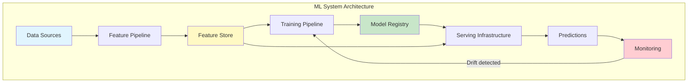
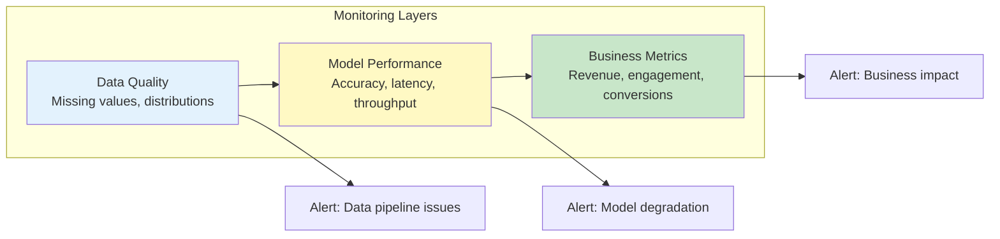

# Cracking ML System Design Case Studies: A Framework for Data Science Interviews

## Abstract

Machine learning system design case studies have become a cornerstone of data science interviews, evaluating candidates' ability to translate ambiguous business problems into production-ready ML systems. This guide presents a comprehensive framework for approaching these interviews, covering problem clarification, data feasibility assessment, feature engineering, model selection, evaluation strategies, serving architecture, and monitoring practices. Rather than memorizing specific solutions, candidates should develop a structured thinking approach that demonstrates end-to-end system understanding and practical tradeoff awareness.

---

## 1. Introduction: Understanding ML System Design Interviews

Data science case study rounds are often the most challenging part of an interview process—not due to technical complexity, but because of their deliberately open-ended nature. There is no single correct answer, no fixed dataset, and no clear stopping point. Candidates must reason through messy real-world problems and explain how they would build machine learning systems that actually work in production.

These interviews have increasingly taken the form of ML system design exercises. Rather than asking candidates to optimize a model or write code, interviewers want to see end-to-end thinking: how you translate business problems into ML problems, reason about data availability and quality, and make tradeoffs when faced with constraints like latency, scale, interpretability, or cost.

*Figure 1: The four pillars of ML system design interviews. Success requires demonstrating competence across all areas, not just modeling expertise.*

### 1.1 What Interviewers Are Actually Evaluating

Interviewers typically evaluate candidates across several core dimensions:

| Dimension | What Interviewers Look For | Common Mistakes |
|-----------|---------------------------|-----------------|
| **Problem Framing** | Understanding business context, identifying decisions the model supports, defining success beyond single metrics | Jumping straight to modeling without establishing what problem is being solved |
| **Data Intuition** | Reasoning about data sources, label quality, feasibility, recognizing missing/noisy data, identifying potential leakage | Treating data as an afterthought |
| **Tradeoff Awareness** | Balancing accuracy vs. interpretability, latency vs. complexity, iteration speed vs. robustness | Proposing solutions without acknowledging constraints |
| **System Thinking** | Understanding the full ML lifecycle: training, serving, monitoring | Stopping at model selection |
| **Communication** | Structured thinking, clear explanations, adapting based on feedback | Technically dense but poorly organized answers |

The fundamental question interviewers are trying to answer: *Can this person be trusted to design and evolve a machine learning system that delivers value to the business?*

---

## 2. A Mental Framework for ML System Design

One of the biggest mistakes candidates make is treating each case study as a unique problem requiring a custom answer. In reality, interviewers look for a consistent and repeatable way of thinking that can be applied to any ML problem.

*Figure 2: The seven-stage framework for approaching any ML system design problem. Each stage builds on the previous, creating a coherent system design.*

---

## 3. Problem Clarification and Business Objective

The most important part of any ML system design case study happens before machine learning is even discussed. Problem clarification is where strong candidates immediately differentiate themselves.

### 3.1 Identifying the Decision Boundary

Most prompts are framed in terms of outcomes rather than decisions. Being asked to "design a churn prediction system" doesn't mean the goal is to predict churn accurately. The real question is what action the business intends to take based on that prediction.

**Key Questions to Ask:**
- Who consumes the model output?
- How frequently are predictions needed?
- What operational action is triggered by a prediction?
- What is the cost of false positives vs. false negatives?

*Figure 3: The same prediction task leads to different system designs depending on the consumer and use case.*

### 3.2 Defining Success Metrics

Strong candidates connect ML metrics to business outcomes rather than defaulting to model-centric metrics like accuracy or AUC.

| Metric Type | Examples | When to Use |
|-------------|----------|-------------|
| **Offline ML Metrics** | AUC, Precision, Recall, F1, RMSE | Model development and comparison |
| **Online ML Metrics** | Prediction latency, throughput, coverage | Production performance |
| **Business Metrics** | Revenue impact, user retention, cost savings | Ultimate success criteria |

### 3.3 Surfacing Constraints

Constraints are often implicit in the prompt and must be surfaced by the candidate:

- **Latency requirements**: Batch vs. real-time inference
- **Interpretability requirements**: Regulatory or stakeholder needs
- **Cost constraints**: Training frequency, infrastructure budget
- **Time horizon**: Definition of positive/negative outcomes

---

## 4. Data Understanding and Feasibility

Once the problem is defined, assess whether it can actually be solved with data. This is where interviewers evaluate practical intuition.

### 4.1 Data Source Identification

| Data Type | Examples | Considerations |
|-----------|----------|----------------|
| **Application Logs** | Page views, clicks, feature usage | Volume, granularity, retention |
| **Transactional Data** | Purchases, subscriptions, payments | Completeness, timing |
| **User Behavior** | Session sequences, engagement patterns | Privacy, aggregation needs |
| **External Data** | Demographics, market signals | Availability, cost, freshness |

### 4.2 Label Definition and Quality

Label definition is one of the most common failure points in ML systems. Key considerations:

- **Label availability**: How are labels generated? Manual annotation, implicit feedback, or derived from outcomes?
- **Label delay**: How long until the true outcome is known?
- **Label noise**: What is the expected error rate in labels?
- **Label leakage**: Are there features that implicitly contain label information?

*Figure 4: Common label definition challenges and their solutions.*

### 4.3 Cold Start Considerations

New users or items lack historical data. Strong candidates address:
- How does the system behave for new entities?
- What fallback strategies exist (popularity-based, content-based)?
- How quickly can the system learn about new entities?

---

## 5. Feature Engineering and Representation

Feature engineering transforms raw data into meaningful signals for the model.

### 5.1 Feature Categories

| Category | Description | Examples |
|----------|-------------|----------|
| **Static Features** | Rarely change | User demographics, item categories |
| **Dynamic Features** | Change frequently | Recent activity, current context |
| **Aggregated Features** | Computed over windows | 7-day purchase count, average session length |
| **Interaction Features** | Combinations | User-item affinity scores |

### 5.2 Feature Freshness and Availability

A critical distinction exists between features available at training time vs. inference time:

*Figure 5: Training-serving skew is a common production issue that feature stores help address.*

---

## 6. Model Selection and Tradeoffs

### 6.1 Start Simple

Strong candidates always start with a simple baseline:

1. **Heuristic baseline**: Rule-based approach (e.g., "users inactive for 7 days are churned")
2. **Simple ML baseline**: Logistic regression or decision tree
3. **Complex models**: Gradient boosting, neural networks (only if justified)

### 6.2 Model Selection Criteria

| Criterion | Simple Models (LR, Trees) | Complex Models (GBM, NN) |
|-----------|---------------------------|--------------------------|
| **Interpretability** | High | Low |
| **Training Speed** | Fast | Slow |
| **Feature Engineering** | Required | Can learn representations |
| **Data Requirements** | Lower | Higher |
| **Debugging** | Easier | Harder |

### 6.3 When to Use Deep Learning

Deep learning is often over-indexed by candidates. It's most appropriate when:
- Large amounts of unstructured data (text, images, sequences)
- Complex feature interactions that are hard to engineer manually
- Sufficient data and compute resources available
- Interpretability is not a primary constraint

---

## 7. Training and Evaluation Strategy

### 7.1 Data Splitting Strategies

| Strategy | When to Use | Risks |
|----------|-------------|-------|
| **Random Split** | IID data, no temporal structure | Leakage if temporal patterns exist |
| **Time-Based Split** | Predicting future behavior | May miss seasonal patterns |
| **Entity-Based Split** | Generalizing to new users/items | Smaller effective dataset |
| **Stratified Split** | Imbalanced classes | May not reflect production distribution |

### 7.2 Offline Evaluation Metrics

Choose metrics aligned with the business objective:

| Problem Type | Common Metrics | Considerations |
|--------------|----------------|----------------|
| **Classification** | Precision, Recall, F1, AUC-ROC | Threshold selection matters |
| **Ranking** | NDCG, MAP, Precision@K | Position bias in evaluation |
| **Regression** | RMSE, MAE, MAPE | Outlier sensitivity |
| **Calibration** | Brier Score, Reliability Diagrams | Important for risk scoring |

### 7.3 Bias and Fairness Evaluation

Interviewers increasingly expect awareness of fairness considerations:
- Evaluate performance across relevant subpopulations
- Identify systematic disparities
- Consider fairness constraints in model selection or thresholding

---

## 8. Serving and System Architecture

### 8.1 Batch vs. Real-Time Inference

| Aspect | Batch Inference | Real-Time Inference |
|--------|-----------------|---------------------|
| **Latency** | Hours to days | Milliseconds to seconds |
| **Use Cases** | Periodic scoring, recommendations | Fraud detection, live ranking |
| **Complexity** | Lower | Higher |
| **Cost** | Generally lower | Generally higher |
| **Freshness** | Stale predictions | Up-to-date predictions |

### 8.2 System Architecture Components

*Figure 6: Key components of a production ML system architecture.*

### 8.3 Failure Mode Planning

Strong candidates acknowledge and plan for failures:
- Missing features at inference time
- Model service outages
- Stale predictions
- Graceful degradation strategies (fallback to simpler models or heuristics)

---

## 9. Monitoring, Retraining, and Iteration

### 9.1 Types of Drift

| Drift Type | Description | Detection |
|------------|-------------|-----------|
| **Data Drift** | Input feature distributions change | Statistical tests on feature distributions |
| **Concept Drift** | Relationship between features and target changes | Performance degradation on recent data |
| **Label Drift** | Target distribution changes | Monitor label statistics over time |

### 9.2 Monitoring Strategy

*Figure 7: Multi-layered monitoring catches issues at different stages of the system.*

### 9.3 Retraining Triggers

| Trigger Type | Description | Tradeoffs |
|--------------|-------------|-----------|
| **Time-Based** | Retrain on fixed schedule | Predictable but may miss sudden changes |
| **Performance-Based** | Retrain when metrics degrade | Responsive but requires good monitoring |
| **Data-Based** | Retrain when sufficient new data available | Efficient but may delay updates |

### 9.4 Human-in-the-Loop Workflows

For high-risk or ambiguous cases, human oversight may be necessary:
- Validating predictions in edge cases
- Correcting labels for model improvement
- Handling cases below confidence thresholds

---

## 10. Common Interview Traps to Avoid

### 10.1 Mistakes That Signal Inexperience

| Trap | Why It's Problematic | Better Approach |
|------|---------------------|-----------------|
| **Jumping to model selection** | Signals poor problem framing | Clarify objectives and constraints first |
| **Defaulting to deep learning** | Often unnecessary complexity | Start simple, justify complexity |
| **Ignoring data availability** | Designs unrealistic systems | Treat data as first-class concern |
| **Confusing ML and business metrics** | Misses the point of the system | Connect model outputs to decisions |
| **Forgetting monitoring/retraining** | Incomplete system thinking | Address full ML lifecycle |
| **Designing for perfection** | Unrealistic in practice | Propose MVP and iteration path |

---

## 11. Interview Preparation Checklist

### 11.1 Framework Quick Reference

**Stage 1: Problem Clarification**
- [ ] Define the decision the model supports
- [ ] Identify the prediction consumer
- [ ] Align ML metrics with business outcomes
- [ ] Surface constraints (latency, cost, interpretability)

**Stage 2: Data Understanding**
- [ ] Identify available data sources
- [ ] Define labels and acknowledge limitations
- [ ] Reason about offline vs. online data availability
- [ ] Address cold start scenarios

**Stage 3: Feature Engineering**
- [ ] Transform raw data into meaningful signals
- [ ] Separate static and dynamic features
- [ ] Design aggregations and time windows
- [ ] Ensure feature freshness at prediction time

**Stage 4: Model Selection**
- [ ] Start with simple baseline
- [ ] Choose model based on data and constraints
- [ ] Balance interpretability and performance
- [ ] Explicitly rule out inappropriate models

**Stage 5: Training and Evaluation**
- [ ] Use appropriate data splits
- [ ] Select metrics aligned with decisions
- [ ] Address class imbalance
- [ ] Evaluate bias and fairness

**Stage 6: Serving Architecture**
- [ ] Decide batch vs. real-time inference
- [ ] Design for latency and reliability
- [ ] Plan for training-serving consistency
- [ ] Address failure modes

**Stage 7: Monitoring and Iteration**
- [ ] Monitor data and concept drift
- [ ] Track model and business performance
- [ ] Define retraining triggers
- [ ] Incorporate human oversight where needed

---

## 12. Conclusion

ML system design interviews are not tests of algorithmic knowledge. They are evaluations of how you make decisions when faced with incomplete information, real-world constraints, and competing priorities. The strongest answers are rarely the most complex—they demonstrate clear reasoning and intentional tradeoffs.

Strong candidates approach these problems like owners rather than modelers. They focus on what the system is meant to achieve, how it will be used, and how it will evolve over time. Instead of optimizing a single model in isolation, they think about data quality, deployment realities, and long-term maintenance.

A well-structured framework consistently outperforms fancy algorithms in these interviews. Having a repeatable way to approach ambiguous problems helps you stay grounded, communicate clearly, and adapt to follow-up questions. It also signals maturity and experience, even when the problem itself is unfamiliar.

**Key Takeaways:**
1. Problem framing matters more than model selection
2. Data feasibility determines system viability
3. Simple baselines should always come first
4. Production concerns (serving, monitoring) are essential
5. Communication and structure differentiate strong candidates

---

## References

1. BuildML. (2026). "Data Science Interview Guide - Cracking ML System Design Case Studies." BuildML Newsletter.

2. Huyen, C. (2022). *Designing Machine Learning Systems*. O'Reilly Media.

3. Lakshmanan, V., Robinson, S., & Munn, M. (2020). *Machine Learning Design Patterns*. O'Reilly Media.

4. Burkov, A. (2020). *Machine Learning Engineering*. True Positive Inc.

5. Amazon Science Blog. "Preventing Degradation in NLP Models." https://www.amazon.science/

6. Airbnb Engineering. "Machine Learning-Powered Search Ranking." https://medium.com/airbnb-engineering

7. Netflix Technology Blog. "Fraud Detection Using Semi-Supervised Methods." https://netflixtechblog.com/

8. Uber Engineering. "Backtesting at Scale." https://eng.uber.com/

9. DoorDash Engineering. "ML Model Monitoring Best Practices." https://doordash.engineering/

10. Meta AI Blog. "Content Moderation at Scale." https://ai.meta.com/blog/
