# Essential LLM Concepts: A Technical Deep-Dive for AI Practitioners

## Abstract

Large Language Models have fundamentally transformed the AI landscape, becoming central to modern software systems across industries. This comprehensive guide explores the core technical concepts that underpin LLM development, deployment, and optimization. From positional encodings and attention mechanisms to alignment techniques and retrieval-augmented generation, we examine the theoretical foundations and practical considerations that every AI practitioner should understand. The material synthesizes insights from leading AI research organizations and provides a structured framework for mastering LLM fundamentals.

---

## 1. Introduction: The LLM Knowledge Landscape

The rapid evolution of large language models has created an unprecedented demand for practitioners who understand both the theoretical underpinnings and practical deployment considerations of these systems. Modern LLM development spans multiple disciplines: deep learning architecture, optimization theory, distributed systems, and human-AI alignment.

This guide organizes essential LLM concepts into coherent themes, providing both intuitive explanations and technical depth. Whether you're building production systems or advancing research, these fundamentals form the foundation of effective LLM work.

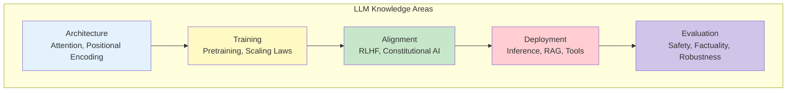

*Figure 1: The five pillars of LLM expertise. Mastery requires understanding how these areas interconnect.*

---

## 2. Architectural Foundations

### 2.1 Rotary Positional Embeddings (RoPE)

Transformers process sequences without inherent position awareness—they see tokens as an unordered set. Positional encodings solve this by injecting position information into the model's representations.

**How RoPE Works:**

Rotary positional embeddings encode position by applying rotation transformations to query and key vectors in the attention mechanism. Each pair of dimensions in a vector forms a 2D plane, and RoPE rotates this plane by an angle proportional to the token's position.

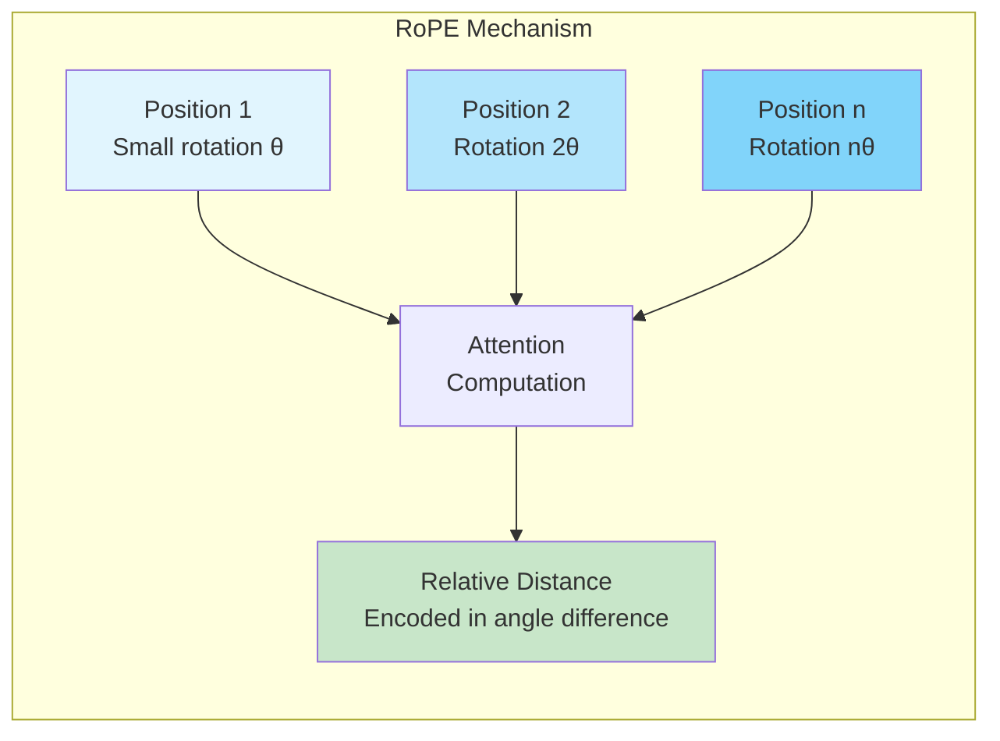

*Figure 2: RoPE encodes position through rotation angles that increase with position index.*

**Key Properties:**
- **Relative distance encoding**: The angle difference between two positions directly encodes their distance
- **Magnitude preservation**: Rotation changes direction but preserves vector magnitude
- **Extrapolation capability**: Mathematical generation of angles enables extension beyond training lengths

**Comparison with Absolute Positional Embeddings:**

| Aspect | Absolute Embeddings | RoPE |
|--------|-------------------|------|
| **Mechanism** | Learned fixed vectors per position | Mathematical rotation based on position |
| **What's encoded** | Position identity | Relative distance |
| **Length generalization** | Poor beyond training length | Smooth extrapolation |
| **Modern usage** | Legacy architectures | Standard in long-context LLMs |

### 2.2 Causal vs. Bidirectional Attention

The attention mask determines what information each token can access during computation.

**Causal (Autoregressive) Attention:**
- Each token attends only to previous positions
- Creates left-to-right information flow
- Essential for text generation (GPT-style models)
- Prevents "cheating" by looking at future tokens during training

**Bidirectional Attention:**
- Each token attends to all positions
- Enables holistic context understanding
- Used for comprehension tasks (BERT-style models)
- Cannot be used directly for generation

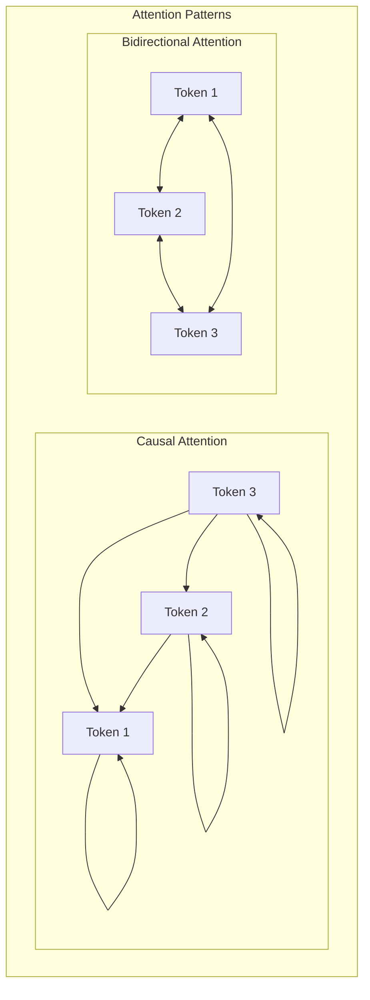

*Figure 3: Causal attention restricts information flow to past tokens; bidirectional allows full context access.*

### 2.3 KV-Cache: Efficient Autoregressive Decoding

During text generation, transformers produce tokens sequentially. Without optimization, each new token requires recomputing attention over the entire sequence—an O(n²) operation that becomes prohibitive for long outputs.

**The KV-Cache Solution:**

The key-value cache stores computed key and value vectors from previous tokens. At each generation step:
1. Compute keys and values only for the new token
2. Append to the cached keys and values
3. Compute attention using cached history + new token

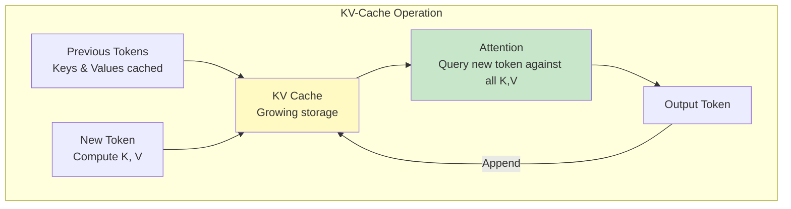

*Figure 4: KV-cache eliminates redundant computation by storing and reusing intermediate attention states.*

**Complexity Reduction:**
- Without cache: O(n²) per sequence (reprocess entire prefix each step)
- With cache: O(n) per sequence (one forward pass per new token)

---

## 3. Training Paradigms and Scaling

### 3.1 Chinchilla Scaling Laws

Before 2022, the dominant strategy was "bigger is better"—increasing model parameters while training on similar data quantities. DeepMind's Chinchilla research revealed this approach wastes compute.

**Core Insight:** For a fixed compute budget, optimal performance requires balancing model size and training data. The research suggested approximately 20 tokens per parameter as the optimal ratio.

| Approach | Parameters | Tokens | Outcome |
|----------|-----------|--------|---------|
| **Pre-Chinchilla** (GPT-3 style) | 175B | 300B | Undertrained, inefficient |
| **Chinchilla-optimal** | Smaller | Much larger | Better performance, lower cost |

**Implications:**
- Shifted focus from "make models bigger" to "train longer on more data"
- Drove investment in dataset collection and curation
- Enabled GPT-3-level performance with fewer parameters
- Reduced inference costs through smaller, better-trained models

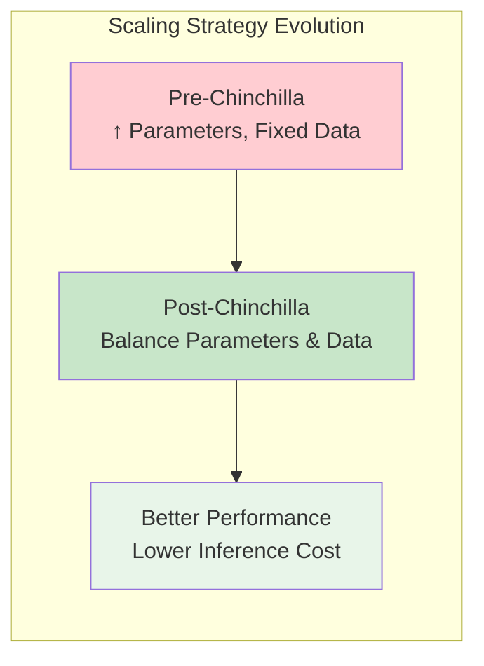

*Figure 5: Chinchilla laws shifted the scaling paradigm from parameter-centric to data-balanced approaches.*

### 3.2 Training Instability at Scale

Large-scale transformer training faces numerical challenges that compound across billions of parameters and thousands of layers.

**Primary Causes:**

| Issue | Description | Mitigation |
|-------|-------------|------------|
| **Gradient explosion/vanishing** | Gradients grow or shrink exponentially through layers | Careful initialization, gradient clipping |
| **Attention entropy collapse** | Attention becomes too peaked or too uniform | Temperature scaling, attention regularization |
| **Loss spikes** | Sudden training divergence | Learning rate warmup, checkpointing |
| **Numerical precision** | Float16/BF16 overflow/underflow | Mixed precision strategies, loss scaling |

**Architectural Solutions:**
- **Pre-LayerNorm**: Normalize before (not after) attention and FFN blocks
- **RMSNorm**: Simplified normalization without mean centering
- **Careful initialization**: Scale initial weights to prevent early instability

---

## 4. Alignment: From Pretraining to Helpfulness

### 4.1 The Three-Stage Alignment Pipeline

Raw pretrained models predict likely text continuations but don't inherently follow instructions or behave helpfully. Alignment transforms them into useful assistants.

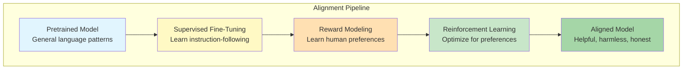

*Figure 6: The standard alignment pipeline progressively shapes model behavior from raw language modeling to helpful assistance.*

**Stage 1: Supervised Fine-Tuning (SFT)**
- Train on curated prompt-response pairs
- Objective: Standard cross-entropy on high-quality answers
- Purpose: Establish helpful baseline behavior

**Stage 2: Reward Modeling**
- Humans compare model responses and indicate preferences
- Train a reward model to predict human preferences
- Output: Scalar score reflecting response quality

**Stage 3: Reinforcement Learning (typically PPO)**
- Generate responses, score with reward model
- Update policy to maximize expected reward
- KL penalty prevents divergence from SFT model

### 4.2 Understanding the Loss Functions

Each training stage optimizes a different objective:

| Stage | Objective | What It Teaches |
|-------|-----------|-----------------|
| **Pretraining** | Next-token prediction (cross-entropy) | General language patterns, world knowledge |
| **SFT** | Next-token prediction on curated data | Instruction-following, response format |
| **RLHF** | Maximize reward while staying close to SFT | Nuanced preferences, safety, helpfulness |

**Key Distinction:** Pretraining and SFT use the same loss function but different data. RLHF uses a fundamentally different objective—preference optimization rather than imitation.

### 4.3 Constitutional AI: Scalable Alignment

Constitutional AI reduces human labeling requirements by having models self-critique using written principles.

**The Process:**
1. Define a "constitution" of behavioral principles
2. Model generates initial responses
3. Model critiques its own responses against principles
4. Model produces improved responses
5. Use improved responses for training

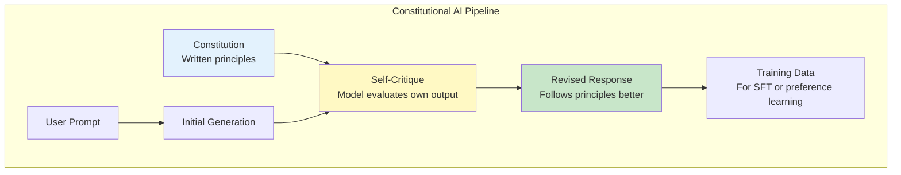

*Figure 7: Constitutional AI uses self-critique to generate alignment data at scale.*

**Advantages:**
- Reduces human labeling costs
- Provides consistent alignment signal
- Enables rapid iteration on behavioral guidelines

---

## 5. Inference Optimization and Deployment

### 5.1 Parameter-Efficient Fine-Tuning: LoRA and QLoRA

Full fine-tuning updates all model parameters—expensive and prone to catastrophic forgetting. Low-Rank Adaptation (LoRA) offers an efficient alternative.

**LoRA Mechanism:**
Instead of updating weight matrix W directly, LoRA learns a low-rank decomposition:
- Original: W (frozen)
- Update: ΔW = A × B (where A and B are small matrices)
- Inference: W + ΔW

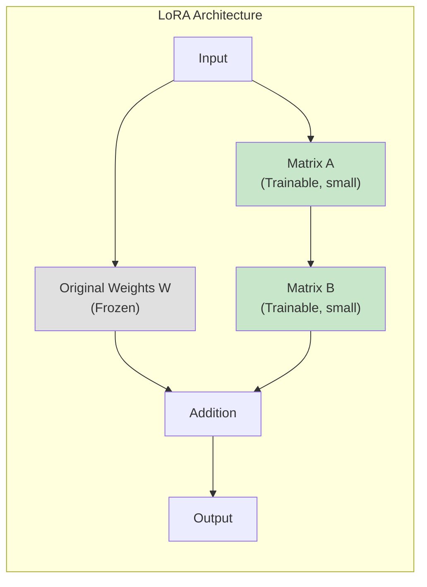

*Figure 8: LoRA adds trainable low-rank matrices alongside frozen original weights.*

**QLoRA Extension:**
- Quantize base model to 4-bit precision
- Train LoRA adapters in higher precision
- Enables fine-tuning very large models on consumer hardware

| Method | Base Model | Trainable Parameters | Memory Requirement |
|--------|-----------|---------------------|-------------------|
| **Full Fine-tuning** | 16-bit, all trainable | 100% | Very high |
| **LoRA** | 16-bit, frozen | ~0.1-1% | High |
| **QLoRA** | 4-bit, frozen | ~0.1-1% | Low |

### 5.2 Quantization and Distillation

**Quantization** reduces numerical precision of model weights:
- FP32 → FP16/BF16: 2x memory reduction, minimal quality loss
- FP16 → INT8: Additional 2x reduction, small quality impact
- INT8 → INT4: Further reduction, noticeable but often acceptable impact

**Knowledge Distillation** trains smaller models to mimic larger ones:
1. Large "teacher" model generates outputs
2. Small "student" model learns to match teacher behavior
3. Student captures teacher's knowledge in fewer parameters

---

## 6. Retrieval-Augmented Generation (RAG)

### 6.1 Why RAG Matters

LLMs have fixed knowledge cutoffs and limited context windows. RAG addresses these limitations by retrieving relevant information at inference time.

**Benefits:**
- Access to current information beyond training data
- Grounding in authoritative sources reduces hallucination
- Domain-specific knowledge without fine-tuning
- Transparent sourcing enables verification

### 6.2 RAG Pipeline Architecture

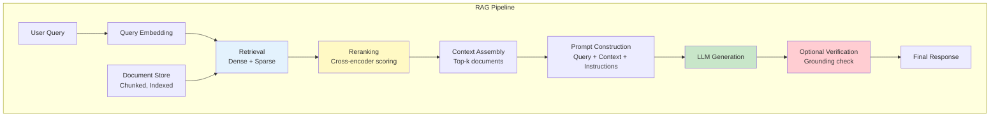

*Figure 9: A production RAG pipeline combines retrieval, reranking, and generation with optional verification.*

**Key Components:**

| Component | Purpose | Techniques |
|-----------|---------|------------|
| **Chunking** | Split documents into retrievable units | Fixed-size, semantic, hierarchical |
| **Indexing** | Enable fast similarity search | Dense embeddings, sparse (BM25), hybrid |
| **Retrieval** | Find relevant chunks | Vector similarity, keyword matching |
| **Reranking** | Improve retrieval precision | Cross-encoder models |
| **Generation** | Synthesize answer from context | Prompted LLM with retrieved content |

### 6.3 Why LLMs Still Hallucinate with RAG

Retrieval doesn't guarantee grounding. Common failure modes:

1. **Retrieved content doesn't answer the question**: Model fills gaps with parametric knowledge
2. **Conflicting information**: Model may prefer its training over retrieved evidence
3. **Weak grounding instructions**: Model treats context as suggestion, not constraint
4. **Over-interpretation**: Model infers connections not present in retrieved text

**Mitigation Strategies:**
- Explicit instructions to use only provided context
- Required citations for all claims
- Verification pass checking output against retrieved content
- Constrained decoding favoring retrieved text

---

## 7. Tools and Function Calling

### 7.1 Extending LLM Capabilities

LLMs excel at language but struggle with precise computation, real-time information, and external system interaction. Tools bridge this gap.

**What Tools Enable:**
- Accurate calculations (calculator, code execution)
- Current information (web search, APIs)
- System interaction (databases, file systems)
- Specialized processing (image analysis, data transformation)

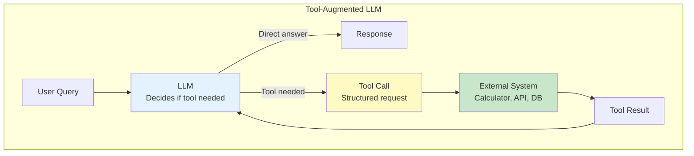

*Figure 10: Tool-augmented LLMs can delegate specialized tasks to external systems.*

### 7.2 Function Calling Workflow

1. **Intent Recognition**: Model determines a tool would help
2. **Schema Compliance**: Model formats request according to tool specification
3. **Execution**: External system processes the request
4. **Integration**: Model incorporates result into final response

**Benefits:**
- Dramatic reduction in hallucination for factual queries
- Precise computation without approximation
- Real-time information access
- Integration with existing enterprise systems

---

## 8. Hallucination: Causes and Mitigations

### 8.1 Why Models Hallucinate

LLMs optimize for fluent, likely text—not factual accuracy. Hallucination emerges from this fundamental mismatch.

**Root Causes:**

| Cause | Description |
|-------|-------------|
| **Pattern completion** | Model completes expected patterns even without supporting evidence |
| **Training objective** | Optimizing likelihood doesn't require truth |
| **Knowledge gaps** | Weak signal in training data leads to plausible fabrication |
| **Exposure bias** | Model never sees its own errors during training |

### 8.2 Mitigation Strategies

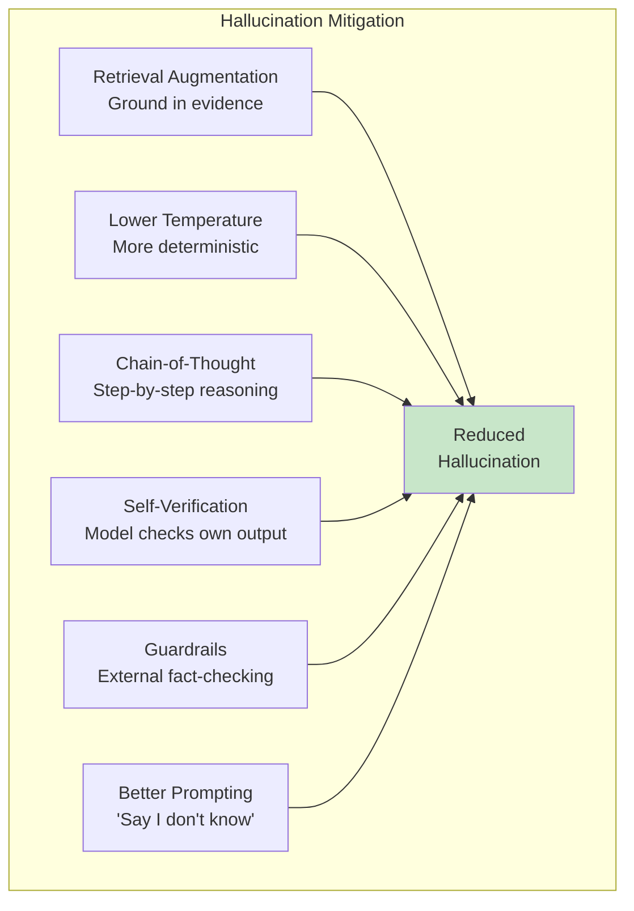

*Figure 11: Multiple complementary strategies reduce hallucination risk.*

**Practical Approaches:**

| Strategy | Implementation | Effectiveness |
|----------|---------------|---------------|
| **RAG** | Retrieve and cite sources | High for factual queries |
| **Temperature reduction** | Lower sampling randomness | Moderate |
| **Self-consistency** | Sample multiple times, choose consensus | Moderate-High |
| **Verification pass** | Second model checks claims | High but costly |
| **Explicit uncertainty** | Train model to express doubt | Moderate |

---

## 9. Evaluation Framework

### 9.1 Multi-Dimensional Assessment

Comprehensive LLM evaluation spans multiple quality dimensions:

**Helpfulness**: Does the model solve the user's problem?
- Task completion rate
- Response completeness and clarity
- Side-by-side preference comparisons

**Factuality**: Are the model's claims accurate?
- Fact-checking against known answers
- Retrieval-based verification
- Hallucination detection

**Robustness**: Does the model handle input variations gracefully?
- Paraphrase consistency
- Typo and noise tolerance
- Adversarial prompt resistance

**Safety**: Does the model avoid harmful outputs?
- Toxicity detection
- Refusal appropriateness
- Bias evaluation across demographics

### 9.2 Evaluation Methodology

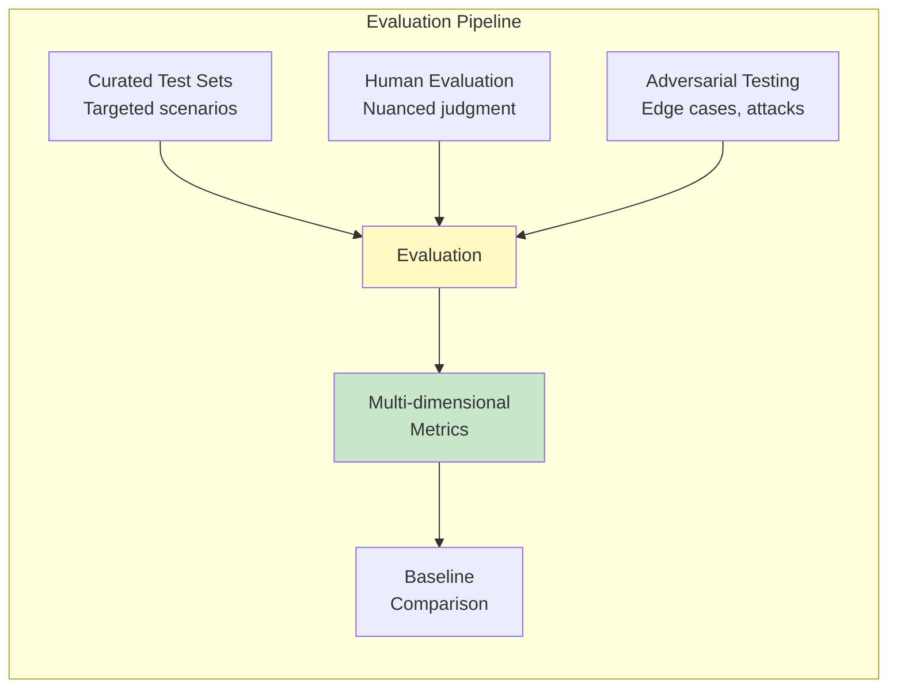

*Figure 12: Robust evaluation combines automated metrics, human judgment, and adversarial testing.*

---

## 10. Model Steerability

### 10.1 What Makes a Model Steerable?

Steerability refers to how reliably a model follows instructions to adjust its behavior—tone, length, formality, detail level, or domain focus.

**Indicators of Good Steerability:**
- Consistent response to explicit instructions
- Appropriate behavior adaptation across contexts
- Reliable adherence to system prompt guidelines
- Graceful handling of conflicting instructions

### 10.2 Improving Steerability

| Approach | Mechanism | Impact |
|----------|-----------|--------|
| **Diverse instruction data** | Train on varied instruction styles | High |
| **Preference training** | Reward instruction-following | High |
| **Clear system prompts** | Explicit behavioral guidelines | Moderate |
| **Few-shot examples** | Demonstrate desired behavior | Moderate |

---

## 11. Protecting Sensitive Information

### 11.1 Defense-in-Depth Strategy

Enterprise LLM deployments must prevent sensitive information disclosure through multiple protective layers.

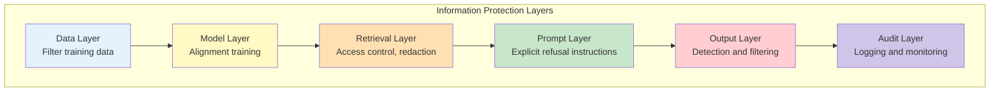

*Figure 13: Multiple protection layers prevent sensitive information disclosure.*

**Layer-by-Layer Protection:**

1. **Data filtering**: Remove secrets from training data
2. **Alignment**: Train model to refuse sensitive requests
3. **Access control**: Enforce permissions in retrieval
4. **Prompt engineering**: Explicit refusal instructions
5. **Output filtering**: Detect and block sensitive content
6. **Monitoring**: Log and audit for policy violations

---

## 12. Performance Optimization Metrics

### 12.1 Latency, Throughput, and Efficiency

**Latency**: Time from request to response
- Time-to-first-token (TTFT)
- Total generation time
- P95/P99 percentiles for tail latency

**Throughput**: System capacity under load
- Requests per second
- Tokens per second
- Concurrent user capacity

**Token Efficiency**: Resource utilization
- Input tokens per request
- Output tokens per response
- Cost per useful answer

### 12.2 Optimization Techniques

| Metric | Optimization Approaches |
|--------|------------------------|
| **Latency** | KV-cache, streaming, smaller models, quantization |
| **Throughput** | Batching, GPU utilization, horizontal scaling |
| **Efficiency** | Prompt compression, context caching, model distillation |

---

## 13. Conclusion

Mastering LLM technology requires understanding the full stack: from architectural innovations like RoPE and KV-caching, through training paradigms and alignment techniques, to deployment considerations including RAG, tools, and safety guardrails.

**Key Takeaways:**

1. **Architecture matters**: Positional encodings, attention patterns, and caching strategies fundamentally shape model capabilities
2. **Alignment is multi-stage**: Pretraining, SFT, and RLHF each contribute distinct aspects of model behavior
3. **Deployment is complex**: Production systems require retrieval, tools, safety measures, and performance optimization
4. **Evaluation is multi-dimensional**: Helpfulness, factuality, robustness, and safety all require attention
5. **The field evolves rapidly**: Continuous learning is essential as techniques and best practices advance

The concepts covered here form the foundation for effective LLM development and deployment. As the field continues to advance, these fundamentals provide the framework for understanding and applying new innovations.

---

## References

1. Vaswani, A., et al. (2017). "Attention Is All You Need." *Advances in Neural Information Processing Systems*.

2. Su, J., et al. (2021). "RoFormer: Enhanced Transformer with Rotary Position Embedding." *arXiv preprint*.

3. Hoffmann, J., et al. (2022). "Training Compute-Optimal Large Language Models." *arXiv preprint* (Chinchilla paper).

4. Ouyang, L., et al. (2022). "Training Language Models to Follow Instructions with Human Feedback." *arXiv preprint*.

5. Bai, Y., et al. (2022). "Constitutional AI: Harmlessness from AI Feedback." *arXiv preprint*.

6. Hu, E., et al. (2021). "LoRA: Low-Rank Adaptation of Large Language Models." *arXiv preprint*.

7. Dettmers, T., et al. (2023). "QLoRA: Efficient Finetuning of Quantized LLMs." *arXiv preprint*.

8. Lewis, P., et al. (2020). "Retrieval-Augmented Generation for Knowledge-Intensive NLP Tasks." *Advances in Neural Information Processing Systems*.

9. Schulman, J., et al. (2017). "Proximal Policy Optimization Algorithms." *arXiv preprint*.

10. BuildML. (2025). "Top 24 LLM Questions Asked at DeepMind, OpenAI, Meta and More." BuildML Newsletter.
