# Recommendation Systems: From Fundamentals to Production Architectures

## Abstract

Recommendation systems power much of the modern digital experience, from streaming platforms to e-commerce sites. Unlike traditional supervised learning, these systems operate on sparse, implicit behavioral data and optimize for ranking quality rather than prediction accuracy. This guide provides a comprehensive exploration of recommendation system fundamentals, covering evaluation metrics, modeling approaches from popularity-based methods through collaborative filtering and matrix factorization, and the architectural patterns that enable these systems to scale. Understanding these concepts is essential for building effective personalization systems and navigating technical discussions about recommendation infrastructure.

---

## 1. Introduction: The Recommendation Problem

Recommendation systems solve a fundamentally different problem than typical machine learning tasks. Rather than classifying inputs or predicting continuous values, they must surface the most relevant items from potentially millions of candidates for each individual user. This requires reasoning about user preferences from incomplete, noisy behavioral signals.

The challenge compounds at scale: users interact with only a tiny fraction of available items, preferences evolve over time, and new users and items constantly enter the system. These constraints shape every aspect of recommendation system design, from data representation to model architecture to evaluation methodology.

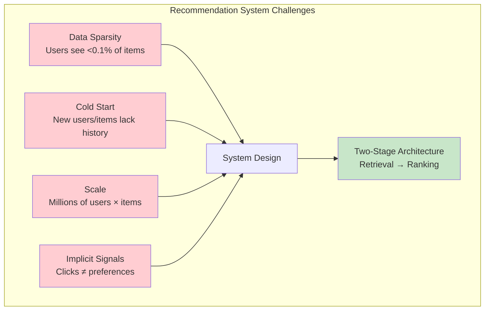
```mermaid
graph TD
    subgraph "Recommendation System Challenges"
    SPARSE["Data Sparsity<br/>Users see <0.1% of items"] --> DESIGN["System Design"]
    COLD["Cold Start<br/>New users/items lack history"] --> DESIGN
    SCALE["Scale<br/>Millions of users × items"] --> DESIGN
    IMPLICIT["Implicit Signals<br/>Clicks ≠ preferences"] --> DESIGN
    DESIGN --> ARCH["Two-Stage Architecture<br/>Retrieval → Ranking"]
    end
    
    style SPARSE fill:#ffcdd2
    style COLD fill:#ffcdd2
    style SCALE fill:#ffcdd2
    style IMPLICIT fill:#ffcdd2
    style ARCH fill:#c8e6c9
```

*Figure 1: Core challenges that shape recommendation system architecture.*

---

## 2. Data Foundations: Explicit vs. Implicit Feedback

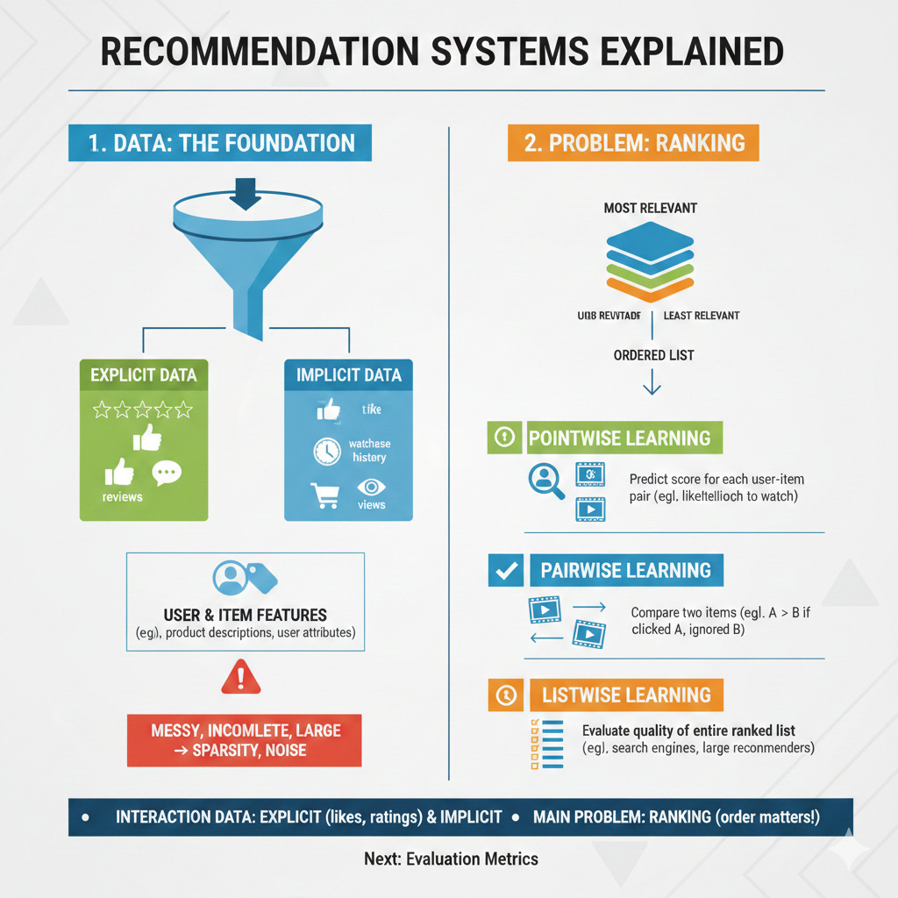
*Source: BuildML - Overview of recommendation system data flow and architecture.*

### 2.1 Types of User Signals

Recommendation systems learn from two fundamentally different types of user feedback:

**Explicit Feedback:**
- Direct expressions of preference (ratings, reviews, likes)
- Clear signal but sparse collection
- Examples: 5-star ratings, thumbs up/down, written reviews

**Implicit Feedback:**
- Behavioral signals inferred from actions
- Abundant but noisy and ambiguous
- Examples: clicks, watch time, purchases, page views, scroll depth

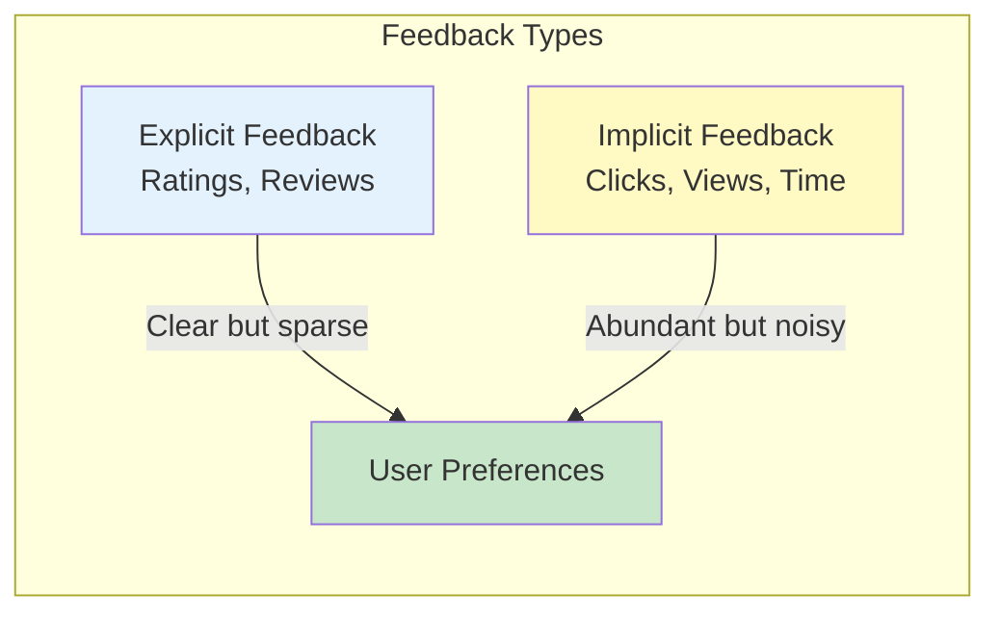
```mermaid
graph LR
    subgraph "Feedback Types"
    EXP["Explicit Feedback<br/>Ratings, Reviews"] --> |"Clear but sparse"| PREF["User Preferences"]
    IMP["Implicit Feedback<br/>Clicks, Views, Time"] --> |"Abundant but noisy"| PREF
    end
    
    style EXP fill:#e3f2fd
    style IMP fill:#fff9c4
    style PREF fill:#c8e6c9
```

*Figure 2: Explicit feedback provides clearer signals; implicit feedback provides more data.*

### 2.2 The Implicit Feedback Challenge

Most production systems rely primarily on implicit feedback because explicit signals are too rare. This creates several challenges:

| Challenge | Description | Mitigation |
|-----------|-------------|------------|
| **Ambiguous negatives** | Non-interaction doesn't mean dislike | Negative sampling strategies |
| **Position bias** | Items shown first get more clicks | Propensity score correction |
| **Popularity bias** | Popular items dominate signals | Inverse propensity weighting |
| **Temporal dynamics** | Preferences change over time | Time-decay weighting |

---

## 3. Problem Formulation: Rating Prediction vs. Ranking

### 3.1 The Shift from Prediction to Ranking

Early recommendation research focused on rating prediction: given a user and item, predict the rating. Modern systems recognize that ranking quality matters more than prediction accuracy.

**Why Ranking Matters More:**
- Users see ordered lists, not predicted scores
- A model can predict ratings accurately but rank poorly
- Top positions receive disproportionate attention
- Business value comes from surfacing the right items first

### 3.2 Learning Paradigms for Ranking

Three approaches frame the ranking learning problem differently:

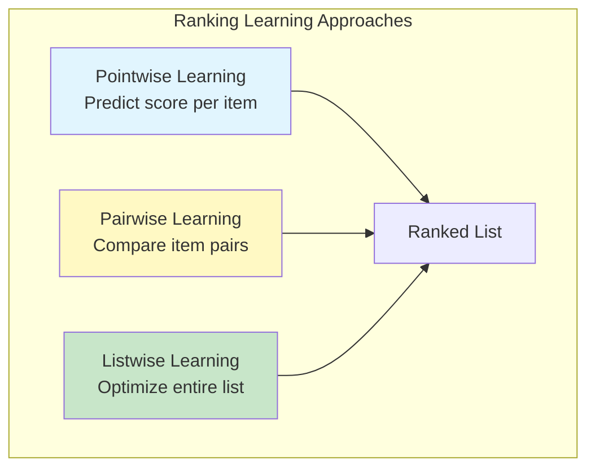
```mermaid
graph TD
    subgraph "Ranking Learning Approaches"
    POINT["Pointwise Learning<br/>Predict score per item"] --> RANK["Ranked List"]
    PAIR["Pairwise Learning<br/>Compare item pairs"] --> RANK
    LIST["Listwise Learning<br/>Optimize entire list"] --> RANK
    end
    
    style POINT fill:#e1f5fe
    style PAIR fill:#fff9c4
    style LIST fill:#c8e6c9
```

*Figure 3: Three paradigms for learning to rank, each with different optimization objectives.*

| Approach | Objective | Advantages | Disadvantages |
|----------|-----------|------------|---------------|
| **Pointwise** | Predict relevance score per item | Simple, interpretable | Ignores relative ordering |
| **Pairwise** | Predict which item user prefers | Directly models comparisons | Computationally expensive |
| **Listwise** | Optimize list-level metric | Aligns with evaluation | Complex optimization |

---

## 4. Evaluation Metrics: Measuring Recommendation Quality

### 4.1 Why Traditional Metrics Fall Short

Rating prediction metrics like RMSE and MAE measure prediction accuracy but miss what matters for recommendations:

$$\text{RMSE} = \sqrt{\frac{1}{N} \sum_{i=1}^{N} (\hat{y}_i - y_i)^2}$$

**The Problem:** A model can achieve low RMSE by accurately predicting ratings for items users will never see, while poorly ranking the items that actually matter.

### 4.2 Precision and Recall at K

These metrics evaluate the top-K recommendations:

**Precision@K**: What fraction of recommended items are relevant?

$$\text{Precision@K} = \frac{\text{Relevant items in top K}}{K}$$

**Recall@K**: What fraction of relevant items appear in recommendations?

$$\text{Recall@K} = \frac{\text{Relevant items in top K}}{\text{Total relevant items}}$$

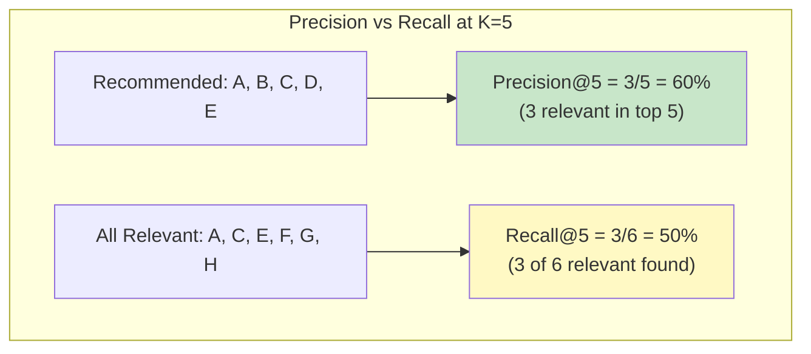
```mermaid
graph TD
    subgraph "Precision vs Recall at K=5"
    REC["Recommended: A, B, C, D, E"] --> PREC["Precision@5 = 3/5 = 60%<br/>(3 relevant in top 5)"]
    REL["All Relevant: A, C, E, F, G, H"] --> RECALL["Recall@5 = 3/6 = 50%<br/>(3 of 6 relevant found)"]
    end
    
    style PREC fill:#c8e6c9
    style RECALL fill:#fff9c4
```

*Figure 4: Precision measures recommendation accuracy; recall measures coverage of relevant items.*

**Limitation:** These metrics treat all positions within top-K equally, ignoring that position 1 matters more than position 10.

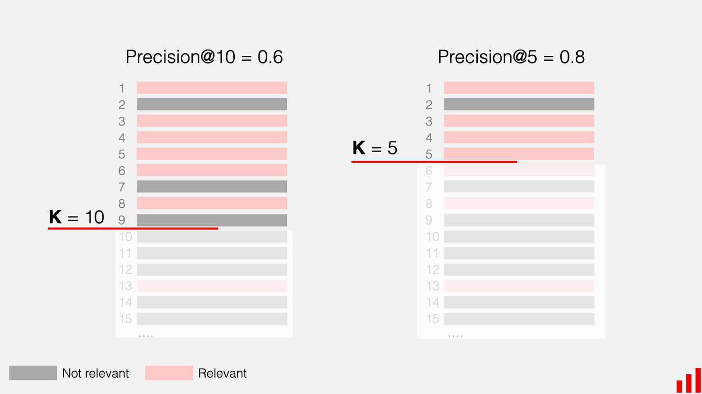
*Source: Evidently AI - Visual representation of Precision@K and Recall@K metrics.*

### 4.3 Mean Average Precision (MAP)

MAP rewards models that place relevant items earlier by computing precision at each relevant item's position:

$$\text{AP} = \frac{1}{R} \sum_{k=1}^{N} P(k) \times \text{rel}(k)$$

Where R is total relevant items, P(k) is precision at position k, and rel(k) indicates if position k contains a relevant item.

**Advantage:** Directly rewards early placement of relevant items.

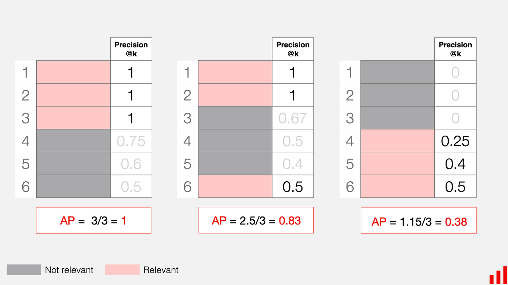
*Source: Evidently AI - How MAP rewards models that place relevant items earlier.*

### 4.4 Normalized Discounted Cumulative Gain (NDCG)

NDCG applies logarithmic position discounting, reflecting how user attention drops off:

$$\text{DCG@K} = \sum_{i=1}^{K} \frac{\text{rel}(i)}{\log_2(i + 1)}$$

$$\text{NDCG@K} = \frac{\text{DCG@K}}{\text{IDCG@K}}$$

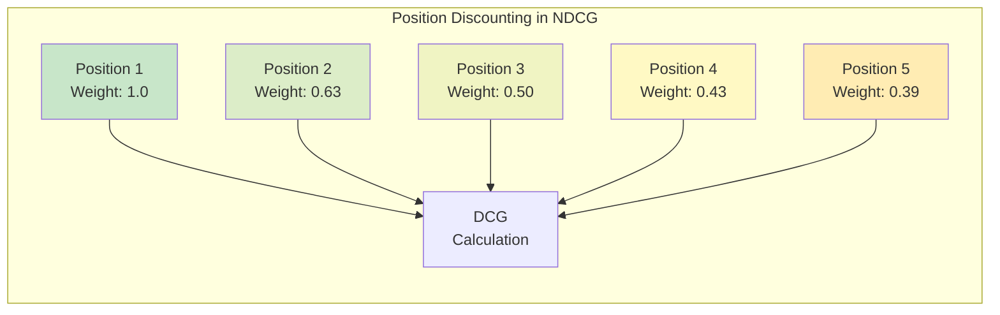
```mermaid
graph LR
    subgraph "Position Discounting in NDCG"
    P1["Position 1<br/>Weight: 1.0"] --> DCG["DCG<br/>Calculation"]
    P2["Position 2<br/>Weight: 0.63"] --> DCG
    P3["Position 3<br/>Weight: 0.50"] --> DCG
    P4["Position 4<br/>Weight: 0.43"] --> DCG
    P5["Position 5<br/>Weight: 0.39"] --> DCG
    end
    
    style P1 fill:#c8e6c9
    style P2 fill:#dcedc8
    style P3 fill:#f0f4c3
    style P4 fill:#fff9c4
    style P5 fill:#ffecb3
```

*Figure 5: NDCG applies logarithmic discounting—early positions contribute more to the score.*

**Why NDCG is Preferred:**
- Models realistic attention decay
- Normalizes across users with different numbers of relevant items
- Produces scores between 0 and 1 for easy comparison

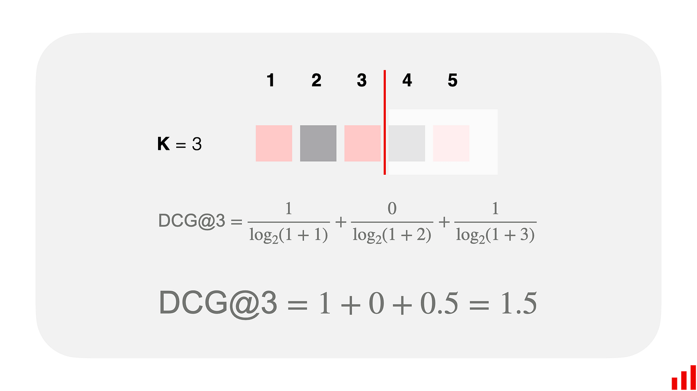
*Source: Evidently AI - NDCG applies logarithmic discounting based on position.*

### 4.5 Beyond Accuracy: Coverage and Diversity

Accuracy metrics alone miss important system properties:

| Metric | Definition | Why It Matters |
|--------|------------|----------------|
| **Coverage** | Fraction of catalog recommended | Prevents over-concentration on popular items |
| **Diversity** | Dissimilarity among recommendations | Improves user satisfaction and discovery |
| **Novelty** | Unexpectedness of recommendations | Balances exploitation with exploration |
| **Serendipity** | Surprising yet relevant items | Creates delight and engagement |

$$\text{Coverage} = \frac{\text{Unique items recommended}}{\text{Total catalog size}}$$

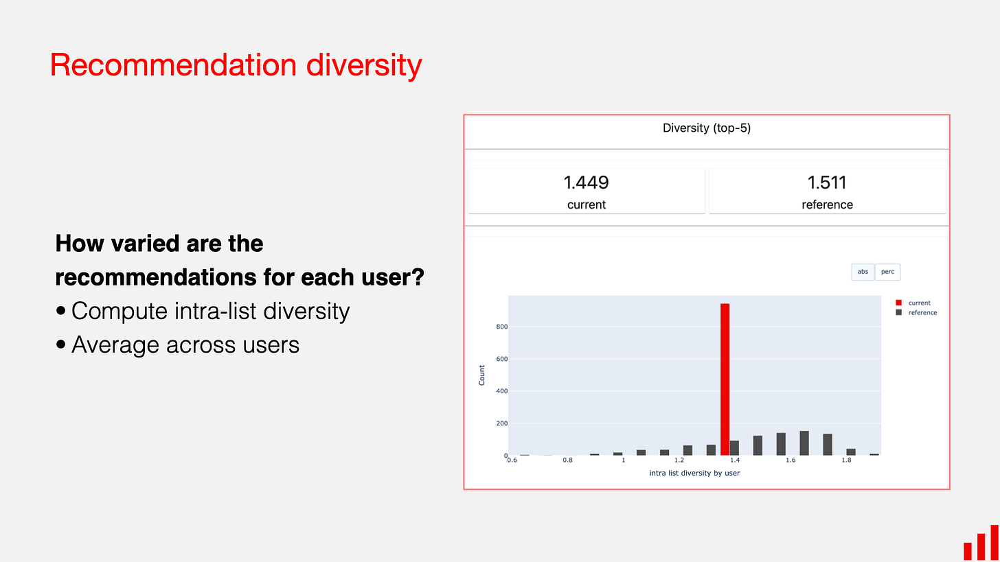
*Source: Evidently AI - Coverage and diversity metrics for recommendation quality.*

---

## 5. Modeling Approaches

### 5.1 Popularity-Based Recommendations

The simplest approach: recommend what's popular.

**Mechanism:**
- Rank items by interaction count, recency-weighted popularity, or trending score
- No personalization—all users see the same recommendations

**Strengths:**
- Zero cold-start problem
- Computationally trivial
- Reliable baseline

**Weaknesses:**
- No personalization
- Reinforces popularity bias
- Poor for niche users

**When to Use:**
- New user onboarding
- Fallback when personalization fails
- Trending/discovery sections

### 5.2 Content-Based Filtering

Recommend items similar to what the user previously liked, based on item attributes.

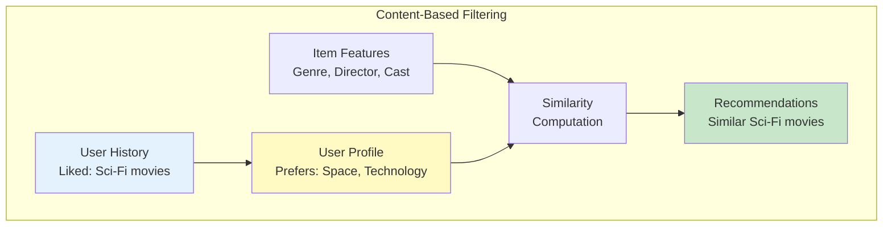
```mermaid
graph TD
    subgraph "Content-Based Filtering"
    USER["User History<br/>Liked: Sci-Fi movies"] --> PROFILE["User Profile<br/>Prefers: Space, Technology"]
    ITEMS["Item Features<br/>Genre, Director, Cast"] --> SIM["Similarity<br/>Computation"]
    PROFILE --> SIM
    SIM --> REC["Recommendations<br/>Similar Sci-Fi movies"]
    end
    
    style USER fill:#e3f2fd
    style PROFILE fill:#fff9c4
    style REC fill:#c8e6c9
```

*Figure 6: Content-based filtering matches user preferences to item attributes.*

**How It Works:**
1. Extract features from items (genre, description, metadata)
2. Build user profile from features of liked items
3. Recommend items with similar feature profiles

**Similarity Computation:**

$$\text{sim}(u, i) = \frac{\mathbf{u} \cdot \mathbf{i}}{\|\mathbf{u}\| \|\mathbf{i}\|}$$

**Strengths:**
- Works for new items with metadata
- Explainable recommendations
- No need for other users' data

**Weaknesses:**
- Limited to available features
- Creates filter bubbles (over-specialization)
- Cannot discover cross-category preferences

### 5.3 Collaborative Filtering

Learn from collective user behavior: users who agreed in the past will agree in the future.

#### User-Based Collaborative Filtering

Find similar users, recommend what they liked.

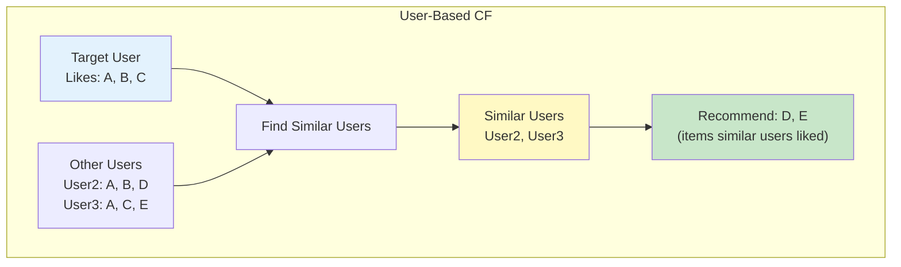
```mermaid
graph TD
    subgraph "User-Based CF"
    TARGET["Target User<br/>Likes: A, B, C"] --> SIM["Find Similar Users"]
    USERS["Other Users<br/>User2: A, B, D<br/>User3: A, C, E"] --> SIM
    SIM --> NEIGHBOR["Similar Users<br/>User2, User3"]
    NEIGHBOR --> REC["Recommend: D, E<br/>(items similar users liked)"]
    end
    
    style TARGET fill:#e3f2fd
    style NEIGHBOR fill:#fff9c4
    style REC fill:#c8e6c9
```

*Figure 7: User-based CF finds similar users and recommends their preferred items.*

**User Similarity:**

$$\text{sim}(u, v) = \frac{\mathbf{u} \cdot \mathbf{v}}{\|\mathbf{u}\| \|\mathbf{v}\|}$$

**Challenge:** User vectors are sparse and volatile—preferences change frequently.

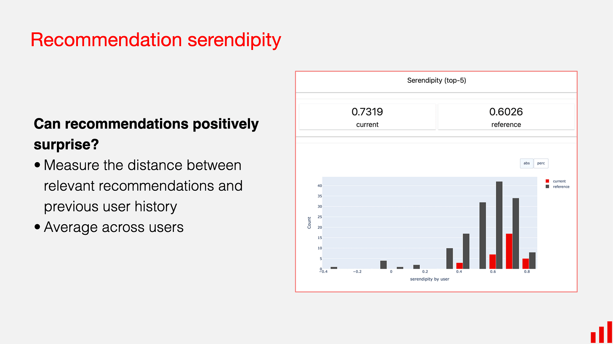
*Source: Google RecSys - User-based collaborative filtering finds similar users to make recommendations.*

#### Item-Based Collaborative Filtering

Find similar items based on co-consumption patterns.

**Key Insight:** If many users who liked item A also liked item B, those items are similar.

**Item Similarity:**

$$\text{sim}(i, j) = \frac{\mathbf{i} \cdot \mathbf{j}}{\|\mathbf{i}\| \|\mathbf{j}\|}$$

**Scoring:**

$$\text{score}(u, j) = \sum_{i \in \text{Items}(u)} \text{sim}(i, j)$$

**Why Item-Based Often Wins:**
- Item similarities are more stable than user similarities
- Popular items have dense interaction vectors
- Scales better (fewer items than users typically)
- Amazon famously found item-item CF outperformed user-user

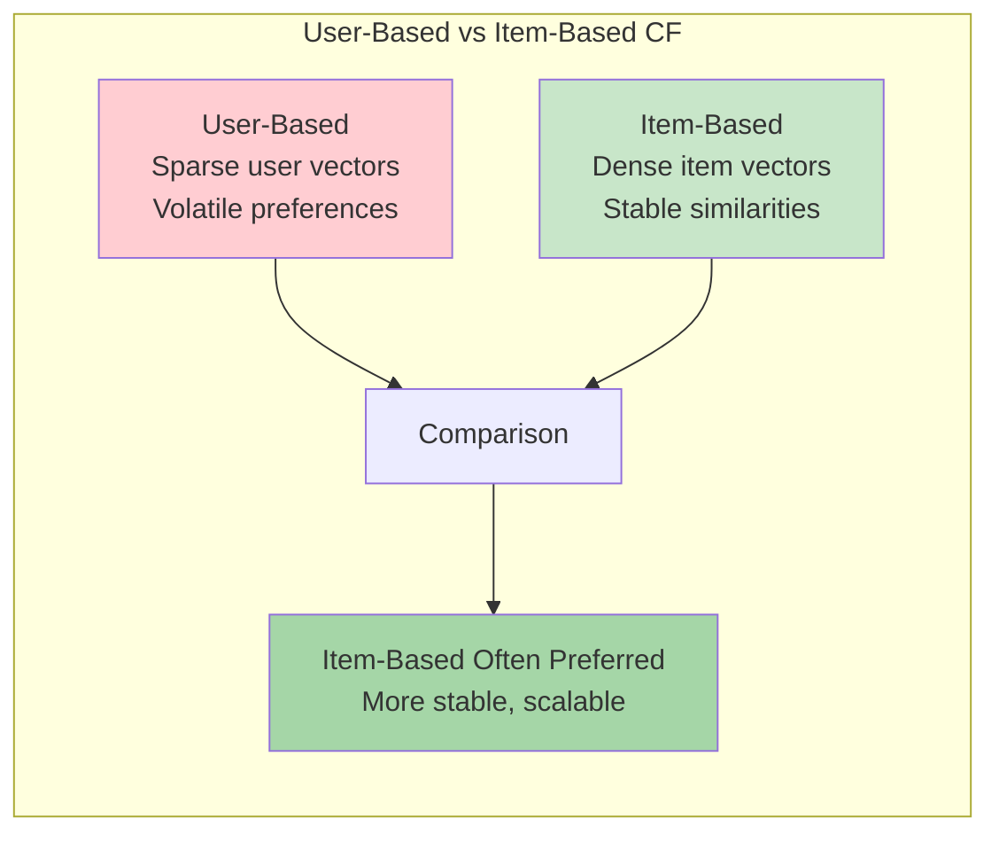
```mermaid
graph LR
    subgraph "User-Based vs Item-Based CF"
    UB["User-Based<br/>Sparse user vectors<br/>Volatile preferences"] --> COMPARE["Comparison"]
    IB["Item-Based<br/>Dense item vectors<br/>Stable similarities"] --> COMPARE
    COMPARE --> WINNER["Item-Based Often Preferred<br/>More stable, scalable"]
    end
    
    style UB fill:#ffcdd2
    style IB fill:#c8e6c9
    style WINNER fill:#a5d6a7
```

*Figure 8: Item-based CF typically outperforms user-based in production due to stability.*

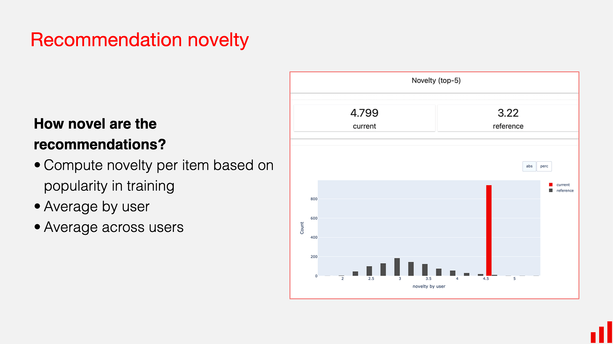
*Source: Google RecSys - Item-based CF compares items based on co-consumption patterns.*

### 5.4 Matrix Factorization

Decompose the user-item interaction matrix into latent factor representations.

**Core Idea:** User preferences and item characteristics can be represented as vectors in a shared latent space. The dot product predicts interaction strength.

$$\hat{R}_{ui} = \mathbf{u}_u^\top \mathbf{v}_i$$

**Objective Function:**

$$\min_{\mathbf{U}, \mathbf{V}} \sum_{(u,i) \in \Omega} (R_{ui} - \mathbf{u}_u^\top \mathbf{v}_i)^2 + \lambda(\|\mathbf{U}\|^2 + \|\mathbf{V}\|^2)$$

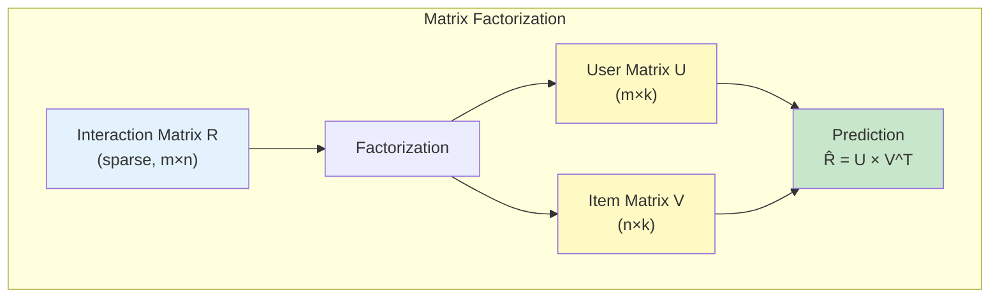
```mermaid
graph TD
    subgraph "Matrix Factorization"
    R["Interaction Matrix R<br/>(sparse, m×n)"] --> DECOMP["Factorization"]
    DECOMP --> U["User Matrix U<br/>(m×k)"]
    DECOMP --> V["Item Matrix V<br/>(n×k)"]
    U --> PRED["Prediction<br/>R̂ = U × V^T"]
    V --> PRED
    end
    
    style R fill:#e3f2fd
    style U fill:#fff9c4
    style V fill:#fff9c4
    style PRED fill:#c8e6c9
```

*Figure 9: Matrix factorization learns low-dimensional representations that reconstruct interactions.*

*Source: Google RecSys - Matrix factorization decomposes the user-item matrix into latent factors.*

**Why It Works:**
- Handles sparsity by learning generalizable patterns
- Latent factors capture implicit item properties
- Scales efficiently with dimensionality k << min(m, n)

#### Training Methods

| Method | Mechanism | Best For |
|--------|-----------|----------|
| **SVD** | Singular value decomposition | Dense matrices (requires imputation) |
| **SVD++** | Incorporates implicit feedback | Systems with both explicit and implicit signals |
| **ALS** | Alternating least squares | Large-scale, parallelizable training |
| **SGD** | Stochastic gradient descent | Flexible, easy to extend |

**ALS Advantage:** Fixes one matrix, solves for the other in closed form. Naturally parallelizable—each user/item vector can be computed independently.

*Source: Google RecSys - SVD-based approaches for learning user and item embeddings.*

*Source: Google RecSys - Training process for matrix factorization models.*

---

## 6. Cold Start: The Persistent Challenge

### 6.1 Types of Cold Start

| Type | Problem | Solutions |
|------|---------|-----------|
| **New User** | No interaction history | Popularity, content-based, onboarding surveys |
| **New Item** | No consumption data | Content features, boost exposure for data collection |
| **System** | New platform with no data | Import external data, start with content-based |

### 6.2 Mitigation Strategies

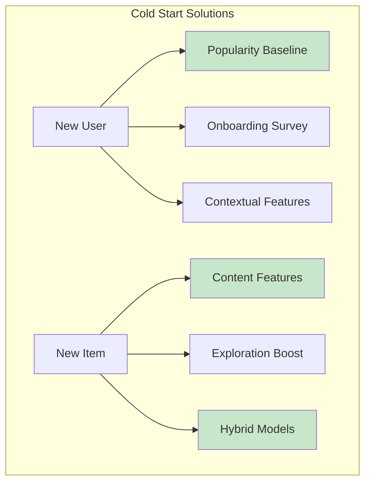
```mermaid
graph TD
    subgraph "Cold Start Solutions"
    NU["New User"] --> POP["Popularity Baseline"]
    NU --> ONBOARD["Onboarding Survey"]
    NU --> CONTEXT["Contextual Features"]
    
    NI["New Item"] --> CONTENT["Content Features"]
    NI --> BOOST["Exploration Boost"]
    NI --> HYBRID["Hybrid Models"]
    end
    
    style POP fill:#c8e6c9
    style CONTENT fill:#c8e6c9
    style HYBRID fill:#c8e6c9
```

*Figure 10: Different cold start scenarios require different mitigation strategies.*

*Source: BuildML - Strategies for handling cold start problems in recommendation systems.*

---

## 7. Production Architecture: Two-Stage Systems

### 7.1 Why Two Stages?

Ranking all items for every request is computationally infeasible at scale. Production systems split the problem:

1. **Retrieval (Candidate Generation):** Quickly select hundreds of candidates from millions
2. **Ranking:** Apply expensive models to score and order candidates

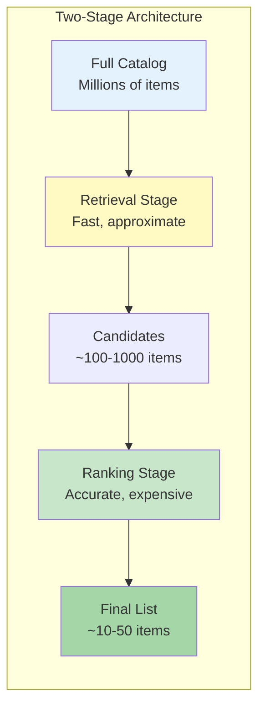
```mermaid
graph LR
    subgraph "Two-Stage Architecture"
    CATALOG["Full Catalog<br/>Millions of items"] --> RETRIEVE["Retrieval Stage<br/>Fast, approximate"]
    RETRIEVE --> CANDIDATES["Candidates<br/>~100-1000 items"]
    CANDIDATES --> RANK["Ranking Stage<br/>Accurate, expensive"]
    RANK --> FINAL["Final List<br/>~10-50 items"]
    end
    
    style CATALOG fill:#e3f2fd
    style RETRIEVE fill:#fff9c4
    style RANK fill:#c8e6c9
    style FINAL fill:#a5d6a7
```

*Figure 11: Two-stage architecture balances computational cost with ranking quality.*

### 7.2 Retrieval Stage

**Goals:** Speed and coverage (don't miss relevant items)

**Common Approaches:**
- Approximate Nearest Neighbor (ANN) search on embeddings
- Multiple retrieval sources (popularity, collaborative, content)
- Lightweight scoring models

**ANN Algorithms:** HNSW, FAISS, ScaNN—trade small accuracy loss for massive speedup

### 7.3 Ranking Stage

**Goals:** Precision and relevance ordering

**Common Approaches:**
- Gradient-boosted trees (XGBoost, LightGBM)
- Deep neural rankers
- Learning-to-rank objectives

---

## 8. Handling Implicit Feedback

### 8.1 The Negative Sampling Problem

Implicit data lacks explicit negatives. Non-interaction is ambiguous—the user might dislike the item, or simply never saw it.

**Solutions:**

| Strategy | Description | Tradeoff |
|----------|-------------|----------|
| **Random negatives** | Sample random non-interacted items | Simple but noisy |
| **Popularity-weighted** | Sample popular non-interacted items | Harder negatives |
| **In-batch negatives** | Use other users' positives as negatives | Efficient, may have false negatives |

### 8.2 Loss Functions for Implicit Feedback

**Bayesian Personalized Ranking (BPR):**
Optimize pairwise ranking—positive items should score higher than negatives.

$$\mathcal{L}_{BPR} = -\sum_{(u,i,j)} \log \sigma(\hat{r}_{ui} - \hat{r}_{uj})$$

Where (u, i, j) represents user u, positive item i, negative item j.

---

## 9. Common Interview Questions

### Q1: Why are ranking metrics preferred over RMSE?

RMSE measures prediction accuracy across all items, including those users will never see. Ranking metrics evaluate whether relevant items appear at the top of the list, which directly reflects user experience. A model can achieve low RMSE while producing poor rankings.

### Q2: When would you use item-based vs. user-based collaborative filtering?

Item-based CF is typically preferred because:
- Item similarities are more stable over time
- Popular items have denser interaction vectors
- Scales better (usually fewer items than users)
- More robust to user behavior changes

User-based CF may work better when user communities are well-defined and stable.

### Q3: How do you handle cold start for new users?

Start with non-personalized methods:
- Popularity-based recommendations
- Content-based using available attributes
- Onboarding surveys or preference elicitation
- Contextual features (device, location, time)

Gradually transition to collaborative methods as interaction history accumulates.

### Q4: What's the advantage of matrix factorization over memory-based CF?

Matrix factorization:
- Generalizes better under sparsity
- Learns latent representations that smooth noise
- Scales more efficiently (fixed-size embeddings)
- Can incorporate regularization to prevent overfitting

Memory-based methods rely directly on observed interactions and become unstable with sparse data.

### Q5: Why is diversity important in recommendations?

Even accurate recommendations can feel repetitive. Diversity:
- Improves user satisfaction
- Prevents filter bubbles
- Encourages exploration and discovery
- Reduces risk of user fatigue

### Q6: How do you evaluate implicit feedback models offline?

Use ranking metrics (Precision@K, NDCG) with careful evaluation design:
- Construct positives from interactions
- Sample negatives carefully (not all non-interactions are true negatives)
- Use temporal splits (train on past, evaluate on future)
- Validate with online A/B tests

### Q7: Why do production systems use two-stage architectures?

Computational necessity:
- Ranking millions of items per request is infeasible
- Retrieval stage quickly narrows to manageable candidates
- Ranking stage applies expensive models to smaller set
- Enables using different models optimized for each stage

---

## 10. Model Selection Guidelines

### 10.1 Decision Framework

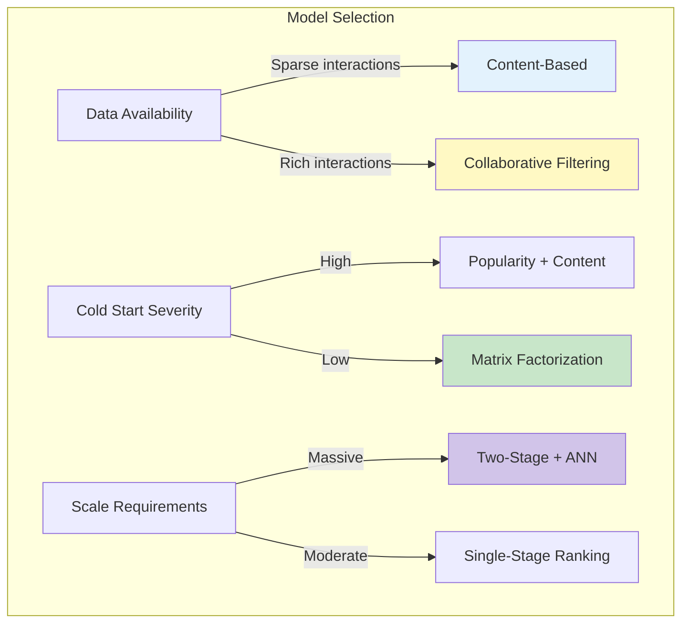
```mermaid
graph TD
    subgraph "Model Selection"
    DATA["Data Availability"] --> |"Sparse interactions"| CONTENT["Content-Based"]
    DATA --> |"Rich interactions"| CF["Collaborative Filtering"]
    
    COLD["Cold Start Severity"] --> |"High"| POP["Popularity + Content"]
    COLD --> |"Low"| MF["Matrix Factorization"]
    
    SCALE["Scale Requirements"] --> |"Massive"| TWO["Two-Stage + ANN"]
    SCALE --> |"Moderate"| SINGLE["Single-Stage Ranking"]
    end
    
    style CONTENT fill:#e3f2fd
    style CF fill:#fff9c4
    style MF fill:#c8e6c9
    style TWO fill:#d1c4e9
```

*Figure 12: Model selection depends on data availability, cold start severity, and scale requirements.*

### 10.2 Hybrid Approaches

Most production systems combine multiple methods:

| Component | Purpose |
|-----------|---------|
| **Popularity** | Cold start fallback, trending content |
| **Content-based** | New item handling, explainability |
| **Collaborative** | Personalization from behavior |
| **Matrix factorization** | Scalable embeddings |
| **Deep models** | Complex feature interactions |

---

## 11. Conclusion

Recommendation systems represent a distinct machine learning paradigm where ranking quality, data sparsity, and scale constraints drive every design decision. Success requires understanding:

1. **Data characteristics**: Implicit feedback dominates but is noisy and ambiguous
2. **Evaluation alignment**: Ranking metrics (NDCG, MAP) reflect user experience better than prediction accuracy
3. **Model tradeoffs**: Each approach (popularity, content, collaborative, matrix factorization) has distinct strengths
4. **Cold start strategies**: New users and items require special handling
5. **Production architecture**: Two-stage retrieval + ranking enables scale

The field continues to evolve with deep learning approaches, but the fundamentals covered here remain essential for building effective recommendation systems and discussing them in technical contexts.

---

## References

1. Koren, Y., Bell, R., & Volinsky, C. (2009). "Matrix Factorization Techniques for Recommender Systems." *IEEE Computer*.

2. Rendle, S., et al. (2009). "BPR: Bayesian Personalized Ranking from Implicit Feedback." *UAI*.

3. Hu, Y., Koren, Y., & Volinsky, C. (2008). "Collaborative Filtering for Implicit Feedback Datasets." *ICDM*.

4. Covington, P., Adams, J., & Sargin, E. (2016). "Deep Neural Networks for YouTube Recommendations." *RecSys*.

5. He, X., et al. (2017). "Neural Collaborative Filtering." *WWW*.

6. Linden, G., Smith, B., & York, J. (2003). "Amazon.com Recommendations: Item-to-Item Collaborative Filtering." *IEEE Internet Computing*.

7. Ricci, F., Rokach, L., & Shapira, B. (2015). *Recommender Systems Handbook*. Springer.

8. BuildML. (2025). "Mastering Recommendation Systems for Machine Learning Interviews." BuildML Newsletter.

9. Google Developers. "Recommendation Systems Course." Machine Learning Crash Course.

10. Järvelin, K., & Kekäläinen, J. (2002). "Cumulated Gain-Based Evaluation of IR Techniques." *ACM TOIS*.
