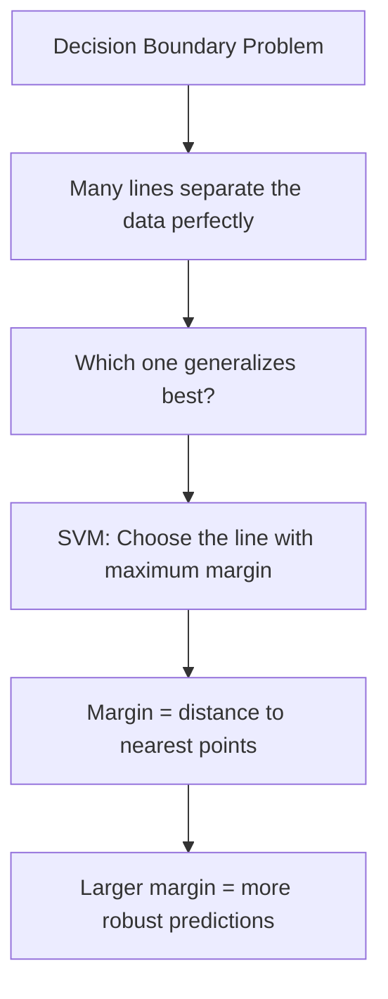
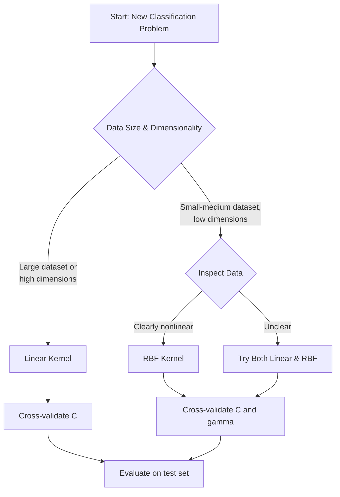

# Crash Course to Crack Machine Learning Interview – Part 5: Support Vector Machines

### Mastering margins, kernels, and optimization for ML interviews

Support Vector Machines (SVMs) occupy a unique position in machine learning interviews. They're not necessarily the most widely deployed algorithm in production today, but they represent a convergence of fundamental concepts that every data scientist should master: **geometry, optimization, generalization, and the bias-variance tradeoff**. Understanding SVMs signals to interviewers that you grasp how machine learning models balance competing objectives to learn from data.

At their core, SVMs reframe classification as a **geometric problem**. Instead of simply assigning labels to data points, SVMs ask: "Where should we draw the decision boundary, and how can we make it as robust as possible?" The answer lies in **maximizing the margin** — the breathing room between the boundary and the nearest points from each class.

This geometric intuition leads naturally to an **optimization framework** where the model balances two competing goals: maintaining a wide margin for generalization while still correctly classifying (most of) the training data. When you add the **kernel trick** to this foundation, SVMs gain the ability to learn complex, nonlinear decision boundaries without explicitly constructing high-dimensional feature spaces.

For interviews, SVMs test whether you can:
- Explain geometric intuition clearly without relying solely on equations
- Reason about optimization objectives and constraints
- Understand hyperparameter effects on model behavior
- Know when SVMs are appropriate versus when simpler models suffice

In this guide, we'll build a comprehensive understanding of SVMs from first principles, explore their optimization mechanics, discuss practical considerations, and tackle the most common interview questions you're likely to encounter.

## The Geometric Intuition: Why Margins Matter

Let's start with a fundamental question: when you have data from two classes that can be separated by a line (or hyperplane in higher dimensions), which line should you choose?

Consider a simple 2D dataset where red and blue points are cleanly separated. You could draw countless lines that perfectly classify all training points. Some lines pass very close to certain points, while others maintain more distance from both classes. Intuitively, which seems more trustworthy?



SVMs formalize this intuition: **choose the boundary that maximizes the margin** — the minimum distance between the boundary and any training point. This principle has profound implications:

**1. Robustness to Noise**

A larger margin means small perturbations in the data are less likely to cause misclassifications. If your boundary barely squeezes between classes, a slight shift in measurement or new data points could flip predictions. A wide margin provides buffer space.

**2. Reduced Overfitting**

By focusing on maximizing margin rather than perfectly fitting every training point, SVMs implicitly regularize the model. The margin constraint prevents the boundary from contorting to accommodate every detail of the training set.

**3. Support Vectors Define Everything**

Here's a crucial insight: only the points closest to the boundary actually matter. These **support vectors** determine where the boundary lies. Points far from the margin could be removed without changing the decision boundary at all. This sparsity is both elegant and computationally efficient.

**4. Distance Over Probability**

Unlike logistic regression, which models class probabilities, SVMs care about **geometric distance** from the boundary. A point barely on the correct side and a point far away are treated very differently — the former may become a support vector that influences the boundary, while the latter is ignored.

This geometric perspective also explains why SVMs can work well in high-dimensional spaces. As dimensionality increases, there are many possible separating hyperplanes. The maximum margin principle provides a principled way to select among them, favoring simpler, more stable boundaries.

## Hard Margin vs. Soft Margin: Dealing with Reality

The maximum margin principle works beautifully when data is **perfectly linearly separable** — when a hyperplane exists that separates classes with no errors. But real-world data rarely cooperates. You'll encounter:

- **Noise and mislabeled points**: Incorrect labels that would prevent perfect separation
- **Class overlap**: Regions where classes naturally intermix
- **Outliers**: Extreme points that shouldn't dictate the entire boundary

**Hard Margin SVM** assumes perfect separability. Every point must lie on the correct side of the boundary and outside the margin. If even one point violates this constraint, the optimization problem has no solution. This brittleness makes hard margin SVMs impractical for most applications.

**Soft Margin SVM** relaxes this requirement through **slack variables** (denoted ξᵢ for each point i):

- If ξᵢ = 0, the point is correctly classified and outside the margin (ideal case)
- If 0 < ξᵢ < 1, the point is correctly classified but inside the margin (margin violation)
- If ξᵢ ≥ 1, the point is misclassified (error)

The soft margin objective becomes:

$$\min_{w, b, \xi} \frac{1}{2} ||w||^2 + C \sum_{i=1}^{n} \xi_i$$

Subject to:
$$y_i(w \cdot x_i + b) \geq 1 - \xi_i$$
$$\xi_i \geq 0$$

This formulation explicitly balances two goals:
- **Minimize $||w||^2$**: Maximize the margin (margin = 2/||w||)
- **Minimize $\sum \xi_i$**: Minimize margin violations and errors

The parameter **C** controls this tradeoff, which we'll explore in detail shortly.

The soft margin formulation transforms SVMs from a theoretical curiosity into a practical algorithm that handles messy, real-world data while still maintaining the geometric elegance of maximum margin separation.

## The Optimization Perspective: What SVMs Actually Minimize

Understanding SVMs as an optimization problem reveals why they have desirable properties like convexity and global optima. The soft margin formulation above is called the **primal problem**.

#### Primal Formulation

In the primal form, we directly optimize the weight vector **w** that defines the hyperplane:

$$f(x) = w \cdot x + b$$

The decision boundary is where f(x) = 0, and the margin has width 2/||w||. Maximizing the margin is equivalent to minimizing ||w||².

#### Dual Formulation

The **dual problem** provides an alternative view that's crucial for understanding kernels. By applying Lagrangian duality and KKT conditions, we can rewrite the problem in terms of **Lagrange multipliers αᵢ** for each training point:

$$\max_{\alpha} \sum_{i=1}^{n} \alpha_i - \frac{1}{2} \sum_{i=1}^{n} \sum_{j=1}^{n} \alpha_i \alpha_j y_i y_j (x_i \cdot x_j)$$

Subject to: $\sum_{i=1}^{n} \alpha_i y_i = 0$ and $0 \leq \alpha_i \leq C$

Key insights from the dual:

**1. Only Support Vectors Matter**

In the optimal solution, most αᵢ = 0. Only points with αᵢ > 0 are support vectors that influence the boundary.

**2. Predictions Use Dot Products**

The decision function becomes:
$$f(x) = \sum_{i \in SV} \alpha_i y_i (x_i \cdot x) + b$$

We only need dot products between data points, never the explicit weight vector w.

**3. Kernel Trick Becomes Possible**

Since predictions only require dot products, we can replace $(x_i \cdot x)$ with a kernel function $K(x_i, x)$ without ever computing transformed features. This is the gateway to nonlinear SVMs.

#### Convexity and Global Optima

A critical property: the SVM optimization problem is **convex**. There's a single global minimum, no local optima to worry about. This contrasts sharply with neural networks, where initialization and training dynamics significantly affect the solution. For SVMs, different optimization algorithms will find the same answer (within numerical precision).

## The Regularization Parameter C: Controlling the Tradeoff

The parameter C is your primary lever for controlling model complexity and generalization. Understanding its effect is essential for both interviews and practice.

**C controls how much the model penalizes margin violations and errors.**

#### Large C (C → ∞)

- **Effect**: Heavy penalty for any violation
- **Boundary behavior**: Tries to classify every training point correctly
- **Margin**: Narrow, squeezes between classes
- **Overfitting risk**: High — sensitive to noise and outliers
- **Bias-variance**: Low bias, high variance

When C is large, even small errors are costly. The model will distort the boundary to correctly classify borderline points, even if they're noisy. In the extreme case (hard margin), no violations are allowed at all.

#### Small C (C → 0)

- **Effect**: Tolerant of violations
- **Boundary behavior**: Prioritizes margin width over perfect classification
- **Margin**: Wide, smooth
- **Underfitting risk**: Moderate — may ignore legitimate patterns
- **Bias-variance**: Higher bias, lower variance

When C is small, the model accepts misclassifications and margin violations in exchange for a simpler, more stable boundary. This often improves generalization, especially with noisy data.

#### Practical Guidance

- **Start with cross-validation**: Try C ∈ {0.01, 0.1, 1, 10, 100} and select based on validation performance
- **Consider data quality**: Noisy data benefits from smaller C
- **Scale matters**: C's effect depends on feature scale and sample size
- **Interaction with kernel**: C works together with kernel parameters like gamma

In interviews, explaining C in terms of "strictness vs. tolerance" or "fitting training data vs. maintaining margin" demonstrates intuitive understanding beyond mathematical definitions.

## The Kernel Trick: Nonlinear Decision Boundaries

Linear boundaries work well for many problems, but real data often demands more flexibility. Classes might be arranged in concentric circles, spiral patterns, or other nonlinear configurations that no straight line can separate.

#### The Feature Mapping Idea

One approach: manually transform features to make the problem linearly separable. For example, if data forms concentric circles, adding a feature $x_3 = x_1^2 + x_2^2$ (distance from origin) could help separate them.

But which transformations should you try? How high-dimensional should the feature space be? The **kernel trick** provides an elegant answer.

#### Kernels: Implicit Feature Spaces

A kernel function $K(x_i, x_j)$ computes the dot product between points in some transformed feature space **without explicitly constructing that space**:

$$K(x_i, x_j) = \phi(x_i) \cdot \phi(x_j)$$

Where φ(x) is an implicit transformation to a higher-dimensional space.

Since the dual SVM formulation only requires dot products, we can replace $(x_i \cdot x_j)$ with $K(x_i, x_j)$. The model learns a linear boundary in the transformed space, which corresponds to a **nonlinear boundary in the original space**.

This is computationally powerful: we gain the expressiveness of high-dimensional feature spaces without the memory and computation costs of explicitly constructing them.

#### Common Kernel Functions

**1. Linear Kernel**
$$K(x_i, x_j) = x_i \cdot x_j$$

- No transformation, equivalent to standard linear SVM
- Fast, scalable, often sufficient for high-dimensional data (e.g., text)
- Always try this first as a baseline

**2. Polynomial Kernel**
$$K(x_i, x_j) = (\gamma x_i \cdot x_j + r)^d$$

- Captures feature interactions up to degree d
- d=2 allows quadratic boundaries
- Higher degrees increase complexity but risk overfitting
- Less commonly used due to sensitivity to parameters

**3. Radial Basis Function (RBF) / Gaussian Kernel**
$$K(x_i, x_j) = \exp(-\gamma ||x_i - x_j||^2)$$

- Most popular nonlinear kernel
- Measures similarity based on Euclidean distance
- Produces smooth, localized decision boundaries
- Can model very complex patterns
- Controlled by gamma (discussed next)

**4. Sigmoid Kernel**
$$K(x_i, x_j) = \tanh(\gamma x_i \cdot x_j + r)$$

- Mimics neural network activation
- Rarely used in practice due to unpredictable behavior
- Not always positive semi-definite (violates kernel requirements)

#### Kernel Selection Strategy



## Gamma: Controlling Kernel Complexity

When using the RBF kernel, the parameter **gamma** (γ) determines how localized the influence of each training point is. Understanding gamma is crucial for interview questions and practical tuning.

#### Mathematical Role

In the RBF kernel, gamma appears in the exponent:
$$K(x_i, x_j) = \exp(-\gamma ||x_i - x_j||^2)$$

- Larger gamma → faster decay as distance increases
- Smaller gamma → slower decay, broader influence

#### Effect on Decision Boundaries

**High Gamma (γ → ∞)**

- **Influence**: Each point affects only a tiny neighborhood
- **Boundary**: Highly localized, complex, wiggly
- **Behavior**: Model acts almost like k-nearest neighbors
- **Risk**: Severe overfitting, memorizes training data
- **Bias-variance**: Very low bias, extremely high variance

**Low Gamma (γ → 0)**

- **Influence**: Each point affects large regions
- **Boundary**: Smooth, global, approaches linear
- **Behavior**: Model captures only broad patterns
- **Risk**: Underfitting, ignores fine-grained structure
- **Bias-variance**: Higher bias, lower variance

#### Interaction with C

Gamma and C interact strongly:

- **High C + High gamma**: Extremely flexible, aggressive overfitting
- **High C + Low gamma**: Moderate flexibility, balanced
- **Low C + High gamma**: Complex boundary but tolerant of violations
- **Low C + Low gamma**: Simple, smooth, high regularization

Both should be tuned together using grid search or random search over cross-validation folds.

#### Feature Scaling is Critical

Gamma is distance-based, making it **highly sensitive to feature scales**. If one feature ranges from 0-1 and another from 0-1000, the latter will dominate distance calculations.

**Always standardize features** (zero mean, unit variance) before using RBF kernels. This isn't optional — it's required for gamma to behave predictably.

#### Default Values and Tuning

- **Scikit-learn default**: gamma = 1 / (n_features × X.var())
- **Common search range**: {0.001, 0.01, 0.1, 1, 10, 100}
- **Strategy**: Grid search or random search with cross-validation

In interviews, the key message is: **gamma controls locality and complexity**. High gamma creates complex, overfitting-prone boundaries, while low gamma produces smoother, more regularized ones.

## Feature Scaling: A Non-Negotiable Requirement

Unlike tree-based models, SVMs are **not scale-invariant**. Feature scaling isn't just a best practice — it's essential for the algorithm to work correctly.

#### Why Scaling Matters

**1. Margin Calculation**

The margin is computed based on ||w||², which depends on feature magnitudes. Unscaled features cause larger-scale features to dominate the margin, effectively ignoring smaller-scale features.

**2. Kernel Distance**

RBF and polynomial kernels compute distances or dot products. Features with larger scales will overwhelm these calculations, making gamma and other parameters behave unpredictably.

**3. Optimization Convergence**

SVM solvers use gradient-based or quadratic programming methods that converge much faster when features are on similar scales.

#### Scaling Methods

**Standardization (Z-score normalization)** — Most common for SVMs
```python
from sklearn.preprocessing import StandardScaler
scaler = StandardScaler()
X_scaled = scaler.fit_transform(X_train)
```

Transforms features to zero mean and unit variance: $x' = \frac{x - \mu}{\sigma}$

**Min-Max Scaling** — Alternative for bounded features
```python
from sklearn.preprocessing import MinMaxScaler
scaler = MinMaxScaler()
X_scaled = scaler.fit_transform(X_train)
```

Transforms features to [0, 1] range: $x' = \frac{x - \min(x)}{\max(x) - \min(x)}$

#### Critical Points for Interviews

- **Scale before training**: Fit the scaler on training data only, then transform both train and test
- **Include in pipeline**: Use `sklearn.pipeline.Pipeline` to prevent data leakage
- **Linear kernels too**: Even linear SVMs benefit from scaling for optimization
- **Red flag**: Discussing C and gamma tuning without mentioning scaling suggests lack of practical experience

```python
from sklearn.pipeline import Pipeline
from sklearn.preprocessing import StandardScaler
from sklearn.svm import SVC

# Correct approach: scaling in pipeline
pipeline = Pipeline([
    ('scaler', StandardScaler()),
    ('svm', SVC(kernel='rbf', C=1.0, gamma='scale'))
])
pipeline.fit(X_train, y_train)
predictions = pipeline.predict(X_test)
```

## Handling Multiclass Classification

SVMs are inherently **binary classifiers** — designed to separate two classes. Real-world problems often involve multiple classes (e.g., classifying images into 10 digit categories). How do we extend SVMs to multiclass settings?

Libraries like scikit-learn handle this automatically, but interviewers want to know what's happening under the hood.

#### One-vs-Rest (OvR) / One-vs-All

**Strategy**: Train K separate binary classifiers (one per class)
- Classifier i learns to distinguish class i from all other classes combined
- **Prediction**: Run all K classifiers, choose the class with highest confidence (decision function value)

**Pros**:
- Simple, intuitive
- Only K classifiers needed
- Memory efficient

**Cons**:
- Class imbalance (one class vs. all others)
- Classifiers may not be well-calibrated for comparison

#### One-vs-One (OvO)

**Strategy**: Train a classifier for every pair of classes
- Number of classifiers: K(K-1)/2
- Each classifier distinguishes between just two classes
- **Prediction**: Each classifier "votes" for one class; class with most votes wins

**Pros**:
- Each classifier sees balanced data (two classes)
- Can work better when classes overlap
- Each problem is simpler (fewer points)

**Cons**:
- Many classifiers needed (grows quadratically)
- Slower training and prediction
- Voting can be ambiguous

#### Which to Use?

- **scikit-learn default**: OvR for most algorithms
- **OvR**: Better for many classes or large datasets
- **OvO**: Can be better with small datasets or when classes overlap significantly

#### Interview Key Points

- Recognize that multiclass SVMs are decomposed into binary problems
- Know both strategies and their tradeoffs
- Understand this extends to any binary classifier, not just SVMs

## Support Vector Regression (SVR)

SVMs can be adapted for **regression** tasks where the goal is predicting continuous values instead of discrete classes. The core ideas — margins, support vectors, regularization — carry over, but the objective changes.

#### ε-Insensitive Loss

In classification, we want points outside the margin. In regression, we define an **ε-tube** around the prediction function and only penalize points that fall outside this tube.

$$L_{\epsilon}(y, f(x)) = \max(0, |y - f(x)| - \epsilon)$$

- If $|y - f(x)| < \epsilon$: Error = 0 (within acceptable range)
- If $|y - f(x)| \geq \epsilon$: Error = |y - f(x)| - ε

This makes SVR **robust to small errors** and **sparse** (only points outside the tube become support vectors).

#### SVR Objective

$$\min_{w,b,\xi} \frac{1}{2}||w||^2 + C\sum_{i=1}^{n}(\xi_i + \xi_i^*)$$

Subject to:
- $y_i - (w \cdot x_i + b) \leq \epsilon + \xi_i$
- $(w \cdot x_i + b) - y_i \leq \epsilon + \xi_i^*$

#### Key Parameters

- **C**: Controls penalty for large errors (same role as classification)
- **ε (epsilon)**: Width of the tube; determines acceptable error margin
- **Kernel**: Can use RBF, polynomial, etc., for nonlinear regression

#### Practical Considerations

- **ε tuning**: Larger ε → fewer support vectors, smoother fit
- **Sensitive to outliers**: Larger ε provides robustness
- **Computationally expensive**: Kernelized SVR doesn't scale well to large datasets

In interviews, emphasize that SVR maintains the SVM philosophy — it's about **margins** (the ε-tube) and **sparsity** (support vectors), just applied to regression.

## Practical Considerations and Limitations

SVMs have strong theoretical foundations, but they come with real-world tradeoffs that affect when you should use them.

#### When SVMs Excel

**1. Small to Medium-Sized Datasets**
- SVMs work well with hundreds to tens of thousands of samples
- Quality often beats tree-based methods in this regime

**2. High-Dimensional Spaces**
- Text classification, gene expression data
- Linear SVMs scale well even with millions of features
- Margin-based learning prevents overfitting

**3. Clear Margin Structure**
- When classes are separable with some margin
- Robust decision boundaries matter more than probability calibration

**4. Non-Linear Patterns (with appropriate data size)**
- RBF kernels can model complex boundaries
- Works when data size justifies kernel computation

#### When to Avoid SVMs

**1. Very Large Datasets**
- Training complexity: O(n² to n³) for kernel methods
- Doesn't scale to millions of samples efficiently
- Linear SVMs can handle more, but alternatives may be faster

**2. Need for Probability Estimates**
- SVMs don't naturally output calibrated probabilities
- Platt scaling can add probabilities, but it's a post-hoc addition
- Logistic regression is more appropriate

**3. Real-Time Inference Requirements**
- Prediction requires comparing to all support vectors
- Can be slow when many support vectors exist
- Neural networks or tree ensembles may be faster

**4. Interpretability Requirements**
- Nonlinear kernel SVMs are black boxes
- Can't easily explain why a prediction was made
- Linear models or tree-based methods are more interpretable

**5. Streaming or Online Learning**
- SVMs require batch training
- Not designed for continuous updating with new data
- Online learning algorithms are better suited

#### Computational Complexity

- **Training**: O(n² × d) to O(n³ × d) for kernel methods, where n = samples, d = features
- **Prediction**: O(n_sv × d) where n_sv = number of support vectors
- **Memory**: Must store all support vectors

#### Common Issues and Fixes

| Problem | Symptom | Solution |
|---------|---------|----------|
| Poor performance | Low train & test accuracy | Feature engineering, try nonlinear kernel |
| Overfitting | High train, low test accuracy | Decrease C, decrease gamma, use linear kernel |
| Slow training | Takes too long | Reduce data size, use linear kernel, try approximate methods |
| Unstable results | Results vary significantly | Scale features, adjust C and gamma ranges |
| Memory errors | Out of memory | Use linear SVM, subsample data, use SGDClassifier |

## SVM vs. Logistic Regression: When to Choose Which

These two classifiers are often compared because they're both linear models (with appropriate kernels/basis functions) used for binary classification. Understanding their differences is a common interview topic.

#### Core Difference: Loss Function and Objective

**Logistic Regression**
- **Objective**: Maximize likelihood of correct class probabilities
- **Loss**: Log loss (cross-entropy)
- **Output**: Calibrated probabilities via sigmoid: P(y=1|x)
- **Influence**: All points affect the model, weighted by distance from boundary

**SVM**
- **Objective**: Maximize margin while minimizing violations
- **Loss**: Hinge loss (penalizes only margin violations)
- **Output**: Decision function (distance from boundary), not probabilities
- **Influence**: Only support vectors (points near boundary) affect the model

#### Practical Implications

| Aspect | Logistic Regression | SVM |
|--------|-------------------|-----|
| **Training Speed** | Faster, scales better | Slower with kernels |
| **Probabilistic Output** | Yes, naturally calibrated | No (can add via Platt scaling) |
| **Sparsity** | No, uses all points | Yes, only support vectors matter |
| **Outlier Sensitivity** | Sensitive to all points | Only sensitive near boundary |
| **Regularization** | L1/L2 penalties | C parameter, margin maximization |
| **Non-linearity** | Feature engineering or basis functions | Kernel trick |
| **Interpretability** | Coefficients have clear meaning | Linear: interpretable, Kernel: opaque |

#### When to Choose Logistic Regression

- Need probability estimates for decision-making
- Large dataset (millions of samples)
- Real-time, low-latency predictions required
- Model interpretability is important
- Online learning or streaming data

#### When to Choose SVM

- Maximum separation and robust boundaries matter
- Small-medium dataset with potential for complex patterns
- High-dimensional feature space
- Don't need probabilities, just classifications
- Willing to invest in hyperparameter tuning

#### Interview Key Point

Both can learn similar decision boundaries with appropriate settings. The choice depends on **computational constraints**, **need for probabilities**, and **data characteristics** rather than one being universally better.

## Common Interview Questions with Detailed Answers

#### 1. Explain the concept of margin in SVMs and why maximizing it leads to better generalization.

The margin is the distance between the decision boundary and the closest points from each class. Maximizing the margin creates a buffer zone that makes the classifier more robust to small perturbations in the data. A wider margin means the boundary is less likely to be affected by noise or slight variations in feature values. From a generalization perspective, among all boundaries that separate the training data, the maximum margin boundary tends to perform better on unseen data because it's the most "stable" — it maintains maximum distance from the data it was trained on, reducing sensitivity to the specific sample we happened to observe.

#### 2. What are support vectors and why are they called "support" vectors?

Support vectors are the training points that lie closest to the decision boundary — specifically, those that are either on the margin boundary or violate it (in soft margin SVMs). They "support" or define the decision boundary because only these points have non-zero Lagrange multipliers (αᵢ > 0) in the optimization solution. Removing any support vector would change the position of the decision boundary, while removing points far from the margin would have no effect at all. This makes the model sparse and focused on the most critical examples.

#### 3. Explain the difference between hard margin and soft margin SVMs.

Hard margin SVMs require perfect separation — every point must be on the correct side of the boundary and outside the margin. This works only for linearly separable data with no noise or outliers. In practice, this is unrealistic. Soft margin SVMs introduce slack variables that allow some points to violate the margin or even be misclassified. The parameter C controls how heavily these violations are penalized. Soft margins make SVMs practical by handling noisy, overlapping data while still maintaining the maximum margin principle where possible.

#### 4. How does the regularization parameter C affect the bias-variance tradeoff?

C controls the tradeoff between maximizing the margin (regularization) and minimizing classification errors. Large C heavily penalizes violations, forcing the model to fit training data closely — this reduces bias but increases variance, leading to potential overfitting. Small C is more tolerant of errors, prioritizing a wide margin over perfect training accuracy — this increases bias but reduces variance, improving generalization. Tuning C is essentially tuning the bias-variance tradeoff, similar to how you'd adjust L2 regularization strength in other models.

#### 5. Explain the kernel trick and why it's computationally efficient.

The kernel trick allows SVMs to learn nonlinear decision boundaries without explicitly computing high-dimensional feature transformations. Normally, you'd transform data via φ(x), compute dot products in the transformed space, and train a linear model there. But this is expensive if φ(x) is high-dimensional (or infinite-dimensional). Kernels compute K(xᵢ, xⱼ) = φ(xᵢ) · φ(xⱼ) directly without constructing φ(x). Since the SVM dual formulation only needs dot products, we can replace all dot products with kernel evaluations. This gives us the expressive power of high-dimensional spaces at the computational cost of computing a simple kernel function.

#### 6. When would you choose a linear kernel over RBF?

Choose a linear kernel when: (1) you have high-dimensional data relative to the number of samples (e.g., text classification where features >> samples), (2) you have a very large dataset where kernel methods would be too slow, (3) the data appears linearly separable or nearly so, (4) you want interpretability and fast predictions, or (5) you want to establish a baseline before trying more complex kernels. Linear kernels are faster, more scalable, less prone to overfitting in high dimensions, and often surprisingly effective.

#### 7. How does the gamma parameter affect the decision boundary in RBF kernels?

Gamma controls the "reach" or influence of each training point. High gamma means each point's influence drops off rapidly with distance, creating very localized, complex boundaries that can wiggle around individual points — this easily leads to overfitting. Low gamma means each point influences a large region, creating smoother, more global boundaries — this can lead to underfitting if too low. In practice, gamma interacts with C: high gamma + high C creates extremely flexible models, while low gamma + low C creates very regularized models.

#### 8. Why is feature scaling critical for SVMs?

SVMs compute margins based on ||w||² and kernels compute distances or dot products between feature vectors. If features are on different scales, larger-scale features dominate these calculations. For example, if feature 1 ranges from 0-1 and feature 2 from 0-1000, feature 2 will completely determine the margin and kernel similarities, effectively ignoring feature 1. Standardization (zero mean, unit variance) ensures all features contribute appropriately. This isn't optional — without scaling, hyperparameters like C and gamma behave unpredictably and the model performs poorly.

#### 9. How do SVMs handle multiclass classification problems?

SVMs are binary classifiers, so multiclass problems require decomposition strategies. One-vs-Rest (OvR) trains K classifiers, each separating one class from all others; prediction chooses the class with highest confidence. One-vs-One (OvO) trains K(K-1)/2 classifiers for every pair of classes; prediction uses voting. OvR is more memory-efficient and standard in most libraries. OvO can work better when classes overlap since each classifier sees balanced data. The choice depends on the number of classes, dataset size, and computational constraints.

#### 10. What are the main limitations of SVMs that prevent their use in modern large-scale applications?

Key limitations: (1) **Scalability** — kernel SVMs have O(n²) to O(n³) training complexity and don't scale to millions of samples; (2) **Memory** — must store all support vectors, which can be large; (3) **Prediction speed** — requires computing kernel similarities to all support vectors, slowing inference; (4) **Hyperparameter sensitivity** — poor choices of C, gamma, and kernel can lead to severe under/overfitting; (5) **No native probability estimates** — requires post-hoc calibration; (6) **Limited interpretability** — especially with nonlinear kernels. For large-scale problems, linear models, tree ensembles, or neural networks are often preferred.

#### 11. How do you approach tuning an SVM on a new dataset?

Start with: (1) **Preprocessing** — scale features using StandardScaler, handle missing values, check for outliers; (2) **Baseline** — train a linear SVM with default C, establish baseline performance; (3) **Nonlinear** — if baseline is insufficient and data size allows, try RBF kernel; (4) **Grid search** — use cross-validation to search over C ∈ {0.01, 0.1, 1, 10, 100} and gamma ∈ {0.001, 0.01, 0.1, 1, 10}; (5) **Evaluate** — assess on held-out test set with appropriate metrics (accuracy, F1, AUC); (6) **Iterate** — adjust search ranges based on results, consider different kernels if needed.

#### 12. Compare SVMs and logistic regression. When would you prefer one over the other?

Logistic regression models probabilities and is influenced by all training points; it's faster, more scalable, and provides calibrated probability outputs naturally. SVMs focus on maximum margin separation and only depend on support vectors; they can be more robust near the boundary and handle nonlinear patterns via kernels. Prefer logistic regression for large datasets, when you need probabilities, or for interpretability. Prefer SVMs for small-medium datasets where robust boundaries matter, when you don't need probabilities, or when the kernel trick provides clear benefits. Both can learn similar linear boundaries; the choice depends on computational constraints and output requirements.

#### 13. Explain what happens when you set C to an extremely large value.

When C → ∞, the SVM approaches a hard margin classifier. It heavily penalizes any margin violation or misclassification, forcing the model to fit the training data as closely as possible. The margin becomes very narrow, squeezing between classes. This typically leads to overfitting — the boundary becomes overly sensitive to noise, outliers, and individual training points. The model will have low bias but very high variance, performing well on training data but poorly on test data. In practice, extremely large C values are rarely appropriate unless you have perfectly clean, separable data.

#### 14. Why do SVMs work well in high-dimensional spaces?

In high-dimensional spaces, data points tend to be more separated (curse of dimensionality has a benefit here), making it easier to find a separating hyperplane. SVMs use margin maximization to choose among the many possible separating hyperplanes, selecting the most stable one. The focus on support vectors prevents overfitting despite high dimensionality. Additionally, for sparse high-dimensional data (like text), linear SVMs are computationally efficient and the margin-based regularization prevents memorization. This is why SVMs remain competitive for text classification even with hundreds of thousands of features.

#### 15. How do SVMs handle imbalanced datasets?

SVMs can struggle with imbalanced data because the majority class can dominate the margin. Solutions include: (1) **Class weights** — use `class_weight='balanced'` or set custom weights to penalize minority class errors more heavily (effectively different C for each class); (2) **Resampling** — oversample minority class (SMOTE) or undersample majority class; (3) **Evaluation metrics** — use F1-score, precision-recall, or AUC instead of accuracy; (4) **Adjust decision threshold** — tune the threshold on the decision function to favor minority class recall. Class weights are the most common approach and work well in practice.

#### 16. What preprocessing steps are essential before training an SVM?

Essential steps: (1) **Feature scaling** — standardize to zero mean and unit variance (non-negotiable); (2) **Handle missing values** — impute or remove (SVMs can't handle missing data); (3) **Encode categorical variables** — use one-hot or ordinal encoding; (4) **Remove or cap extreme outliers** — especially if using high C; (5) **Pipeline construction** — use sklearn's Pipeline to prevent data leakage between train and test. Feature scaling is by far the most critical — forgetting this step will cause poor performance and unpredictable hyperparameter behavior.

#### 17. Explain Support Vector Regression and how it differs from SVM classification.

SVR applies the SVM framework to regression by defining an ε-tube around the prediction function. Points within this tube (error < ε) don't contribute to the loss — they're considered "good enough." Only points outside the tube become support vectors and affect the model. This makes SVR robust to small errors and sparse (few support vectors). Like SVM classification, SVR balances margin width (smoothness of the function) against violations (points outside the tube), controlled by C. The key difference is the ε-insensitive loss instead of hinge loss, and the goal is fitting a continuous function rather than classification.

#### 18. Why is the SVM optimization problem convex, and why does this matter?

The SVM objective (minimize ||w||² subject to linear constraints with slack variables) is a quadratic function with linear constraints, which defines a convex optimization problem. This means there's a single global minimum — no local optima to worry about. Practical benefits: (1) Different optimization algorithms will find the same solution; (2) No sensitivity to initialization; (3) Guaranteed to converge to the optimal solution (within numerical precision); (4) Reliable and reproducible results. This contrasts with neural networks, where initialization and training dynamics significantly affect the final model.

#### 19. How would you explain SVMs to a non-technical stakeholder?

"Imagine you have data points from two groups — say, customers who bought a product (blue) and those who didn't (red). An SVM draws a boundary line that separates these groups, but not just any line — it finds the line that maintains the maximum distance from both groups. This 'breathing room' makes predictions more reliable when we see new customers. The model focuses only on the customers closest to the boundary (support vectors) since they're the ones that matter most for making the decision. It's like finding the fairest dividing line that gives both groups equal space."

#### 20. What signals would make you choose NOT to use an SVM?

Don't use SVMs when: (1) Dataset has millions of samples (too slow); (2) You need probability estimates for decision-making (logistic regression better); (3) Real-time prediction with strict latency requirements (tree ensembles or simple linear models faster); (4) Interpretability is critical (linear models or trees are clearer); (5) Data has streaming/online learning requirements (SVMs are batch algorithms); (6) Very limited compute resources (kernel methods are expensive); (7) Similar performance achieved with simpler models (don't add complexity unnecessarily).

## Summary and Key Takeaways

Support Vector Machines represent a beautiful convergence of geometry, optimization, and statistical learning theory. Their elegance lies not in complexity, but in how they formalize the intuitive idea that good decision boundaries should maintain distance from the data they separate.

**Core Principles to Remember:**

1. **Maximum Margin**: SVMs choose boundaries that maximize the distance to the nearest training points, creating robust classifiers that generalize well

2. **Sparsity via Support Vectors**: Only points near the boundary matter — most training data can be discarded without affecting predictions

3. **Soft Margins for Real Data**: Allowing controlled violations through parameter C makes SVMs practical for noisy, overlapping real-world data

4. **Kernel Trick**: Enables learning nonlinear boundaries without explicitly constructing high-dimensional feature spaces

5. **Convex Optimization**: Guarantees global optima and reproducible results, unlike many other ML algorithms

6. **Hyperparameter Interactions**: C controls strictness vs. tolerance, gamma controls locality vs. smoothness, and they interact strongly

7. **Scaling is Non-Negotiable**: Feature scaling is required, not optional, for SVMs to work correctly

**For Interviews:**

Focus on **intuition over equations**. Explain how margins create robustness, how support vectors define boundaries, and how hyperparameters affect model behavior. Show you understand the tradeoffs: SVMs excel with small-medium sized, high-dimensional data but don't scale to massive datasets. Know when to use linear vs. nonlinear kernels, and always mention feature scaling when discussing RBF kernels.

**In Practice:**

Start simple with linear SVMs, scale your features, tune C via cross-validation. Only move to RBF kernels if the data clearly demands nonlinearity and size permits. Consider whether you really need SVMs or if logistic regression, tree ensembles, or other methods might be more appropriate for your specific use case.

SVMs may not be the most fashionable algorithm in the era of deep learning, but they remain a cornerstone of machine learning education and a powerful tool in the right contexts. More importantly, understanding SVMs deeply demonstrates mastery of concepts that apply across all of machine learning: the bias-variance tradeoff, regularization, optimization objectives, and the balance between model flexibility and generalization.

---

*This article is part of the "Crash Course to Crack Machine Learning Interviews" series. For more articles on fundamental ML algorithms and interview preparation, see the [Tech Demystified repository](https://github.com/harshitha-8/Tech-Demystified).*

**References and Further Reading:**
- Inspired by discussion on BuildML (Jan 2026)
- Vapnik, V. (1995). The Nature of Statistical Learning Theory
- Burges, C. J. (1998). A Tutorial on Support Vector Machines for Pattern Recognition
- Scikit-learn SVM Documentation: https://scikit-learn.org/stable/modules/svm.html
