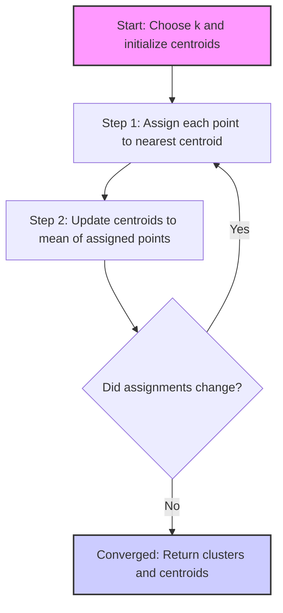

# Crash Course to Crack Machine Learning Interview – Part 6: k-Means Clustering

### Understanding unsupervised learning, choosing k, and mastering clustering interview questions

Clustering problems represent a fascinating shift from supervised learning. Instead of learning from labeled examples, you're asked to discover hidden structure in unlabeled data. Among clustering algorithms, **k-Means** stands out as the most frequently discussed in interviews — not because it's the most sophisticated, but because it elegantly demonstrates fundamental concepts: **optimization**, **distance metrics**, **convergence**, and the **trade-offs between simplicity and expressiveness**.

At its core, k-Means attempts to partition data into k distinct groups where points within each group are more similar to each other than to points in other groups. The algorithm does this by iteratively refining cluster assignments and cluster centers until it reaches a stable configuration.

What makes k-Means particularly valuable for interviews is how it brings together several machine learning concepts in a concrete, visualizable way:

- **Optimization**: k-Means minimizes a clear objective function (within-cluster sum of squares)
- **Convergence**: The algorithm is guaranteed to converge, though not necessarily to the global optimum
- **Non-convexity**: Local minima exist, making initialization crucial
- **Practical constraints**: Scaling, outliers, and feature engineering dramatically affect results

Understanding k-Means deeply signals to interviewers that you grasp both the mathematical foundations and practical considerations of unsupervised learning. You need to know not just how the algorithm works, but **when it works well, when it fails, and how to diagnose and fix common problems**.

In this guide, we'll build k-Means from first principles, explore its optimization mechanics, discuss practical preprocessing requirements, cover evaluation strategies, and tackle the most common interview questions you'll encounter.

## The Core Algorithm: How k-Means Works

Let's start with the fundamental question: given a dataset with no labels, how can we identify natural groupings?

Consider a dataset of customers described by two features: monthly spending and number of website visits. When you plot these customers, you might visually notice clusters — groups of similar customers that seem to belong together. k-Means formalizes this intuition into a repeatable algorithm.

#### The k-Means Process

k-Means operates through an elegant two-step iterative process:



Let's break down each component:

#### Step 0: Initialization

Before the algorithm begins, you must:
1. **Choose k**: Decide how many clusters you want (we'll discuss choosing k later)
2. **Initialize centroids**: Place k points in the feature space to serve as initial cluster centers

These initial centroid positions can be:
- Random points from the dataset
- Random positions in the feature space
- Strategically placed using k-Means++ (preferred method)

#### Step 1: Assignment

For each data point, compute the distance to all k centroids and assign the point to the nearest centroid. Using Euclidean distance:

$$d(x_i, \mu_j) = \sqrt{\sum_{d=1}^{D} (x_{id} - \mu_{jd})^2}$$

Where:
- $x_i$ is data point i
- $\mu_j$ is centroid j
- D is the number of dimensions/features

Point $x_i$ is assigned to cluster $C_j$ if centroid $\mu_j$ is closest:

$$C_j = \{x_i : ||x_i - \mu_j||^2 \leq ||x_i - \mu_{j'}||^2 \text{ for all } j'\}$$

#### Step 2: Update

After all points are assigned, recompute each centroid as the **mean** of all points assigned to that cluster:

$$\mu_j = \frac{1}{|C_j|} \sum_{x_i \in C_j} x_i$$

This moves the centroid to the center of mass of its assigned points.

#### Convergence

Repeat steps 1 and 2 until one of these stopping conditions is met:
- Assignments no longer change
- Centroids no longer move (or move less than a threshold)
- Maximum number of iterations reached

#### Why This Works: The Coordinate Descent Perspective

k-Means alternates between two types of optimization:
1. **Fix centroids, optimize assignments**: When centroids are fixed, the best assignment for each point is clearly the nearest centroid
2. **Fix assignments, optimize centroids**: When assignments are fixed, the best position for each centroid is the mean of its points

This is a form of **coordinate descent** — alternating optimization of different variables. Each step is guaranteed to decrease (or keep constant) the objective function, ensuring convergence.

#### A Concrete Example

Let's walk through a simple example:

**Initial State**: 6 customers, k=2
- Customers: [(1,1), (1,2), (2,1), (8,8), (8,9), (9,8)]
- Initial centroids: μ₁=(1,1), μ₂=(9,9)

**Iteration 1**:
- Assignment: 
  - Points (1,1), (1,2), (2,1) → Cluster 1
  - Points (8,8), (8,9), (9,8) → Cluster 2
- Update:
  - μ₁ = mean of [(1,1), (1,2), (2,1)] = (1.33, 1.33)
  - μ₂ = mean of [(8,8), (8,9), (9,8)] = (8.33, 8.33)

**Iteration 2**:
- Assignment: (no changes from iteration 1)
- Algorithm converges!

In this clean example, convergence happened immediately. Real data typically requires more iterations.

## The Objective Function: What k-Means Optimizes

Understanding what k-Means is trying to minimize provides crucial insight into its behavior and limitations.

#### Within-Cluster Sum of Squares (WCSS)

k-Means minimizes the **total squared distance** between each point and its assigned centroid:

$$J = \sum_{j=1}^{k} \sum_{x_i \in C_j} ||x_i - \mu_j||^2$$

This is also called:
- **Inertia** (scikit-learn terminology)
- **Within-cluster sum of squares (WCSS)**
- **Distortion**

#### Why Squared Distance?

Squaring the distance has important implications:

**1. Makes Optimization Tractable**

The squared Euclidean distance has a nice mathematical property: the point that minimizes the sum of squared distances to a set of points is their **mean**. This is why step 2 of k-Means simply computes averages.

**2. Heavily Penalizes Outliers**

A point that's 10 units away contributes 100 to the objective, while a point 1 unit away contributes only 1. This makes k-Means very sensitive to outliers.

**3. Favors Compact, Spherical Clusters**

Points equidistant from a center form a circle (2D) or sphere (higher dimensions). This geometric property means k-Means naturally prefers roughly circular clusters.

#### Guaranteed Convergence, But Not to Global Optimum

A critical property of k-Means:

**Convergence is guaranteed**: Each iteration decreases (or maintains) the objective function, and there are only finitely many possible assignments, so the algorithm must eventually stop.

**Global optimum is NOT guaranteed**: The objective function is non-convex in the joint space of assignments and centroids. Different initializations can lead to different local minima.

This is the fundamental reason why:
- Running k-Means multiple times with different initializations is standard practice
- Initialization strategy (like k-Means++) matters so much
- Results can vary between runs

#### Practical Implications of the Objective

**Inertia Always Decreases with More Clusters**

If you increase k, inertia will always go down. In the extreme case where k equals the number of points, inertia becomes zero (each point is its own cluster).

This means **you cannot use inertia alone to choose k** — you need additional criteria.

**Inertia Favors Similar-Sized Clusters**

Large clusters contribute more to the total inertia simply because they have more points. This can cause k-Means to split large clusters while ignoring small, tight clusters.

**Feature Scale Dramatically Affects Results**

Since inertia is based on Euclidean distance, features with larger magnitudes dominate the objective. A feature ranging from 0-1000 will completely overshadow a feature ranging from 0-1, even if the latter is more meaningful.

This is why **feature scaling is mandatory** for k-Means, not optional.

## Choosing k: The Most Common Interview Question

"How do you choose k?" is probably the single most frequently asked question about k-Means in interviews. Unlike supervised learning where you can measure performance against ground truth labels, unsupervised learning requires more nuanced evaluation.

#### Why Choosing k is Hard

The fundamental difficulty: **there's no single correct answer**. Real-world data rarely falls into perfectly separated groups. Instead, there are often many valid ways to partition the data, depending on:

- **The goal of clustering**: Are you trying to find broad market segments or fine-grained user types?
- **Interpretability**: Can stakeholders understand and act on k=5 clusters vs k=20?
- **Computational constraints**: More clusters mean more centroids to compute and store
- **Stability**: Do clusters remain consistent across different samples?

#### The Elbow Method

The most widely taught approach, though not always the most reliable.

**Procedure**:
1. Run k-Means for a range of k values (e.g., k=1 to k=10)
2. For each k, record the inertia
3. Plot inertia vs. k
4. Look for an "elbow" — a point where the rate of decrease sharply changes

**Intuition**: 

Before the elbow, each additional cluster captures significant structure (large decrease in inertia). After the elbow, additional clusters provide diminishing returns (small decrease in inertia).

**Example**:
```
k=1: Inertia = 10000
k=2: Inertia = 5000  (50% reduction)
k=3: Inertia = 3000  (40% reduction)
k=4: Inertia = 2200  (27% reduction)  ← Elbow here?
k=5: Inertia = 1900  (14% reduction)
k=6: Inertia = 1700  (11% reduction)
```

**Limitations**:
- The elbow is often **subjective** — different people see the bend at different points
- Many real datasets show a **smooth curve** with no clear elbow
- Doesn't account for cluster interpretability or stability

Despite these limitations, the elbow method provides a useful starting point for exploring k values.

#### Silhouette Score

A more sophisticated metric that considers both **cluster cohesion** (how close points are to their own cluster) and **separation** (how far points are from other clusters).

**For each point i**:

1. **a(i)**: Mean distance to other points in the same cluster (cohesion)
2. **b(i)**: Mean distance to points in the nearest neighboring cluster (separation)
3. **Silhouette score**: 

$$s(i) = \frac{b(i) - a(i)}{\max(a(i), b(i))}$$

**Interpretation**:
- s(i) ≈ 1: Point is well-clustered (far from neighboring clusters)
- s(i) ≈ 0: Point is on the border between clusters
- s(i) < 0: Point might be assigned to the wrong cluster

**Average Silhouette Score**: Mean of s(i) over all points, ranging from -1 to 1.

**Using Silhouette to Choose k**:
- Compute average silhouette score for different k values
- Choose k with the highest average score
- Also examine per-cluster silhouette scores to identify problem clusters

**Advantages over Elbow Method**:
- Accounts for both cohesion and separation
- Can identify when clusters overlap significantly
- Less subjective than visual elbow identification

**Limitations**:
- Computationally expensive (O(n²) distances)
- Still doesn't guarantee the "right" k for your application
- Can favor equal-sized clusters

#### Other Methods for Choosing k

**Gap Statistic**

Compares inertia to what you'd expect from randomly distributed data:

1. Compute inertia for your data at different k values
2. Generate random reference datasets with similar properties
3. Compute inertia for random data
4. Gap = log(random inertia) - log(actual inertia)
5. Choose k where the gap is largest

This helps identify when additional clusters capture real structure vs. just fitting noise.

**Domain Knowledge and Business Constraints**

Often the most practical approach:
- Marketing teams may want 3-5 interpretable segments
- Personalization systems might handle 10-20 clusters effectively
- Operational constraints might limit how many groups you can act on differently

**Cross-Validation with Downstream Tasks**

If clustering is feeding into a supervised task:
- Try different k values
- Train downstream model for each k
- Choose k that gives best downstream performance

This aligns clustering directly with your end goal.

#### Interview Strategy for "How to Choose k"

A strong answer mentions multiple approaches:

1. **Start with domain knowledge**: Do you have prior belief about number of groups?
2. **Use elbow method** as initial exploration
3. **Compute silhouette scores** for more rigorous evaluation
4. **Examine cluster interpretability**: Can you describe what each cluster represents?
5. **Check stability**: Do clusters remain consistent across multiple runs?
6. **Consider downstream use**: What k value works best for your application?

The key is demonstrating that k selection is a **combination of quantitative metrics and qualitative judgment**, not a purely algorithmic decision.

## Initialization Strategies and k-Means++

Because k-Means converges to local minima, where you start dramatically affects where you end up. Poor initialization is one of the most common causes of bad clustering results.

#### Problems with Random Initialization

The simplest initialization: randomly select k points from your dataset as initial centroids.

**Common Failure Modes**:

**1. Centroids Start Too Close Together**

If two centroids start near each other, they compete for the same region of data, leaving other regions uncovered.

Example: In customer data with distinct low-value and high-value segments, both centroids might initialize in the middle segment, causing the algorithm to split it artificially while ignoring the extremes.

**2. Centroids Start in Sparse Regions**

A centroid might start in a sparse area with few nearby points. It may never accumulate enough points to move toward denser regions, remaining as a nearly empty cluster.

**3. Unequal Coverage**

Random initialization doesn't ensure centroids are spread throughout the feature space, leading to unbalanced coverage and poor final clustering.

#### k-Means++: Smarter Initialization

k-Means++ addresses these issues with a simple but powerful idea: **place centroids far apart from each other**.

**Algorithm**:

1. **First centroid**: Choose uniformly at random from the dataset
2. **Subsequent centroids**: For each remaining point x, compute:
   - D(x) = distance to nearest already-chosen centroid
3. **Choose next centroid**: Select point x with probability proportional to D(x)²

Points farther from existing centroids have higher probability of being selected.

**Why It Works**:

- **Spreads centroids**: Unlikely to place two centroids close together
- **Covers the space**: Natural clusters are more likely to each get a centroid
- **Probabilistic**: Still allows some randomness for exploration
- **Efficient**: Only O(k) times slower than random initialization

**Example**:

Dataset: Low-value customers (around x=2), medium-value (around x=5), high-value (around x=9)

**Random Init Might Give**: μ₁=4.5, μ₂=5.2, μ₃=5.8
- All three centroids start in the middle segment
- Poor coverage of low and high-value customers

**k-Means++ Would Likely Give**: μ₁=2.1, μ₂=5.3, μ₃=8.9
- One centroid near each natural cluster
- Better initial coverage

#### Multiple Random Restarts

Even with k-Means++, running the algorithm multiple times improves results:

```python
best_inertia = float('inf')
best_clustering = None

for i in range(n_restarts):
    clustering = kmeans(data, k, init='k-means++')
    if clustering.inertia < best_inertia:
        best_inertia = clustering.inertia
        best_clustering = clustering

return best_clustering
```

**Why This Helps**:
- Even k-Means++ can occasionally place centroids suboptimally
- Multiple runs increase chances of finding a good local minimum
- Can compare results across runs to assess clustering stability

**Practical Guidelines**:
- **10-20 restarts** is common for small-medium datasets
- **Fewer restarts** needed with k-Means++ than random init
- **Diminishing returns** after ~20 runs for most problems

#### Interview Key Points

When discussing initialization:
- Mention that k-Means finds **local minima**, making initialization crucial
- Explain k-Means++ as the **standard best practice**
- Note that **multiple restarts** are standard in production implementations
- Show awareness of the **speed vs. quality tradeoff**

## Assumptions and Limitations: When k-Means Fails

k-Means makes implicit assumptions that aren't always stated explicitly. When your data violates these assumptions, k-Means can produce misleading or meaningless results.

#### Assumption 1: Spherical (Isotropic) Clusters

**What it means**: Clusters should be roughly circular (2D) or spherical (higher dimensions), with similar spread in all directions.

**Why it matters**: Euclidean distance treats all directions equally. The closest centroid is determined by circular distance contours.

**When it breaks**:
- **Elongated clusters**: Stretched or elliptical shapes get split into multiple pieces
- **Curved clusters**: Crescent or banana-shaped clusters cannot be captured
- **Nested clusters**: Concentric circles or clusters-within-clusters fail

**Example**: Consider customers forming an elongated group (low spending + high visits vs. high spending + low visits). k-Means might split this into two artificial clusters based on circular distance contours.

#### Assumption 2: Similar Cluster Variance

**What it means**: All clusters should have roughly equal spread/variance.

**Why it matters**: k-Means minimizes total squared distance without accounting for cluster density. A large, diffuse cluster contributes more to inertia than a small, tight cluster.

**When it breaks**:
- One cluster is very compact, another is spread out
- k-Means may split the larger cluster to reduce inertia
- Smaller clusters may be absorbed into larger ones

**Example**: Power users (few, scattered) vs. regular users (many, tightly grouped). k-Means might ignore the power users entirely or merge them inappropriately.

#### Assumption 3: Similar Cluster Sizes

**What it means**: Clusters should have roughly similar numbers of points.

**Why it matters**: Large clusters have more influence on centroid positions through sheer numbers.

**When it breaks**:
- Imbalanced cluster sizes cause centroids to shift toward larger clusters
- Very small clusters may disappear entirely if no centroid remains nearby
- The algorithm may create artificial splits in large clusters

**Example**: 95% regular users, 5% VIP users. k-Means may place most/all centroids in the regular user space, failing to identify the VIP segment.

#### Assumption 4: Euclidean Distance is Meaningful

**What it means**: Features should be continuous numerical values where distance has clear meaning.

**Why it breaks**:
- **Categorical features**: Distance between "red" and "blue" is undefined
- **Mixed data types**: Combining continuous and categorical features
- **Ordinal data**: Ranks where intervals aren't equal
- **Non-metric spaces**: Text, graphs, or other structured data

**When it breaks**: Results become uninterpretable or meaningless.

**Example**: Clustering users by [age, income, favorite_color]. You cannot meaningfully compute distance to "favorite_color".

#### Assumption 5: Features are on Similar Scales

**What it means**: All features should have comparable ranges and units.

**Why it matters**: Features with larger magnitude completely dominate the Euclidean distance calculation.

**When it breaks**:
- One feature has range [0, 100000], another [0, 1]
- Clustering happens almost entirely along the large-magnitude feature
- Other features are effectively ignored

**Example**: Clustering by [income_dollars, age_years]. Income ($20k-$200k) will completely dominate distance calculations over age (18-80), even though age might be equally important.

This is so common and critical that it gets its own section below.

#### When k-Means is the Wrong Choice

**Better Alternatives**:

- **Elongated/irregular shapes**: DBSCAN, Gaussian Mixture Models
- **Hierarchical structure**: Agglomerative/Divisive Hierarchical Clustering
- **Arbitrary shapes**: Spectral Clustering
- **Different cluster densities**: DBSCAN, HDBSCAN
- **Very large datasets**: MiniBatch k-Means, sampling strategies

#### Interview Strategy

When asked about k-Means limitations, structure your answer:

1. **Acknowledge the assumptions**: Spherical clusters, similar sizes, Euclidean space
2. **Explain why they matter**: Connect to the algorithm mechanics
3. **Give concrete examples**: Show when assumptions break in practice
4. **Mention alternatives**: Demonstrate awareness of other methods
5. **Emphasize diagnostics**: How to detect when k-Means is failing

This shows depth of understanding beyond just memorizing the algorithm.

## Preprocessing: Scaling, Outliers, and Feature Engineering

In practice, **preprocessing is often more important than algorithm choice** for clustering quality. k-Means is particularly sensitive to how you prepare your data.

#### Feature Scaling: Absolutely Essential

**The Problem**: k-Means uses Euclidean distance, which treats all features equally **in their raw units**. Features with larger numeric ranges dominate the distance calculation.

**Example**:
```
User A: [income=$50k, age=25]
User B: [income=$51k, age=40]
User C: [income=$70k, age=26]

Distance(A,B) = sqrt((51-50)² + (40-25)²) = sqrt(1 + 225) = 15.03
Distance(A,C) = sqrt((70-50)² + (26-25)²) = sqrt(400 + 1) = 20.02
```

Age difference of 15 years contributes 225, while $1k income difference contributes only 1. But $20k income difference contributes 400, overwhelming the age component entirely.

**Without scaling, clustering happens almost exclusively along the income dimension**, effectively ignoring age.

#### Standardization (Z-score Normalization)

Most common choice for k-Means:

$$z = \frac{x - \mu}{\sigma}$$

Transforms each feature to zero mean and unit variance.

```python
from sklearn.preprocessing import StandardScaler

scaler = StandardScaler()
X_scaled = scaler.fit_transform(X)
```

**After standardization**:
- Both features have mean=0, std=1
- Comparable in terms of variation from typical values
- Distance contributions are balanced

**When to use**: 
- Features have different units (dollars, years, counts)
- Want features to contribute equally based on their relative variation
- Default choice for most k-Means applications

#### Min-Max Scaling

Scales features to a fixed range, typically [0, 1]:

$$x' = \frac{x - x_{min}}{x_{max} - x_{min}}$$

```python
from sklearn.preprocessing import MinMaxScaler

scaler = MinMaxScaler()
X_scaled = scaler.fit_transform(X)
```

**When to use**:
- Features have bounded ranges
- Want to preserve relationships to boundaries (0 and 1 have meaning)
- Less common than standardization for k-Means

#### L2 Normalization (Unit Norm)

Scales each **data point** (not feature) to unit length:

$$x' = \frac{x}{||x||}$$

```python
from sklearn.preprocessing import normalize

X_normalized = normalize(X, norm='l2')
```

**When to use**:
- Working with directional data (text vectors, embeddings)
- Magnitude of vector is less important than direction
- Common in text clustering and recommendation systems

**Critical**: Always fit the scaler on training data only, then transform both train and test:

```python
scaler = StandardScaler()
X_train_scaled = scaler.fit_transform(X_train)
X_test_scaled = scaler.transform(X_test)  # Use same scaling!
```

#### Handling Outliers

Outliers have disproportionate impact on k-Means due to squared distance.

**Detection**:
- Statistical methods (z-score > 3, IQR)
- Distance-based (isolation forest)
- Visual inspection (box plots, scatter plots)

**Strategies**:

**1. Remove Outliers**
```python
from scipy import stats
z_scores = stats.zscore(X)
X_cleaned = X[(abs(z_scores) < 3).all(axis=1)]
```

Simple but loses data and may remove legitimate rare cases.

**2. Clip/Cap Outliers**
```python
from sklearn.preprocessing import RobustScaler

scaler = RobustScaler()  # Uses median and IQR, robust to outliers
X_scaled = scaler.fit_transform(X)
```

Or manually cap:
```python
X_clipped = np.clip(X, percentile_5, percentile_95)
```

**3. Transform Features**

Log transform for right-skewed data:
```python
X_log = np.log1p(X)  # log(1+x) to handle zeros
```

**4. Separate Outlier Handling**

Cluster main data, then assign outliers post-hoc or flag them separately.

#### Feature Engineering for Clustering

**Create Meaningful Features**:
- Ratios: spending_per_visit = total_spending / num_visits
- Aggregations: avg_session_duration, std_purchase_amount
- Temporal: day_of_week, time_since_last_purchase
- Domain-specific: customer_lifetime_value, churn_risk_score

**Reduce Dimensionality**:
```python
from sklearn.decomposition import PCA

pca = PCA(n_components=10)
X_reduced = pca.fit_transform(X_scaled)
```

Benefits:
- Removes noise and collinearity
- Speeds up clustering
- Can improve cluster quality
- Makes visualization possible

**Handle Categorical Variables**:

One-hot encoding:
```python
X_encoded = pd.get_dummies(X, columns=['category_feature'])
```

But be careful: one-hot encoding can inflate dimensionality and create sparse features.

Alternative: Embed categories using target encoding, entity embeddings, or cluster categorical values separately.

#### Complete Preprocessing Pipeline

```python
from sklearn.pipeline import Pipeline
from sklearn.preprocessing import StandardScaler
from sklearn.decomposition import PCA
from sklearn.cluster import KMeans

pipeline = Pipeline([
    ('scaler', StandardScaler()),
    ('pca', PCA(n_components=0.95)),  # Keep 95% variance
    ('kmeans', KMeans(n_clusters=5, init='k-means++', n_init=10))
])

pipeline.fit(X)
labels = pipeline.predict(X)
```

#### Interview Key Points

When discussing preprocessing for k-Means:
- **Emphasize that scaling is mandatory**, not optional
- Explain **why** outliers affect k-Means (squared distance)
- Show awareness of **different scaling methods** and when to use each
- Mention that **feature engineering often matters more than k**
- Demonstrate understanding of **pipelines** to prevent data leakage

## Evaluation: How to Assess Clustering Quality

Unlike supervised learning where you have ground truth labels, evaluating unsupervised clustering is inherently more challenging. You need multiple perspectives to assess quality.

#### Internal Metrics (No Ground Truth Required)

These metrics only use the data and the clustering assignments.

**Inertia / Within-Cluster Sum of Squares (WCSS)**

$$\text{Inertia} = \sum_{j=1}^{k} \sum_{x_i \in C_j} ||x_i - \mu_j||^2$$

**Interpretation**:
- Lower is better
- Measures cluster compactness
- Always decreases with more clusters

**Limitations**:
- Cannot be used alone to choose k
- Doesn't account for separation between clusters
- Favors many small clusters

**Silhouette Score**

$$s(i) = \frac{b(i) - a(i)}{\max(a(i), b(i))}$$

Where:
- a(i) = average distance to other points in same cluster
- b(i) = average distance to points in nearest other cluster

**Range**: -1 to 1
- **1**: Perfect clustering, points far from other clusters
- **0**: Points on cluster boundaries
- **-1**: Points likely in wrong clusters

**Advantages**:
- Accounts for both cohesion and separation
- Can identify problematic clusters
- Intuitive interpretation

**Limitations**:
- O(n²) computational complexity
- Assumes convex clusters
- May not reflect domain-specific quality

**Davies-Bouldin Index**

Measures the average similarity between each cluster and its most similar cluster:

$$DB = \frac{1}{k} \sum_{i=1}^{k} \max_{j \neq i} \frac{\sigma_i + \sigma_j}{d(c_i, c_j)}$$

Where σ is average distance within cluster, d is distance between centroids.

**Lower is better** — indicates better separation.

**Calinski-Harabasz Index (Variance Ratio)**

Ratio of between-cluster variance to within-cluster variance:

$$CH = \frac{SS_B / (k-1)}{SS_W / (n-k)}$$

**Higher is better** — indicates well-separated, compact clusters.

#### External Metrics (Ground Truth Available)

When you have true labels (common in benchmarking, rare in practice):

**Adjusted Rand Index (ARI)**

Measures similarity between true labels and cluster assignments, adjusted for chance.

**Range**: -1 to 1
- **1**: Perfect agreement
- **0**: Random labeling
- **Negative**: Worse than random

```python
from sklearn.metrics import adjusted_rand_score
ari = adjusted_rand_score(true_labels, cluster_labels)
```

**Normalized Mutual Information (NMI)**

Measures shared information between true labels and clusters.

**Range**: 0 to 1
- **1**: Perfect correlation
- **0**: No mutual information

```python
from sklearn.metrics import normalized_mutual_info_score
nmi = normalized_mutual_info_score(true_labels, cluster_labels)
```

#### Qualitative Evaluation

Often more important than metrics:

**Interpretability**
- Can you describe what each cluster represents?
- Do the clusters align with domain knowledge?
- Can business stakeholders understand and act on them?

**Stability**
- Do clusters remain consistent across multiple runs?
- Do they persist with slightly different data samples?
- Are they robust to hyperparameter changes?

**Actionability**
- Can you differentiate actions for each cluster?
- Is the granularity useful for your application?
- Do clusters enable better decision-making?

**Visualization**

Use dimensionality reduction for visual inspection:

```python
from sklearn.decomposition import PCA
import matplotlib.pyplot as plt

pca = PCA(n_components=2)
X_2d = pca.fit_transform(X_scaled)

plt.scatter(X_2d[:, 0], X_2d[:, 1], c=labels, cmap='viridis')
plt.scatter(centroids_2d[:, 0], centroids_2d[:, 1], 
            marker='X', s=200, c='red', edgecolors='black')
plt.title('k-Means Clustering (PCA Projection)')
```

Visual inspection can reveal:
- Whether clusters are well-separated
- If boundaries make intuitive sense
- Presence of outliers or noise
- Whether k seems appropriate

#### Comparing to Baseline

Always compare to simple baselines:
- Random clustering
- Single cluster (all points together)
- One point per cluster

If k-Means doesn't substantially beat these, clustering may not be appropriate for your data.

#### Interview Strategy for Evaluation

A comprehensive answer includes:

1. **Multiple metrics**: Silhouette score for internal evaluation, ARI/NMI if ground truth exists
2. **Limitations**: Acknowledge that metrics have blind spots
3. **Qualitative factors**: Interpretability and business value matter
4. **Visualization**: Always visualize results when possible
5. **Stability checks**: Multiple runs and cross-validation

## Common Interview Questions with Detailed Answers

#### 1. Explain how the k-Means algorithm works step by step.

k-Means is an iterative algorithm that partitions data into k clusters. It starts by initializing k centroids (usually with k-Means++). Then it alternates between two steps: (1) **Assignment** — assign each point to the nearest centroid using Euclidean distance, and (2) **Update** — recompute each centroid as the mean of all points assigned to it. These steps repeat until assignments no longer change or centroids stabilize. The algorithm minimizes within-cluster sum of squared distances (inertia) and is guaranteed to converge to a local minimum.

#### 2. What objective function does k-Means minimize?

k-Means minimizes the **within-cluster sum of squares (WCSS)**, also called inertia: the sum of squared Euclidean distances between each point and its assigned centroid. Formally: $\sum_{j=1}^{k} \sum_{x_i \in C_j} ||x_i - \mu_j||^2$. This objective favors compact, spherical clusters where points are close to their cluster centers.

#### 3. Why doesn't k-Means always find the best clustering?

k-Means converges to a **local minimum**, not the global minimum. The objective function is non-convex in the joint space of cluster assignments and centroid positions. Different initializations can lead to different local minima. This is why k-Means++ initialization and multiple random restarts are essential — they increase the chances of finding a good solution.

#### 4. How do you choose the optimal number of clusters k?

There's no single "optimal" k, but several approaches help: (1) **Elbow method** — plot inertia vs. k and look for where the curve bends; (2) **Silhouette score** — choose k with the highest average silhouette; (3) **Domain knowledge** — consider business constraints and interpretability; (4) **Stability** — check if clusters are consistent across runs; (5) **Downstream performance** — if clustering feeds another task, choose k that optimizes that task. Usually, you combine quantitative metrics with qualitative judgment.

#### 5. What is k-Means++ and why is it better than random initialization?

k-Means++ is a smart initialization strategy that spreads initial centroids far apart. It starts by choosing one centroid randomly, then selects subsequent centroids with probability proportional to squared distance from the nearest existing centroid. This ensures better coverage of the feature space and dramatically reduces the chance of poor local minima. It's now the standard initialization in most libraries because it improves both final cluster quality and convergence speed.

#### 6. Why is feature scaling essential for k-Means?

k-Means uses Euclidean distance, which is sensitive to feature magnitude. Features with larger numeric ranges dominate distance calculations. For example, if one feature ranges from 0-1000 and another from 0-1, the first feature will almost entirely determine cluster assignments, even if both are equally important. Standardization (zero mean, unit variance) ensures all features contribute proportionally. **Without scaling, k-Means effectively ignores smaller-scale features**, making it one of the most common failure modes.

#### 7. What assumptions does k-Means make about the data?

k-Means assumes: (1) **Spherical clusters** — clusters are roughly circular/spherical with similar spread in all directions; (2) **Similar variance** — all clusters have comparable spread; (3) **Similar sizes** — clusters have roughly equal numbers of points; (4) **Euclidean space** — features are continuous and distance is meaningful; (5) **Features are scaled** — all features have comparable magnitudes. When these assumptions are violated, k-Means can produce misleading results.

#### 8. How do outliers affect k-Means and how can you handle them?

Outliers have disproportionate impact because k-Means minimizes **squared** distance. An outlier far from its centroid contributes much more to the objective than nearby points. This can pull centroids toward outliers, distorting clusters. Handling strategies: (1) **Remove** outliers using statistical methods (z-score, IQR); (2) **Clip/cap** extreme values at percentiles; (3) **Use robust scaling** (RobustScaler uses median/IQR); (4) **Transform features** (log transform for skewed data); (5) **Consider alternatives** like k-Medoids which use absolute distance instead of squared distance.

#### 9. What's the difference between k-Means and k-Medoids (PAM)?

k-Means represents clusters with **centroids** — the arithmetic mean of assigned points, which may not be an actual data point. k-Medoids represents clusters with **medoids** — actual data points from the cluster that minimize total distance to other points. k-Medoids is more robust to outliers because it uses absolute distance instead of squared distance, but it's computationally more expensive (O(n²) vs O(nk) per iteration). k-Medoids is preferred when you need cluster representatives to be real data points or when outliers are a concern.

#### 10. How can you assess the quality of k-Means clustering without ground truth labels?

Use internal evaluation metrics: (1) **Silhouette score** — measures how well-separated clusters are (-1 to 1, higher is better); (2) **Inertia** — within-cluster sum of squares (lower is better, but can't be used alone); (3) **Davies-Bouldin index** — average similarity ratio (lower is better); (4) **Calinski-Harabasz index** — variance ratio (higher is better). Also essential: (5) **Visual inspection** using PCA/t-SNE; (6) **Interpretability** — can you describe what each cluster represents?; (7) **Stability** — consistent results across multiple runs; (8) **Business value** — do clusters enable better decisions?

#### 11. What's the computational complexity of k-Means?

**Per iteration**: O(nkd) where n = number of points, k = number of clusters, d = dimensionality. You need to compute distances from each of n points to k centroids (each distance is O(d)). **Total**: O(nkdi) where i = number of iterations. In practice, k-Means typically converges in relatively few iterations (often 10-50), making it fast for moderate-sized datasets. However, it doesn't scale well to very large datasets, which is where MiniBatch k-Means becomes useful.

#### 12. When would you NOT use k-Means?

Avoid k-Means when: (1) **Clusters have irregular shapes** — elongated, curved, or nested clusters; (2) **Very different cluster sizes** or densities; (3) **Categorical or mixed data** — Euclidean distance isn't meaningful; (4) **Strong outliers** that can't be removed; (5) **You need hierarchical structure** — use hierarchical clustering instead; (6) **Number of clusters is unknown and hard to determine**; (7) **Very large datasets** where even O(nkd) is too slow — consider MiniBatch k-Means or sampling. In these cases, consider DBSCAN, hierarchical clustering, Gaussian mixture models, or spectral clustering.

#### 13. How does k-Means handle high-dimensional data?

k-Means can work in high dimensions but faces challenges: (1) **Curse of dimensionality** — distances become less meaningful as dimensions increase; (2) **Sparsity** — points tend to be far apart; (3) **Noise** — many dimensions may be irrelevant. **Preprocessing helps**: Apply PCA or other dimensionality reduction before clustering; use feature selection to keep only relevant dimensions; ensure proper scaling. In very high dimensions (like text with thousands of features), simpler methods often work surprisingly well because distances can still separate clusters effectively.

#### 14. What's the difference between k-Means and Gaussian Mixture Models (GMM)?

Both partition data into k clusters, but: **k-Means** uses hard assignments (each point belongs to exactly one cluster) and represents clusters with centroids. **GMM** uses soft assignments (each point has probabilities for all clusters) and models clusters as Gaussian distributions with means and covariances. GMM can capture elliptical clusters and provides probabilistic interpretations, but is more complex and slower. k-Means is a special case of GMM with spherical, equal-variance Gaussians and hard assignments. Choose GMM when you need probabilistic outputs or clusters have different shapes/sizes.

#### 15. How would you use k-Means for color quantization in image compression?

Treat each pixel as a point in RGB color space (3D). Run k-Means to find k representative colors (centroids). Replace each pixel's RGB value with its nearest centroid color. This reduces the image to k colors, enabling compression. For example, k=16 reduces a 24-bit color image (16M colors) to 4 bits per pixel (16 colors). The algorithm finds the k colors that minimize distortion across the image. This is a classic application demonstrating k-Means' ability to find representative prototypes.

#### 16. What is MiniBatch k-Means and when would you use it?

MiniBatch k-Means is a variant that uses small random batches of data in each iteration instead of the entire dataset. Instead of computing distances for all n points, it samples a batch of b points (where b << n), assigns them to nearest centroids, and updates centroids using a moving average. This makes each iteration much faster: O(bkd) instead of O(nkd). **Use when**: dataset is too large for standard k-Means; you need faster convergence; you can accept slightly lower clustering quality. It's particularly useful for online learning or streaming data scenarios.

#### 17. How do you handle categorical features in k-Means?

k-Means requires numerical features where Euclidean distance is meaningful. Options for categorical data: (1) **One-hot encoding** — convert categories to binary features (can create high dimensionality); (2) **Target/frequency encoding** — replace categories with numeric statistics; (3) **Entity embeddings** — learn low-dimensional representations; (4) **k-Modes** — a variant of k-Means designed for categorical data that uses mode instead of mean; (5) **Mixed-type clustering** — use algorithms designed for mixed data like k-Prototypes; (6) **Separate clustering** — cluster categorical and continuous features separately then combine.

#### 18. Explain the relationship between k-Means and vector quantization.

k-Means is essentially **vector quantization** — replacing continuous vectors with discrete representatives. Each cluster centroid is a code word, and the set of k centroids is the codebook. Assigning a point to a cluster is encoding it with the nearest code word. This perspective is used in: (1) **Image compression** (color quantization); (2) **Feature learning** (dictionary learning); (3) **Data compression** (lossy encoding); (4) **Signal processing** (quantizing continuous signals). The inertia minimized by k-Means is exactly the quantization error — the total squared distance between original vectors and their quantized versions.

#### 19. How would you detect if k-Means is converging to a poor local minimum?

Check for: (1) **High inertia** compared to other runs with same k; (2) **Very unbalanced clusters** — one cluster with most points, others nearly empty; (3) **Empty clusters** — some centroids have no assigned points; (4) **Low silhouette scores** — especially negative scores indicating misassignment; (5) **Unstable results** — very different clusterings across multiple runs; (6) **Visual inspection** — clusters don't make intuitive sense; (7) **Business validation** — clusters aren't actionable or interpretable. **Solution**: Use k-Means++ initialization, run multiple times with different seeds, try different k values.

#### 20. How would you explain k-Means clustering to a non-technical stakeholder?

"k-Means finds natural groups in your data by identifying customers (or products, transactions, etc.) that are similar to each other. It starts by guessing k group centers, then repeatedly assigns each customer to the nearest group and adjusts the centers based on who's in each group. After several rounds, it settles on stable groups. Think of it like organizing a messy closet — you decide on k categories (casual, formal, athletic, etc.) and group similar clothes together. The algorithm finds groups where members are more similar to each other than to members of other groups, helping you understand patterns and target each group differently."

## Practical Implementation: Code Examples

Let's bring everything together with practical examples using scikit-learn.

#### Basic k-Means Clustering

```python
import numpy as np
import matplotlib.pyplot as plt
from sklearn.cluster import KMeans
from sklearn.preprocessing import StandardScaler
from sklearn.datasets import make_blobs

# Generate sample data
X, y_true = make_blobs(n_samples=300, centers=4, 
                       cluster_std=0.60, random_state=42)

# Scale features (essential!)
scaler = StandardScaler()
X_scaled = scaler.fit_transform(X)

# Fit k-Means
kmeans = KMeans(n_clusters=4, init='k-means++', 
                n_init=10, random_state=42)
kmeans.fit(X_scaled)

# Get results
labels = kmeans.labels_
centroids = kmeans.cluster_centers_
inertia = kmeans.inertia_

print(f"Inertia: {inertia:.2f}")
print(f"Iterations to converge: {kmeans.n_iter_}")
```

#### Elbow Method for Choosing k

```python
from sklearn.cluster import KMeans
import matplotlib.pyplot as plt

inertias = []
silhouette_scores = []
K_range = range(2, 11)

for k in K_range:
    kmeans = KMeans(n_clusters=k, init='k-means++', 
                    n_init=10, random_state=42)
    kmeans.fit(X_scaled)
    inertias.append(kmeans.inertia_)
    
    # Silhouette score
    from sklearn.metrics import silhouette_score
    score = silhouette_score(X_scaled, kmeans.labels_)
    silhouette_scores.append(score)

# Plot elbow curve
plt.figure(figsize=(12, 4))

plt.subplot(1, 2, 1)
plt.plot(K_range, inertias, 'bo-')
plt.xlabel('Number of Clusters (k)')
plt.ylabel('Inertia')
plt.title('Elbow Method')
plt.grid(True)

plt.subplot(1, 2, 2)
plt.plot(K_range, silhouette_scores, 'ro-')
plt.xlabel('Number of Clusters (k)')
plt.ylabel('Silhouette Score')
plt.title('Silhouette Score Method')
plt.grid(True)

plt.tight_layout()
plt.show()
```

#### Complete Pipeline with Preprocessing

```python
from sklearn.pipeline import Pipeline
from sklearn.preprocessing import StandardScaler
from sklearn.decomposition import PCA
from sklearn.cluster import KMeans

# Create pipeline
pipeline = Pipeline([
    ('scaler', StandardScaler()),
    ('pca', PCA(n_components=0.95)),  # Keep 95% variance
    ('kmeans', KMeans(n_clusters=4, init='k-means++', 
                     n_init=10, random_state=42))
])

# Fit pipeline
pipeline.fit(X)

# Get cluster labels
labels = pipeline.named_steps['kmeans'].labels_

# Access components
pca_components = pipeline.named_steps['pca'].n_components_
explained_var = pipeline.named_steps['pca'].explained_variance_ratio_.sum()

print(f"Reduced to {pca_components} components")
print(f"Explained variance: {explained_var:.2%}")
```

#### Evaluating Clustering Quality

```python
from sklearn.metrics import (silhouette_score, silhouette_samples,
                             davies_bouldin_score, calinski_harabasz_score)

# Fit k-Means
kmeans = KMeans(n_clusters=4, init='k-means++', 
                n_init=10, random_state=42)
labels = kmeans.fit_predict(X_scaled)

# Compute metrics
silhouette_avg = silhouette_score(X_scaled, labels)
davies_bouldin = davies_bouldin_score(X_scaled, labels)
calinski_harabasz = calinski_harabasz_score(X_scaled, labels)

print(f"Silhouette Score: {silhouette_avg:.3f}")
print(f"Davies-Bouldin Index: {davies_bouldin:.3f} (lower is better)")
print(f"Calinski-Harabasz Index: {calinski_harabasz:.3f} (higher is better)")

# Per-sample silhouette scores
silhouette_vals = silhouette_samples(X_scaled, labels)

# Find poorly clustered points
poor_clustering_threshold = 0.0
poor_points = np.where(silhouette_vals < poor_clustering_threshold)[0]
print(f"Number of poorly clustered points: {len(poor_points)}")
```

#### Visualization with PCA

```python
from sklearn.decomposition import PCA
import matplotlib.pyplot as plt

# Reduce to 2D for visualization
pca = PCA(n_components=2)
X_2d = pca.fit_transform(X_scaled)

# Transform centroids too
centroids_scaled = scaler.transform(kmeans.cluster_centers_)
centroids_2d = pca.transform(centroids_scaled)

# Plot
plt.figure(figsize=(10, 6))
plt.scatter(X_2d[:, 0], X_2d[:, 1], c=labels, cmap='viridis', 
            alpha=0.6, edgecolors='k', linewidth=0.5)
plt.scatter(centroids_2d[:, 0], centroids_2d[:, 1], 
            marker='X', s=300, c='red', edgecolors='black', linewidth=2,
            label='Centroids')
plt.xlabel(f'PC1 ({pca.explained_variance_ratio_[0]:.1%} variance)')
plt.ylabel(f'PC2 ({pca.explained_variance_ratio_[1]:.1%} variance)')
plt.title('k-Means Clustering (PCA Projection)')
plt.legend()
plt.grid(True, alpha=0.3)
plt.show()
```

## Summary and Key Takeaways

k-Means clustering is one of the most fundamental and widely-used unsupervised learning algorithms. Its simplicity, speed, and effectiveness make it a natural starting point for clustering problems — and a favorite topic for machine learning interviews.

**Core Concepts to Remember**:

1. **Iterative Optimization**: k-Means alternates between assigning points to nearest centroids and updating centroids to the mean of assigned points, minimizing within-cluster sum of squared distances.

2. **Local Minima**: The algorithm converges to local minima, not global optima. Initialization (k-Means++) and multiple restarts are essential for finding good solutions.

3. **Choosing k**: Use a combination of elbow method, silhouette scores, domain knowledge, and business constraints. There's no single "correct" k.

4. **Feature Scaling is Mandatory**: Not optional. Euclidean distance makes k-Means extremely sensitive to feature magnitude.

5. **Assumptions Matter**: k-Means assumes spherical, similar-sized clusters with comparable variance in Euclidean space. When assumptions break, consider alternatives.

6. **Preprocessing is Critical**: Scaling, outlier handling, and feature engineering often matter more than algorithm tuning.

7. **Multiple Evaluation Perspectives**: Use quantitative metrics (silhouette, inertia), qualitative assessment (interpretability), and visual inspection.

**For Interviews**:

Focus on **intuition over equations**. Explain why k-Means alternates between assignment and update steps. Show you understand the objective function and why local minima exist. Discuss choosing k as a balance between metrics and business needs. Always mention feature scaling when discussing preprocessing. Acknowledge limitations and know when to use alternatives like DBSCAN or hierarchical clustering.

**In Practice**:

Start with proper preprocessing (scaling, outlier handling). Use k-Means++ initialization with multiple restarts. Evaluate using multiple metrics and visual inspection. Validate cluster interpretability and actionability with domain experts. Consider k-Means as a baseline before trying more complex methods.

k-Means may be a simple algorithm, but mastering it demonstrates understanding of fundamental machine learning concepts: optimization, convergence, distance metrics, the curse of dimensionality, and the bias-variance tradeoff. These concepts extend far beyond clustering and are essential to all of machine learning.

---

*This article is part of the "Crash Course to Crack Machine Learning Interviews" series. For more articles on fundamental ML algorithms and interview preparation, see the [Tech Demystified repository](https://github.com/harshitha-8/Tech-Demystified).*

**References and Further Reading:**
- Inspired by discussion on BuildML (January 2026)
- MacQueen, J. (1967). "Some methods for classification and analysis of multivariate observations"
- Arthur, D. & Vassilvitskii, S. (2007). "k-means++: The advantages of careful seeding"
- Scikit-learn Clustering Documentation: https://scikit-learn.org/stable/modules/clustering.html
