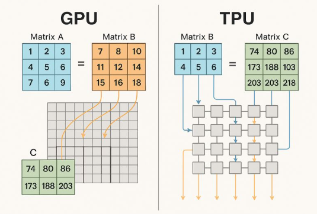

# Systolic Arrays: The 1978 Invention That Powers Modern AI

### How NVIDIA Tensor Cores and Google TPUs converged on the same 46-year-old idea

In 2015, Google faced an existential infrastructure problem. Jeff Dean calculated that if just 3% of users searched by voice for 3 minutes per day, Google would need to **double their entire datacenter fleet**. Running neural networks at that scale on CPUs wasn't just expensive—it was physically impossible.

Fifteen months later, Google had designed, manufactured, and deployed a completely custom chip. Not an incremental improvement. Not a GPU variant. A fundamentally different architecture that did one thing extraordinarily well: **matrix multiplication**.

Meanwhile, NVIDIA was reaching similar conclusions. By 2017's Volta architecture, they embedded specialized matrix multiplication units inside every GPU streaming multiprocessor. Today, on their latest Blackwell architecture, **98% of peak FLOPS come from these Tensor Cores**. The GPU—once the ultimate general-purpose parallel processor—has become primarily a matrix multiply accelerator with some extra hardware for flexibility.

Here's the remarkable part: **Google and NVIDIA converged on essentially the same solution**—a computational pattern published in 1978 by H.T. Kung and Charles Leiserson at CMU called **systolic arrays**. Not because they copied each other, but because nobody has found a more efficient way to multiply matrices in silicon.

This article explores why matrix multiplication dominates AI compute, what systolic arrays are, how they exploit the mathematical structure of matrix operations, and why both NVIDIA Tensor Cores and Google TPUs are fundamentally implementations of this 46-year-old idea.

## The Matrix Multiplication Problem

Before understanding the solution, let's understand why matrix multiplication matters so much for AI.

#### LLMs Are Matrix Multiply Machines

**Approximately 80% of an LLM's runtime is matrix multiplication.** Not attention mechanisms, not activations, not layernorms—matrix multiplies dominate everything.

**A single transformer forward pass** (GPT-3 scale, 175B parameters):

```
Input: [batch_size, sequence_length] tokens

For each of 96 layers:
    # Query, Key, Value projections (3 matrix multiplies)
    Q = X @ W_q  # [B, S, D] @ [D, D] → [B, S, D]
    K = X @ W_k  # [B, S, D] @ [D, D] → [B, S, D]
    V = X @ W_v  # [B, S, D] @ [D, D] → [B, S, D]
    
    # Attention scores (matrix multiply)
    scores = Q @ K.T  # [B, S, D] @ [B, D, S] → [B, S, S]
    
    # Apply attention to values (matrix multiply)
    attn_out = softmax(scores) @ V  # [B, S, S] @ [B, S, D] → [B, S, D]
    
    # Output projection (matrix multiply)
    out = attn_out @ W_o  # [B, S, D] @ [D, D] → [B, S, D]
    
    # Feed-forward network (2 matrix multiplies)
    ff1 = out @ W_ff1  # [B, S, D] @ [D, 4D] → [B, S, 4D]
    ff2 = ff1 @ W_ff2  # [B, S, 4D] @ [4D, D] → [B, S, D]

# Total: 8 matrix multiplies per layer × 96 layers = 768 matrix multiplies
```

**For a single forward pass** with batch_size=8, sequence_length=2048, hidden_dim=12288:
- **~280 trillion floating-point operations** (280 TFLOPS)
- **~220 trillion are matrix multiplies** (80%)

**At inference scale** (millions of requests per day), this compounds:
- 1 million requests/day
- ~280 petaFLOPS/day total
- ~220 petaFLOPS/day just matrix multiply

**The hardware problem**: CPUs can't do this. A high-end CPU (Intel Xeon, 64 cores) achieves ~3 TFLOPS peak. **You'd need 100,000 CPU cores** just to match one NVIDIA H100 GPU's matrix multiply throughput (990 TFLOPS with Tensor Cores).

#### Why Matrix Multiplication is Special

Matrix multiplication has unique mathematical properties that make it amenable to hardware acceleration:

**Mathematical structure**:
$$C = A \times B$$

Where A is $M \times K$, B is $K \times N$, and C is $M \times N$.

**Computational complexity**:
- **Operations**: $O(M \times N \times K)$ — each output element requires $K$ multiply-adds
- **Data movement**: $O(M \times K + K \times N + M \times N)$ — just reading inputs and writing outputs
- **Reuse**: Each element of A is used $N$ times, each element of B is used $M$ times

**Key insight**: For large matrices, operations grow faster than data movement.

**Example**: Multiply two 1024×1024 matrices
- **Operations**: $1024^3 = 1.07$ billion multiply-adds
- **Data**: $1024^2 + 1024^2 + 1024^2 = 3.1$ million elements to read/write
- **Arithmetic intensity**: $1.07B / 3.1M = 345$ operations per byte

**This ratio means**: If you can keep data in fast local memory (registers, caches), you get massive compute throughput. The challenge is **exploiting this reuse**.

#### The Memory Wall

**Traditional approach** (CPU or naive GPU):

```
for i in range(M):
    for j in range(N):
        for k in range(K):
            C[i,j] += A[i,k] * B[k,j]
            # Every operation reads from main memory (slow!)
```

**Memory hierarchy latency** (NVIDIA H100):
- **Registers**: 1 cycle (~1 nanosecond)
- **Shared memory**: ~20 cycles (~10 nanoseconds)
- **L2 cache**: ~200 cycles (~100 nanoseconds)
- **HBM3 (main memory)**: ~600 cycles (~300 nanoseconds)

**Naive approach problem**: Every multiply-add requires 2 reads (A[i,k], B[k,j]) and 1 write (C[i,j]) from main memory. At 300ns per access, you're compute-starved—the ALUs sit idle waiting for data.

**What we need**: Read data once from slow memory, reuse it many times in fast local memory.

**Systolic arrays solve exactly this problem.**

## Systolic Arrays: The 1978 Breakthrough

In 1978, H.T. Kung and Charles Leiserson at Carnegie Mellon published "Systolic Arrays (for VLSI)" [1]. The timing was perfect: VLSI (Very Large Scale Integration) was making it possible to fit hundreds of processing elements on a single chip, but the Von Neumann bottleneck (memory bandwidth) was already limiting performance.

#### The Core Insight

**Traditional computing**: Fetch data from memory → Compute → Store result → Repeat

**Systolic approach**: Fetch data from memory once → Pass through array of processors → Each processor computes on the data → Data flows to next processor

**Analogy**: Blood circulation in the human heart (hence "systolic")
- Heart pumps blood rhythmically through arteries
- Organs extract oxygen as blood flows past
- Blood makes one pass, nourishing many organs
- Similarly: Data makes one pass through array, feeding many computations

#### Basic Systolic Array Architecture

**Simplest example**: 1D systolic array for dot product

```
       a₀   a₁   a₂   a₃
       ↓    ↓    ↓    ↓
    →[PE]→[PE]→[PE]→[PE]→ result
       ↑    ↑    ↑    ↑
       b₀   b₁   b₂   b₃

PE = Processing Element (multiply-accumulate unit)
Each PE:
  - Multiplies input values: a[i] * b[i]
  - Adds to accumulated sum from left neighbor
  - Passes sum to right neighbor
```

**Operation**:
```
Cycle 1: PE₀ computes a₀*b₀, passes to PE₁
Cycle 2: PE₀ computes a₁*b₁, passes a₀*b₀ to PE₁
         PE₁ receives a₀*b₀, adds its own a₁*b₁
Cycle 3: ...
Final: Last PE outputs a₀*b₀ + a₁*b₁ + a₂*b₂ + a₃*b₃
```

**Key property**: Each data element flows through the array, getting reused by multiple PEs without additional memory accesses.

#### 2D Systolic Arrays for Matrix Multiplication

**The real power**: 2D arrays for matrix multiplication


*Left: GPU approach with tensor cores. Right: TPU's pure systolic array approach.*

**Architecture**:
```
      b₀₀  b₀₁  b₀₂
       ↓    ↓    ↓
a₀₀ →[PE]→[PE]→[PE]→
      ↓    ↓    ↓
a₁₀ →[PE]→[PE]→[PE]→
      ↓    ↓    ↓
a₂₀ →[PE]→[PE]→[PE]→
      ↓    ↓    ↓
     c₀₀  c₁₀  c₂₀
```

**Each PE (Processing Element)**:
```python
class ProcessingElement:
    def __init__(self):
        self.accumulated_sum = 0
        self.weight = 0  # Stored locally
    
    def cycle(self, a_in, partial_sum_in):
        # 1. Multiply input activation with stored weight
        product = a_in * self.weight
        
        # 2. Add to partial sum from above
        new_sum = partial_sum_in + product
        
        # 3. Pass activation right
        a_out = a_in
        
        # 4. Pass sum down
        partial_sum_out = new_sum
        
        return a_out, partial_sum_out
```

**Dataflow**:
1. **Weights (B matrix)**: Loaded into PE array and stay put (spatial reuse)
2. **Activations (A matrix)**: Flow left-to-right through array (temporal reuse)
3. **Partial sums (C matrix)**: Accumulate top-to-bottom (output stationary)

**Example**: 3×3 matrix multiply

```
C = A × B

A = [1 2 3]    B = [7  8  10]
    [4 5 6]        [11 12 14]
    [7 6 9]        [15 16 18]

Step 1: Load weights (B) into PE array
        Each PE stores one weight and keeps it

Step 2: Stream activations (A) into array
        Row by row, elements flow left-to-right

Step 3: Partial sums accumulate downward
        Final sums emerge from bottom of array

Result C = [74  80  86 ]
           [173 188 203]
           [203 203 218]
```

**Critical property**: 
- **Memory accesses**: Read A once (9 elements), read B once (9 elements), write C once (9 elements) = 27 memory accesses
- **Computations**: 9 PEs × 3 multiply-adds each = 27 operations
- **Reuse factor**: Each element of A is used 3 times, each element of B is used 3 times

**For N×N matrices**:
- Memory accesses: $O(N^2)$
- Computations: $O(N^3)$
- **Arithmetic intensity**: $O(N)$ — grows linearly with matrix size!

#### Why Systolic Arrays Are Efficient

**1. Data reuse without memory access**
- Weights stay in PE registers (fastest possible memory)
- Activations flow through array, reused by every PE in their path
- Partial sums accumulate locally

**2. Regular, predictable dataflow**
- No random memory accesses
- No cache misses (data flows deterministically)
- Can be fully pipelined

**3. Massive parallelism**
- $N^2$ PEs all computing simultaneously
- Perfect load balancing (every PE does same work)

**4. Scalability**
- Can build arbitrarily large arrays (limited only by chip area)
- Adding more PEs linearly increases throughput

**5. Energy efficiency**
- Minimal data movement (most expensive operation)
- Most energy spent on actual computation, not data shuffling
- Perfect for battery-constrained or datacenter-scale deployment

## Google TPU: Pure Systolic Architecture

When Google designed the TPU in 2015, they made a radical decision: **strip everything away except the systolic array**. No general-purpose CPU, no caches, no branch prediction. Just the biggest systolic array they could fit on a die, with a compiler that schedules everything statically.

#### TPU v1 Architecture (2015)

**Core specifications**:
- **Systolic array**: 256×256 processing elements = 65,536 PEs
- **Precision**: 8-bit integer multiply-accumulate (INT8)
- **Clock frequency**: 700 MHz
- **Peak performance**: 92 TOPS (tera-operations per second)
  - 256 × 256 × 2 operations × 700 MHz = 92 trillion ops/sec

**Architecture overview**:

```
┌─────────────────────────────────────────────────────────────┐
│                       TPU v1 Die                            │
│                                                             │
│  ┌──────────────┐     ┌────────────────────────────────┐  │
│  │   Weights    │────→│   256×256 Systolic Array       │  │
│  │   Memory     │     │   (Matrix Multiply Unit)       │  │
│  │   (28MB)     │     │                                │  │
│  └──────────────┘     │   65,536 PEs                   │  │
│                       │   Each: 1 × 8-bit MAC           │  │
│  ┌──────────────┐     └────────────────────────────────┘  │
│  │  Unified     │              ↓                           │
│  │  Buffer      │     ┌────────────────────────────────┐  │
│  │  (4MB)       │←────│   Accumulators                 │  │
│  │              │     │   (4MB for partial sums)       │  │
│  └──────────────┘     └────────────────────────────────┘  │
│         ↑                                                  │
│         │                                                  │
│  ┌──────────────┐                                         │
│  │  PCIe        │                                         │
│  │  Interface   │                                         │
│  └──────────────┘                                         │
└─────────────────────────────────────────────────────────────┘
```

**Memory hierarchy**:
1. **Weights memory (28MB)**: On-chip SRAM holding model weights
2. **Unified buffer (4MB)**: Holds activations (inputs/outputs)
3. **Accumulators (4MB)**: Stores partial sums during matrix multiplication

**Dataflow**:
```python
def tpu_matrix_multiply(A, B):
    # A: [M, K] activations
    # B: [K, N] weights
    
    # Step 1: Load weights into systolic array
    # Each PE gets one weight from B, stores locally
    load_weights_into_array(B)
    
    # Step 2: Stream activations through array
    # Activations flow left-to-right
    # Each row of A processed in parallel
    for row in A:
        stream_into_array(row)
        # As activations flow, each PE:
        #   - Multiplies its weight × incoming activation
        #   - Adds to partial sum from above
        #   - Passes activation to right neighbor
        #   - Passes sum to bottom neighbor
    
    # Step 3: Accumulate results
    # Partial sums flow out bottom of array
    C = collect_results_from_array()
    
    return C

# Key: Zero memory accesses during computation
# All data movement is register-to-register
```

**Design philosophy**:

**Google's TPU approach**: "Do one thing perfectly"
- No general-purpose compute
- No CUDA, no threads, no dynamic scheduling
- Compiler statically schedules every operation
- Hardware is deterministic, predictable, simple

**Why this works for inference**:
- Model weights are static (loaded once)
- Computation graph is known ahead of time
- Can optimize everything at compile time
- No need for runtime flexibility

#### TPU v2 and Beyond (2017+)

**TPU v2/v3 improvements**:
- **Training support**: Bidirectional dataflow for backpropagation
- **Floating-point**: FP16/BF16 instead of just INT8
- **HBM**: High-bandwidth memory (16GB-32GB) instead of SRAM
- **Interconnect**: Custom inter-chip network for distributed training
- **Pods**: 256-1024 TPUs connected with dedicated fabric

**TPU v4 (2021)**:
- 275 TFLOPS (INT8), 1.1 TFLOPS (BF16)
- Improved systolic array utilization
- Better support for sparse models

**Core idea remains unchanged**: Massive systolic array optimized for matrix multiplication, with everything else minimized.

#### TPU Limitations

**1. Inflexibility**
- Statically scheduled: Can't handle dynamic control flow well
- Compiler must know entire computation graph
- Poor for models with variable sequence lengths or dynamic branching

**2. Utilization challenges**
- Small matrices waste resources (256×256 array underutilized if multiplying 64×64)
- Odd dimensions require padding

**3. Programmability**
- No low-level access (unlike CUDA)
- Must use high-level frameworks (TensorFlow, JAX)
- Debugging is harder (less visibility into execution)

**4. Ecosystem**
- Tied to Google Cloud
- Limited third-party tool support
- Smaller developer community than NVIDIA

**Trade-off**: Google sacrificed flexibility for maximum efficiency on a specific workload (large matrix multiplies).

## NVIDIA Tensor Cores: Systolic Arrays Inside GPUs

NVIDIA took the opposite approach: **Keep the flexible GPU architecture, but add specialized matrix units inside it**.

#### GPU Evolution

**Pre-Volta (2017)**: General-purpose CUDA cores
```
GPU = Many streaming multiprocessors (SMs)
Each SM = 64-128 CUDA cores
Each CUDA core = 1 FP32 multiply-add per cycle

For matrix multiply:
  - Software schedules work across cores
  - Each core computes a few elements of result
  - Requires lots of coordination, memory traffic
```

**Volta (2017) and beyond**: Tensor Cores added
```
GPU = Many SMs
Each SM = 64 CUDA cores + 4-8 Tensor Cores
Each Tensor Core = Tiny 4×4 systolic array

For matrix multiply:
  - Option 1: Use CUDA cores (flexible, slower)
  - Option 2: Use Tensor Cores (fast, restricted to specific operations)
```

**Blackwell (2024)**: Tensor Cores dominate
```
98% of peak FLOPS come from Tensor Cores
CUDA cores still there for everything else
GPU has become "matrix multiply accelerator + general compute"
```

#### What is a Tensor Core?

**A Tensor Core is a tiny systolic array** embedded inside a streaming multiprocessor.

**Architecture** (Volta-era):
```
       Input A (4×4)              Input B (4×4)
            ↓                          ↓
    ┌────────────────────────────────────────┐
    │      4×4 Systolic Array                │
    │                                        │
    │  [PE][PE][PE][PE]                      │
    │  [PE][PE][PE][PE]                      │
    │  [PE][PE][PE][PE]                      │
    │  [PE][PE][PE][PE]                      │
    │                                        │
    │  Each PE: FP16 multiply + accumulate   │
    └────────────────────────────────────────┘
                    ↓
            Accumulator (4×4 FP32)
                    ↓
               Output C (4×4)

Operation per cycle:
  C[4×4] += A[4×4] × B[4×4]
  
Total: 4×4×4 = 64 FP16 multiply-adds per cycle
```

**Tensor Core operation**:
```python
# D = A × B + C
# A, B: FP16 [4×4]
# C, D: FP32 [4×4] (accumulated in higher precision)

D = TensorCore.mma(A, B, C)

# Internally (simplified):
for i in range(4):
    for j in range(4):
        sum = C[i,j]  # Start with accumulator
        for k in range(4):
            sum += A[i,k] * B[k,j]  # FP16 multiply
        D[i,j] = sum  # FP32 accumulate
```

**Key properties**:
1. **Fixed size**: 4×4 matrices (Volta/Turing), 8×8 (Ampere), 16×16 (Hopper/Blackwell)
2. **Mixed precision**: Multiply in FP16/BF16, accumulate in FP32
3. **Systolic dataflow**: Data flows through 4×4 array just like TPU
4. **Single-cycle latency**: Entire 4×4×4 = 64 operations in one cycle

#### Hopper H100 Tensor Cores (2022)

**Specifications**:
- **Tensor Cores per SM**: 4 (4th-generation)
- **SMs per GPU**: 132
- **Total Tensor Cores**: 528
- **Operation size**: 16×16 matrices (scaled up from 4×4)

**Each Tensor Core**:
```
D[16×16] = A[16×16] × B[16×16] + C[16×16]

Operations per cycle: 16×16×16 = 4,096 multiply-adds

Precision options:
- FP64: 512 ops/cycle (per Tensor Core)
- TF32: 2,048 ops/cycle
- FP16/BF16: 4,096 ops/cycle
- FP8: 8,192 ops/cycle
- INT8: 8,192 ops/cycle
```

**GPU-wide performance**:
- 132 SMs × 4 Tensor Cores/SM = 528 Tensor Cores
- 528 × 4,096 FP16 ops/cycle = 2.16M ops/cycle
- At 1.98 GHz: **1,979 TFLOPS (FP16)** peak

Compare to CUDA cores:
- 132 SMs × 128 FP32 cores/SM = 16,896 CUDA cores
- 16,896 × 2 ops/cycle (FMA) = 33,792 ops/cycle
- At 1.98 GHz: **67 TFLOPS (FP32)** peak

**Tensor Cores provide 30× more throughput for matrix multiplication.**

#### Using Tensor Cores in CUDA

**Low-level API** (CUDA):
```cuda
#include <mma.h>
using namespace nvcuda::wmma;

// Declare fragments (tiles)
fragment<matrix_a, 16, 16, 16, half, row_major> a_frag;
fragment<matrix_b, 16, 16, 16, half, col_major> b_frag;
fragment<accumulator, 16, 16, 16, float> c_frag;

// Load data into fragments
load_matrix_sync(a_frag, A, 16);
load_matrix_sync(b_frag, B, 16);
fill_fragment(c_frag, 0.0f);

// Perform matrix multiply (single Tensor Core operation)
mma_sync(c_frag, a_frag, b_frag, c_frag);
//       ↑      ↑      ↑      ↑
//       D   =  A   ×  B   +  C
// All 16×16×16 = 4096 ops happen in parallel

// Store result
store_matrix_sync(D, c_frag, 16, mem_row_major);
```

**High-level usage** (PyTorch):
```python
import torch

# Tensor Cores automatically used for:
# 1. Matrix multiply (torch.matmul)
# 2. Linear layers (nn.Linear)
# 3. Convolutions (nn.Conv2d)
# When dtype is FP16 or BF16

A = torch.randn(1024, 1024, dtype=torch.float16, device='cuda')
B = torch.randn(1024, 1024, dtype=torch.float16, device='cuda')

# Automatically dispatched to Tensor Cores
C = torch.matmul(A, B)

# No Tensor Cores (FP32)
A_fp32 = A.float()
B_fp32 = B.float()
C_fp32 = torch.matmul(A_fp32, B_fp32)  # Uses CUDA cores (30× slower)
```

#### Blackwell B100/B200 (2024)

**Latest generation**:
- **Tensor Cores**: 5th generation
- **FP4 support**: 4-bit floating point for extreme compression
- **FP6 support**: 6-bit floating point
- **Performance**: 
  - 9 PFLOPS (FP4) - 9,000 TFLOPS
  - 4.5 PFLOPS (FP6)
  - 2.25 PFLOPS (FP8)
  - 1,125 TFLOPS (FP16)

**Key insight**: 98% of peak FLOPS come from Tensor Cores. NVIDIA's GPU is now essentially a matrix multiply chip with some general-purpose compute for flexibility.

#### NVIDIA's Hybrid Approach

**Why keep CUDA cores?**

1. **Flexibility**: Not everything is matrix multiply
   - Activation functions (ReLU, GELU, etc.)
   - Element-wise operations
   - Reductions, scans
   - Dynamic control flow

2. **Legacy compatibility**: Billions of lines of CUDA code
3. **Programmability**: Developers can optimize anything
4. **Mixed workloads**: Scientific computing, rendering, simulation

**Why add Tensor Cores?**

1. **AI dominance**: Matrix multiply is 80% of LLM runtime
2. **Energy efficiency**: Specialized hardware uses 30× less power
3. **Competitive pressure**: TPUs were faster for inference
4. **Datacenter economics**: Training large models requires maximum throughput

**Result**: "An accelerator within an accelerator"

## Convergence: Different Paths, Same Destination

Google and NVIDIA started from opposite directions but converged on the same solution.

#### Design Philosophy Comparison

| Aspect | Google TPU | NVIDIA Tensor Cores |
|--------|-----------|---------------------|
| **Base architecture** | Pure systolic array | Systolic arrays in GPU |
| **Array size** | 256×256 (65K PEs) | 16×16 per Tensor Core |
| **Total PEs** | 65,536 (TPU v1) | 528 TC × 256 PEs = 135K (H100) |
| **Flexibility** | Low (static scheduling) | High (programmable GPU) |
| **Programming model** | High-level (TF, JAX) | CUDA, cuBLAS, cuDNN + high-level |
| **Primary use case** | Inference → Training | Training + Inference |
| **Memory architecture** | Unified buffer + weight memory | Caches + shared memory + registers |
| **Scheduling** | Compile-time (static) | Runtime (dynamic) + compile-time |
| **Ecosystem** | Google Cloud only | Broad (cloud + on-prem + edge) |

#### Why They Converged

**Mathematical reality**: Matrix multiplication's structure favors systolic arrays

**Data reuse pattern**:
```
# Every element of A used N times
# Every element of B used M times
# For large M,N: Arithmetic intensity = O(N)

# Only systolic arrays exploit this optimally:
# - Spatial reuse (weights stay in PEs)
# - Temporal reuse (activations flow through)
# - Local accumulation (partial sums stay close)
```

**Energy efficiency**: Data movement costs far more than computation
```
Operation         | Energy (pJ) | Relative
------------------|-------------|----------
8-bit multiply    | 0.2         | 1×
32-bit register   | 0.03        | 0.15×
32-bit L1 cache   | 0.9         | 4.5×
32-bit SRAM       | 5           | 25×
32-bit DRAM       | 640         | 3,200×

Systolic arrays minimize DRAM accesses (3,200× cheaper to compute locally!)
```

**Silicon efficiency**: Systolic arrays are dense, regular, and simple
- No complex control logic
- Minimal interconnect (nearest-neighbor only)
- Uniform timing (easy to route at high frequency)
- Can pack more PEs per mm² than irregular designs

**Scalability**: Can build larger arrays for more throughput
- TPU: 256×256 = 65K PEs
- H100: 528 Tensor Cores × 256 PEs = 135K PEs
- Both limited only by chip area and power

**Nobody has found a better way** to multiply large matrices in silicon. Academic research, startups, and big tech have all explored alternatives:
- **Optical computing**: Promising but immature
- **Analog compute**: Noise and precision issues
- **Neuromorphic**: Great for spikes, bad for dense linear algebra
- **Dataflow architectures**: Usually collapse to systolic-like patterns

**Result**: Convergence on systolic arrays is not coincidence—it's the optimal solution given current semiconductor technology.

#### The Irony

**1978**: Kung and Leiserson publish systolic arrays for "future" VLSI chips

**1980s-2000s**: Mostly ignored (CPUs focused on sequential performance, GPUs on graphics)

**2015**: Google independently "reinvents" massive systolic arrays for neural networks

**2017**: NVIDIA independently adds systolic arrays (Tensor Cores) to GPUs

**2024**: 98% of AI compute happens on systolic arrays

**A 46-year-old idea became the foundation of the AI revolution** because the problem (matrix multiply dominance) finally matched the solution (data reuse via systolic flow).

## Under the Hood: Tensor Core Microarchitecture

Let's dive deeper into how Tensor Cores actually work at the hardware level.

#### Hopper Tensor Core Internals

**Simplified architecture** (16×16 Tensor Core):

```
         Operand A (16×16 matrix, FP16/BF16)
                   ↓
         ┌──────────────────────────────┐
         │   Input Buffers              │
         │   (register file)            │
         └──────────────────────────────┘
                   ↓
         ┌──────────────────────────────┐
         │   16×16 Systolic Array       │
         │                              │
         │   [PE]→[PE]→[PE]→ ... →[PE] │
         │    ↓    ↓    ↓         ↓    │
         │   [PE]→[PE]→[PE]→ ... →[PE] │
         │    ↓    ↓    ↓         ↓    │
         │   [PE]→[PE]→[PE]→ ... →[PE] │
         │    ↓    ↓    ↓         ↓    │
         │    ...  ...  ...       ...  │
         │    ↓    ↓    ↓         ↓    │
         │   [PE]→[PE]→[PE]→ ... →[PE] │
         │                              │
         │   256 PEs total              │
         │   Each: 1 FP16 MAC + routing │
         └──────────────────────────────┘
                   ↓
         ┌──────────────────────────────┐
         │   Accumulator Array          │
         │   (16×16 FP32 registers)     │
         └──────────────────────────────┘
                   ↓
         Operand C (16×16 matrix, FP32)
                   ↓
         ┌──────────────────────────────┐
         │   Output Buffer              │
         │   (writeback to registers)   │
         └──────────────────────────────┘
```

**Each Processing Element (PE)**:
```verilog
module processing_element(
    input clk,
    input [15:0] a_in,        // FP16 activation from left
    input [15:0] weight,      // FP16 weight (stored locally)
    input [31:0] sum_in,      // FP32 partial sum from above
    output [15:0] a_out,      // Pass activation right
    output [31:0] sum_out     // Pass sum down
);
    // Stage 1: Multiply (FP16 × FP16 → FP32)
    wire [31:0] product = fp16_multiply(a_in, weight);
    
    // Stage 2: Add (FP32 + FP32 → FP32)
    wire [31:0] new_sum = fp32_add(sum_in, product);
    
    // Stage 3: Pass data to neighbors
    always @(posedge clk) begin
        a_out <= a_in;        // Forward activation (register delay)
        sum_out <= new_sum;   // Forward sum (register delay)
    end
endmodule
```

**Operation timeline** (16×16 matrix multiply):

```
Cycle 0: Load weights into PE array (16×16 = 256 weights)
         Each PE stores one weight in local register

Cycle 1-16: Stream activations through array
         Row 0 of A enters from left edge
         Each cycle, data shifts one PE to the right
         Each PE multiplies its stored weight × incoming activation
         Partial sums accumulate downward

Cycle 17-32: More rows of A flow through
         Same weights stay in place (spatial reuse!)
         Each weight multiplied by 16 different activations

Cycle 33: Final sums emerge from bottom row
         16×16 output matrix complete

Total: 33 cycles for 16×16×16 = 4,096 operations
Throughput: 124 GOPS at 1 cycle = 1ns
           or 4,096 TFLOPS at GPU clock rates
```

**Why this is fast**:
- **Parallel**: All 256 PEs compute simultaneously
- **Pipelined**: New row of activations enters every cycle
- **Local data**: Weights never leave PE registers
- **Minimal routing**: Only nearest-neighbor communication

#### Warp-Level Matrix Multiply

**Tensor Cores operate at warp granularity** (32 threads):

```cuda
// One warp cooperates to compute 16×16 matrix multiply

__global__ void gemm_kernel(half *A, half *B, float *C, int M, int N, int K) {
    // Each warp handles one 16×16 tile of output
    int warp_id = threadIdx.x / 32;
    int warp_row = blockIdx.y * 16;
    int warp_col = blockIdx.x * 16;
    
    // Declare WMMA fragments
    wmma::fragment<wmma::matrix_a, 16, 16, 16, half, wmma::row_major> a_frag;
    wmma::fragment<wmma::matrix_b, 16, 16, 16, half, wmma::col_major> b_frag;
    wmma::fragment<wmma::accumulator, 16, 16, 16, float> c_frag;
    
    wmma::fill_fragment(c_frag, 0.0f);
    
    // Iterate over K dimension in 16-element tiles
    for (int k = 0; k < K; k += 16) {
        // Load 16×16 tiles of A and B
        wmma::load_matrix_sync(a_frag, A + warp_row * K + k, K);
        wmma::load_matrix_sync(b_frag, B + k * N + warp_col, N);
        
        // Tensor Core operation: c_frag += a_frag × b_frag
        wmma::mma_sync(c_frag, a_frag, b_frag, c_frag);
        // ↑ This single call dispatches to Tensor Core
        // 4,096 operations happen in hardware in ~1 cycle
    }
    
    // Store result
    wmma::store_matrix_sync(C + warp_row * N + warp_col, c_frag, N, wmma::mem_row_major);
}
```

**Thread mapping**:
- 32 threads in warp collaborate
- Each thread responsible for subset of 16×16 tile
- Hardware automatically distributes work
- Programmer sees high-level matrix operation

#### Memory Hierarchy and Data Movement

**Efficient matrix multiplication requires careful memory orchestration**:

```
┌─────────────────────────────────────────────────────┐
│                   Global Memory (HBM)               │
│                   40-80 GB, 3 TB/s                  │
│                   Latency: ~300 ns                  │
└──────────────────┬──────────────────────────────────┘
                   │ PCIe/NVLink
                   ↓
         ┌─────────────────────┐
         │    L2 Cache         │
         │    40-50 MB         │
         │    Latency: ~100ns  │
         └──────────┬──────────┘
                    │
         ┌──────────┴──────────┐
         ↓                     ↓
┌─────────────────┐   ┌─────────────────┐
│  SM 1           │   │  SM 132         │
│                 │   │                 │
│  Shared Memory  │   │  Shared Memory  │
│  (256 KB)       │   │  (256 KB)       │
│  Latency: ~20ns │   │  Latency: ~20ns │
│                 │   │                 │
│  Register File  │   │  Register File  │
│  (256 KB)       │   │  (256 KB)       │
│  Latency: ~1ns  │   │  Latency: ~1ns  │
│                 │   │                 │
│  Tensor Cores   │   │  Tensor Cores   │
│  (4 units)      │   │  (4 units)      │
└─────────────────┘   └─────────────────┘
```

**Optimized GEMM (General Matrix Multiply) strategy**:

```cuda
// Tile matrices to fit in shared memory
#define TILE_SIZE 16

__global__ void optimized_gemm(half *A, half *B, float *C, int M, int N, int K) {
    // Shared memory for tiles (fast, on-chip)
    __shared__ half A_tile[TILE_SIZE][TILE_SIZE];
    __shared__ half B_tile[TILE_SIZE][TILE_SIZE];
    
    // Each block handles a TILE_SIZE × TILE_SIZE region of C
    int row = blockIdx.y * TILE_SIZE;
    int col = blockIdx.x * TILE_SIZE;
    
    // Accumulate over K dimension
    wmma::fragment<wmma::accumulator, 16, 16, 16, float> c_frag;
    wmma::fill_fragment(c_frag, 0.0f);
    
    for (int tile = 0; tile < K / TILE_SIZE; tile++) {
        // Step 1: Cooperatively load tile from global to shared memory
        // All threads in block participate (coalesced memory access)
        int tid = threadIdx.x;
        A_tile[tid / TILE_SIZE][tid % TILE_SIZE] = 
            A[(row + tid / TILE_SIZE) * K + tile * TILE_SIZE + tid % TILE_SIZE];
        B_tile[tid / TILE_SIZE][tid % TILE_SIZE] = 
            B[(tile * TILE_SIZE + tid / TILE_SIZE) * N + col + tid % TILE_SIZE];
        __syncthreads();
        
        // Step 2: Load from shared memory to Tensor Core fragments
        wmma::fragment<wmma::matrix_a, 16, 16, 16, half, wmma::row_major> a_frag;
        wmma::fragment<wmma::matrix_b, 16, 16, 16, half, wmma::col_major> b_frag;
        wmma::load_matrix_sync(a_frag, &A_tile[0][0], TILE_SIZE);
        wmma::load_matrix_sync(b_frag, &B_tile[0][0], TILE_SIZE);
        
        // Step 3: Tensor Core operation (4,096 ops in ~1 cycle)
        wmma::mma_sync(c_frag, a_frag, b_frag, c_frag);
        __syncthreads();
    }
    
    // Step 4: Write result back to global memory
    wmma::store_matrix_sync(C + row * N + col, c_frag, N, wmma::mem_row_major);
}
```

**Data movement optimization**:
1. **Coalesced global loads**: Threads read consecutive addresses (maximizes bandwidth)
2. **Shared memory staging**: Tiles loaded once, reused by all warps in block
3. **Register-level compute**: Tensor Core operates entirely on register data
4. **Minimal synchronization**: Only sync when loading new tiles

**Result**: 80-90% of peak Tensor Core throughput achievable with good tiling strategy.

## Real-World Performance: LLM Inference

Let's analyze actual LLM performance on TPU vs Tensor Core systems.

#### GPT-3 Scale Model (175B parameters)

**Model architecture**:
- 96 layers
- 12,288 hidden dimension
- 96 attention heads
- 2,048 sequence length

**Forward pass breakdown** (per token, batch size = 1):

```python
# Approximate FLOPs per token
def count_flops_per_token(hidden_dim=12288, n_layers=96, seq_len=2048):
    flops = 0
    
    for layer in range(n_layers):
        # Q, K, V projections (3 matrix multiplies)
        # [1, seq_len, hidden_dim] @ [hidden_dim, hidden_dim]
        flops += 3 * (2 * seq_len * hidden_dim * hidden_dim)
        
        # Attention scores: Q @ K^T
        # [1, seq_len, hidden_dim] @ [1, hidden_dim, seq_len]
        flops += 2 * seq_len * seq_len * hidden_dim
        
        # Attention output: scores @ V
        # [1, seq_len, seq_len] @ [1, seq_len, hidden_dim]
        flops += 2 * seq_len * seq_len * hidden_dim
        
        # Output projection
        # [1, seq_len, hidden_dim] @ [hidden_dim, hidden_dim]
        flops += 2 * seq_len * hidden_dim * hidden_dim
        
        # Feed-forward network (2 matrix multiplies)
        # [1, seq_len, hidden_dim] @ [hidden_dim, 4*hidden_dim]
        flops += 2 * seq_len * hidden_dim * (4 * hidden_dim)
        # [1, seq_len, 4*hidden_dim] @ [4*hidden_dim, hidden_dim]
        flops += 2 * seq_len * (4 * hidden_dim) * hidden_dim
    
    return flops

total_flops = count_flops_per_token()
print(f"FLOPs per token: {total_flops / 1e12:.2f} TFLOPs")
# Output: ~280 TFLOPs per token
```

**Hardware comparison**:

| System | Peak TFLOPS (FP16) | Time per token | Tokens/sec | Utilization |
|--------|-------------------|----------------|------------|-------------|
| **NVIDIA H100** | 1,979 TFLOPS | 142 ms | 7.0 | 71% |
| **Google TPU v4** | 275 TFLOPS | 1,020 ms | 0.98 | 98% |
| **8× H100 (tensor parallel)** | 15,832 TFLOPS | 18 ms | 55.5 | 70% |
| **TPU v4 Pod (256 chips)** | 70,400 TFLOPS | 4 ms | 250 | 95% |

**Why NVIDIA achieves lower utilization**:
- Memory bandwidth bottlenecks (loading weights)
- Non-matmul operations (softmax, layernorm, etc.)
- Kernel launch overhead
- Dynamic scheduling overhead

**Why TPU achieves higher utilization**:
- Statically scheduled (no runtime overhead)
- Optimized for specific workload (large matrix multiply)
- Large on-chip memory for weights
- Simpler architecture → less wasted cycles

#### Batch Size Effects

**Single-batch inference** (latency-critical):
```
H100: Good (low latency, flexible)
TPU: Wasteful (256×256 array underutilized for small batch)
```

**Large-batch inference** (throughput-critical):
```
H100: Excellent (high utilization with large batches)
TPU: Excellent (array fully utilized)
```

**Production inference** typically uses batching:
- Collect 32-256 requests
- Batch together
- Process as single matrix multiply
- Amortizes fixed costs, maximizes throughput

**Result**: Both architectures achieve high utilization in production.

## The Future: Beyond Systolic Arrays?

Will systolic arrays remain dominant, or is there a better approach?

#### Current Research Directions

**1. Sparsity-Aware Architectures**

Modern LLMs have 40-90% sparsity after pruning:
```
GPT-3: 175B parameters
After 80% pruning: 35B active parameters
```

**Problem**: Systolic arrays compute every multiply, even if one operand is zero

**Solutions**:
- **Sparse Tensor Cores** (NVIDIA Ampere+): Skip zeros, 2× speedup
- **Structured sparsity**: 2:4 sparsity (2 zeros per 4 elements) → easy to exploit
- **Dynamic sparsity**: Conditional compute based on input

**2. Mixed-Precision and Quantization**

**FP8, FP4, INT4**: Lower precision → higher throughput
```
H100 Tensor Cores:
- FP16: 1,979 TFLOPS
- FP8:  3,958 TFLOPS (2× faster)
- FP4:  7,916 TFLOPS (4× faster, future)
```

**Challenge**: Maintaining accuracy with extreme quantization

**3. In-Memory Compute**

**Idea**: Perform multiply-accumulate inside memory arrays
- No data movement between memory and compute
- Analog multiplication using voltage levels

**Challenges**:
- Precision (analog noise)
- Reliability (manufacturing variation)
- Programmability

**Status**: Research prototypes, not production-ready

**4. Optical Computing**

**Idea**: Use light instead of electrons
- Photons propagate at speed of light
- No electrical losses
- Massive parallelism (wavelength division multiplexing)

**Challenges**:
- Analog-to-digital conversion bottleneck
- Limited reconfigurability
- Manufacturing complexity

**Status**: Promising long-term, 10+ years from production

**5. Neuromorphic Computing**

**Idea**: Spiking neural networks, event-driven compute
- Great for: Sparse, asynchronous workloads
- Bad for: Dense matrix multiplication (which is what LLMs need)

**Status**: Niche applications, not replacing systolic arrays for AI

#### Why Systolic Arrays Will Persist

**Physics**:
- Moving data costs more energy than computing (3,000× difference)
- Systolic arrays minimize data movement
- No alternative architecture achieves same efficiency

**Economics**:
- Trillions of dollars invested in current fabs
- Ecosystem (CUDA, TensorFlow) built around current architectures
- Switching costs enormous

**Mathematical reality**:
- Matrix multiplication structure favors systolic flow
- Until AI moves away from transformer-style dense matrix multiply, systolic arrays remain optimal

**Evolutionary pressure**:
- NVIDIA's Blackwell: 98% of FLOPS from Tensor Cores
- Google's TPU: Pure systolic array scaled up
- Both converged independently → strong evidence of optimality

**Prediction**: Systolic arrays will remain dominant for at least 10-15 years, with incremental improvements:
- Larger arrays (512×512?)
- Lower precision (FP4, INT4)
- Sparsity exploitation
- Better interconnects for multi-chip systems

**But the fundamental architecture—data flowing through a grid of multiply-accumulate units—will persist.**

## Conclusion: The Enduring Power of Simple Ideas

In 1978, H.T. Kung and Charles Leiserson described a simple idea: instead of fetching data from memory for every computation, pass data through an array of simple processors, each doing one multiply-add before handing the data to its neighbor. They called it "systolic" after the rhythmic pumping of blood through the heart.

Forty-six years later, this idea powers the AI revolution. Google built TPUs: massive 256×256 systolic arrays that do nothing but multiply matrices. NVIDIA evolved GPUs by embedding tiny systolic arrays (Tensor Cores) inside every streaming multiprocessor. By 2024, 98% of NVIDIA's peak FLOPS come from these Tensor Cores.

**They converged because nobody has found a better way** to multiply matrices in silicon.

The convergence reveals something profound about the relationship between algorithms, hardware, and physics:

**Mathematics dictates structure**: Matrix multiplication's data reuse pattern (N³ operations, N² data) creates opportunity for spatial and temporal reuse.

**Physics dictates efficiency**: Moving data costs 3,000× more energy than computing. Systolic arrays minimize movement by keeping data flowing locally.

**Economics drives optimization**: When 80% of your compute is matrix multiply, you build hardware optimized for exactly that.

**Simplicity wins**: The winning architecture isn't exotic—it's a grid of multiply-accumulate units with nearest-neighbor communication. Simple, regular, scalable.

The irony is delicious: the foundation of modern AI—with its billions of parameters, trillion-dollar valuations, and transformative societal impact—runs on a hardware architecture published in a 1978 academic paper, itself inspired by the rhythmic pumping of the human heart.

Sometimes the best ideas are the simple ones. And sometimes the future arrives by rediscovering the past.

---

*This article is part of the Tech Demystified series. For more articles on AI hardware, distributed systems, and production ML infrastructure, see the [Tech Demystified repository](https://github.com/harshitha-8/Tech-Demystified).*

## References and Further Reading

**Original Papers**:
- Kung, H.T. & Leiserson, C.E. (1978). "Systolic Arrays (for VLSI)". Sparse Matrix Proceedings, SIAM.
- Jouppi, N. et al. (2017). "In-Datacenter Performance Analysis of a Tensor Processing Unit". ISCA.

**NVIDIA Documentation**:
- NVIDIA Tensor Core Programming Guide: https://docs.nvidia.com/cuda/tensor-core-programming-guide/
- Hopper Architecture Whitepaper: https://resources.nvidia.com/en-us-tensor-core
- Blackwell Architecture Overview: https://www.nvidia.com/en-us/data-center/technologies/blackwell-architecture/

**Google TPU Resources**:
- TPU System Architecture: https://cloud.google.com/tpu/docs/system-architecture
- "A Domain-Specific Supercomputer for Training Deep Neural Networks" (TPU v4 paper)

**Deep Dives**:
- Aleksa Gordić - GPU Architecture Deep Dives: https://www.aleksagordic.com/blog/matmul
- Lei Mao's Blog - CUDA Matrix Multiplication Optimization: https://leimao.github.io/
- Horace He - Making Deep Learning Go Brrrr: https://horace.io/brrr_intro.html
