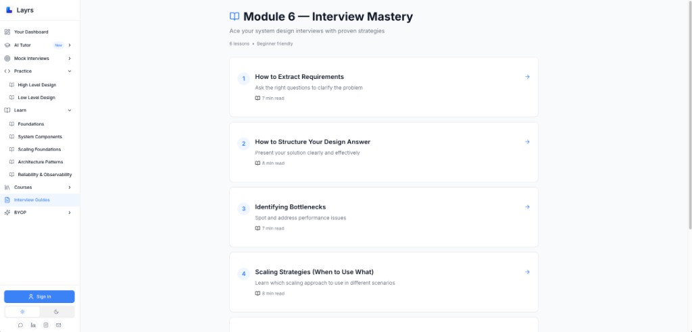

# System Design Interview Mastery: The Complete Framework for FAANG Success

### From ambiguous prompts to scalable architectures: Mastering requirements extraction, structured answers, and trade-off analysis

System design interviews are the **make-or-break moment** for senior engineering roles at FAANG and top-tier startups. Unlike algorithmic interviews where correctness is binary, system design interviews evaluate your ability to:

- Transform vague prompts into crisp requirements
- Design scalable architectures that handle millions of users
- Reason about trade-offs (consistency vs. availability, SQL vs. NoSQL)
- Handle failures gracefully
- Communicate technical decisions clearly under pressure

**The brutal reality**: Most engineers fail system design interviews not because they lack technical knowledge, but because they lack **structure**. They jump straight to microservices without understanding scale. They design elaborate caching layers before defining data models. They optimize for edge cases that don't matter while ignoring bottlenecks that will kill the system at scale.

This article presents the complete framework for mastering system design interviews, based on proven patterns from [Layrs](https://layrs.me/learn/system-design/module-6) (a platform specifically built for interview preparation), battle-tested at Google, Amazon, Meta, and Microsoft. We'll cover:


*Module 6: Interview Mastery from Layrs - The 4 critical skills for acing system design interviews*

1. **Extracting Requirements**: Converting ambiguous prompts into testable specifications
2. **Structuring Your Answer**: The 14-step framework for 45-minute interviews
3. **Identifying Bottlenecks**: Spotting performance and scalability issues
4. **Scaling Strategies**: When to use caching, sharding, replication, and more
5. **Trade-Off Analysis**: Defending architectural decisions with data

**Why this matters**: System design interviews determine whether you get senior roles ($200K-$500K+ compensation). A structured approach is the difference between "didn't meet the bar" and "strong hire."

## The Meta-Skill: Producing Artifacts in the Right Order

Before diving into techniques, understand the **fundamental meta-skill** that separates strong candidates from those who struggle: **producing the right artifacts at the right time**.

#### What Interviewers Actually Evaluate

System design interviews assess four dimensions ([source](https://www.designgurus.io/system-design-interview)):

**1. Problem Solving (30%)**:
- Can you extract requirements from vague prompts?
- Do you ask clarifying questions that narrow scope effectively?
- Can you identify what matters vs. what doesn't?

**2. Technical Design (30%)**:
- Do you choose appropriate components (databases, caches, queues)?
- Is your architecture scalable to specified metrics?
- Are failure modes considered?

**3. Trade-Off Analysis (20%)**:
- Can you articulate why you chose SQL over NoSQL?
- Do you understand consistency vs. availability trade-offs?
- Can you defend decisions when challenged?

**4. Communication (20%)**:
- Do you explain clearly without jargon?
- Do you adapt when interviewer redirects?
- Do you structure answers logically?

#### The Artifact Timeline

**Critical insight from [Layrs System Design Handbook](https://www.systemdesignhandbook.com/blog/system-design-blueprint/)**: Produce these artifacts in this order:

| Time | Artifact | Why This Order |
|------|----------|---------------|
| **0-5 min** | Requirements + Constraints | Can't design without knowing what you're building |
| **5-10 min** | Capacity estimation | Determines if you need caching, sharding, etc. |
| **10-15 min** | API contracts | Forces you to think about interfaces before implementation |
| **15-25 min** | Data model | Schema must support your APIs |
| **25-35 min** | High-level architecture | Now you can choose components intelligently |
| **35-45 min** | Deep-dives + bottlenecks | Optimize specific components |
| **45-50 min** | Failure modes + trade-offs | Show you think about production reality |

**Why this sequence matters**:

```
❌ BAD ORDER (common mistake):
"Let's use microservices with Kafka and Redis..."
Interviewer: "What are you building? What's the scale?"
You: "Uh... a Twitter-like system? Maybe 10M users?"
→ You're guessing, not designing

✅ GOOD ORDER:
"Let me clarify requirements. Is this read-heavy or write-heavy?
What's our DAU target? What latency do users expect?"
[Establishes constraints]

"Based on 100M DAU with 10:1 read:write ratio, I estimate..."
[Capacity math]

"Here are the APIs we need: POST /tweet, GET /timeline..."
[Interface definition]

"Given these APIs, our data model needs..."
[Schema follows from APIs]

"Now for the architecture: A load balancer distributing to..."
[Components chosen based on actual requirements]
```

**Inverting this order = architectural speculation**, not engineering.

## Part 1: Extracting Requirements (The First 10 Minutes)

The most critical—and most neglected—phase of system design interviews.

#### The Problem with Vague Prompts

**Typical interviewer opening**:
> "Design Twitter."

**What they're NOT asking**:
- Build all of Twitter (tweets, DMs, trends, ads, etc.)
- Support 500M users globally
- Replicate every feature

**What they ARE asking**:
> "Given 45 minutes, demonstrate your ability to systematically scope and design a scaled-down version with clearly defined boundaries."

**If you immediately start drawing databases and load balancers, you've failed the first test.**

#### The Requirements Extraction Framework

**Based on [Layrs functional requirements methodology](https://www.systemdesignhandbook.com/blog/functional-requirements-system-design/)**, extract requirements using this structure:

**Step 1: Identify Actors**

```
Who uses the system?

Examples:
- Anonymous users (can view public content)
- Registered users (can post, follow, like)
- Content creators (upload videos, images)
- Administrators (moderate content, ban users)
- API clients (third-party integrations)
```

**Step 2: Define Core Actions**

```
What can each actor do?

User actions:
- Create: Post tweet (text, image, video)
- Read: View timeline (home, user, search)
- Update: Edit tweet (if supported), update profile
- Delete: Remove tweet, deactivate account
- Interact: Like, retweet, reply, follow
```

**Step 3: Establish Workflows**

```
What are the critical user flows?

Primary workflow (posting):
1. User composes tweet (text + optional media)
2. System validates (length limits, content policy)
3. Tweet persisted to database
4. Fanout: Deliver to followers' timelines
5. Update analytics (impressions, engagement)

Secondary workflow (viewing timeline):
1. User requests home timeline
2. System fetches recent tweets from followed users
3. Rank by relevance/time
4. Return paginated results
```

**Step 4: Extract Non-Functional Requirements**

```
Scale and performance targets:

DAU (Daily Active Users): 100M
Tweets/day: 500M (avg 5 tweets/user)
Reads/Writes ratio: 10:1 (read-heavy)
Timeline latency: < 200ms (P99)
Tweet posting latency: < 1s (P95)
Availability: 99.9% (3 nines)
Data durability: No tweet loss
```

#### The Question Framework

**Ask these questions to narrow scope**:

**About users**:
- "How many daily active users are we targeting?"
- "What's the read/write ratio?"
- "Are there power users who behave differently?"

**About features**:
- "Should we support images/videos or just text?"
- "Do we need real-time updates or eventual consistency?"
- "Are we building the posting system, the timeline, or both?"

**About scale**:
- "What's acceptable latency for reads? For writes?"
- "What availability SLA should we target?"
- "Is this a global system or single-region?"

**About constraints**:
- "Can we assume users follow a reasonable number of accounts (< 10K)?"
- "Do we need to handle celebrity users with 100M followers?"
- "Are there content size limits?"

#### Requirements Document Template

**Produce this document on the whiteboard/canvas**:

```markdown
SYSTEM: Twitter-like microblogging platform

FUNCTIONAL REQUIREMENTS:
✓ Users can post tweets (280 chars max, optional image)
✓ Users can view home timeline (tweets from followed accounts)
✓ Users can follow/unfollow other users
✓ Users can like tweets
✗ No DMs (out of scope)
✗ No trending topics (out of scope)
✗ No retweets (simplification)

NON-FUNCTIONAL REQUIREMENTS:
- Scale: 100M DAU, 500M tweets/day
- Performance: 
  * Timeline: < 200ms (P99)
  * Post tweet: < 1s (P95)
- Availability: 99.9% uptime
- Consistency: Eventually consistent timelines OK
- Durability: Zero tweet loss

CONSTRAINTS:
- Max followers per user: 10K (simplification)
- Max timeline fetch: 100 tweets
- Image size limit: 5MB
```

**Time allocation**: 5-10 minutes

**What this achieves**:
- ✅ Shared understanding with interviewer
- ✅ Clear scope boundary
- ✅ Metrics to validate design against
- ✅ Foundation for all subsequent decisions

## Part 2: Structuring Your Answer (The 14-Step Framework)

Once requirements are clear, follow this proven structure ([source](https://www.designgurus.io/answers/detail/how-to-structure-system-design-interview-response)):

### Phase 1: Foundation (Minutes 5-15)

**Step 1: Capacity Estimation**

```
Calculate scale to determine architectural needs:

# DAU and request rate
DAU = 100M users
Avg tweets per user per day = 5
Total tweets/day = 100M × 5 = 500M tweets/day

Tweets/sec = 500M / 86,400s = 5,787 tweets/s
Peak (3× average) = 17,361 tweets/s

# Read traffic
Read/write ratio = 10:1
Timeline requests/sec = 5,787 × 10 = 57,870 req/s
Peak reads = 173,610 req/s

# Storage estimation
Avg tweet size = 280 chars × 2 bytes (UTF-16) = 560 bytes
Metadata (user_id, timestamp, likes) = 100 bytes
Images (30% of tweets): 500 KB average
Total per tweet = 560 + 100 + (0.3 × 500,000) = 150,660 bytes ≈ 150 KB

Daily storage = 500M tweets × 150 KB = 75 TB/day
5-year storage = 75 TB × 365 × 5 = 136 PB

# Bandwidth
Upload: 5,787 tweets/s × 150 KB = 868 MB/s
Download: 57,870 timeline req/s × 100 KB/req = 5.5 GB/s
```

**Key insight**: These numbers drive all subsequent decisions:
- 173K req/s → Need caching + CDN
- 136 PB storage → Need sharding + object storage
- Read-heavy (10:1) → Cache timelines, not raw tweets

**Step 2: Define APIs**

```
Core APIs (RESTful):

POST /v1/tweets
Request:
{
  "text": "Hello world!",
  "media_ids": ["img_123"],
  "user_id": "user_456"
}
Response:
{
  "tweet_id": "tweet_789",
  "created_at": "2024-01-15T10:30:00Z",
  "status": "published"
}

GET /v1/timelines/home?user_id=123&limit=50&cursor=abc
Response:
{
  "tweets": [
    {
      "tweet_id": "tweet_789",
      "user": {...},
      "text": "Hello world!",
      "created_at": "...",
      "likes": 42
    }
  ],
  "next_cursor": "xyz"
}

POST /v1/follows
Request:
{
  "follower_id": "user_123",
  "followee_id": "user_456"
}
```

**Why define APIs early**: Forces you to think about inputs/outputs before implementation

### Phase 2: Data Model (Minutes 15-25)

**Step 3: Design Schema**

```sql
-- Users table
CREATE TABLE users (
    user_id BIGINT PRIMARY KEY,
    username VARCHAR(32) UNIQUE NOT NULL,
    email VARCHAR(255) UNIQUE NOT NULL,
    created_at TIMESTAMP,
    INDEX idx_username (username)
);

-- Tweets table (sharded by user_id for distribution)
CREATE TABLE tweets (
    tweet_id BIGINT PRIMARY KEY,
    user_id BIGINT NOT NULL,
    text VARCHAR(280),
    media_urls TEXT[],
    created_at TIMESTAMP,
    likes_count INT DEFAULT 0,
    INDEX idx_user_created (user_id, created_at DESC)
) PARTITION BY HASH(user_id);

-- Follows (social graph)
CREATE TABLE follows (
    follower_id BIGINT,
    followee_id BIGINT,
    created_at TIMESTAMP,
    PRIMARY KEY (follower_id, followee_id),
    INDEX idx_follower (follower_id),
    INDEX idx_followee (followee_id)
);

-- Timelines (materialized for performance)
CREATE TABLE timelines (
    user_id BIGINT,
    tweet_id BIGINT,
    created_at TIMESTAMP,
    PRIMARY KEY (user_id, created_at DESC, tweet_id)
) PARTITION BY HASH(user_id);
```

**Step 4: Choose Database**

```
Decision: SQL vs. NoSQL

For Tweets:
✓ Structured data (fixed schema)
✓ Need ACID for writes (can't lose tweets)
✓ Simple queries (by user_id, by tweet_id)
→ Choice: PostgreSQL with sharding

For Timelines:
✓ Denormalized (duplicated tweet data)
✓ Read-heavy (10:1 ratio)
✓ Eventually consistent OK
→ Choice: Redis (cache) + Cassandra (durable storage)

For Social Graph:
✓ Relationship-heavy (follows, followers)
✓ Traversal queries common
→ Alternative: Neo4j (graph DB)
→ Pragmatic: PostgreSQL with good indexes
```

**Trade-off discussion**: "I'm choosing PostgreSQL for tweets because we need ACID guarantees—if a user posts a tweet, it must be durable immediately. For timelines, I'm using Redis as a cache backed by Cassandra because eventual consistency is acceptable for read performance, and we can tolerate brief timeline lag after posting."

### Phase 3: High-Level Architecture (Minutes 25-35)

**Step 5: Draw System Diagram**

```
┌─────────────────────────────────────────────────────────────────┐
│                         Clients                                 │
│              (Mobile, Web, Desktop)                             │
└────────────────────┬────────────────────────────────────────────┘
                     │ HTTPS
                     ▼
┌─────────────────────────────────────────────────────────────────┐
│                    CDN (CloudFlare)                             │
│              (Static assets, images, videos)                    │
└─────────────────────────────────────────────────────────────────┘
                     │
                     ▼
┌─────────────────────────────────────────────────────────────────┐
│              Load Balancer (Layer 7)                            │
│         (SSL termination, rate limiting)                        │
└────────────┬────────────────────────────┬────────────────────────┘
             │                            │
             ▼                            ▼
┌─────────────────────┐      ┌─────────────────────┐
│  API Gateway        │      │  API Gateway        │
│  (Auth, routing)    │      │  (Auth, routing)    │
└──────┬──────────────┘      └──────┬──────────────┘
       │                             │
       ├─────────────┬───────────────┤
       │             │               │
       ▼             ▼               ▼
┌──────────┐  ┌──────────┐  ┌──────────┐
│  Tweet   │  │ Timeline │  │  User    │
│  Service │  │ Service  │  │  Service │
└────┬─────┘  └────┬─────┘  └────┬─────┘
     │             │              │
     ├─────────────┼──────────────┤
     │             │              │
     ▼             ▼              ▼
┌─────────────────────────────────────┐
│      Redis (Timeline Cache)         │
└─────────────────────────────────────┘
     │
     ▼
┌──────────────────┐  ┌──────────────────┐
│  PostgreSQL      │  │  Cassandra       │
│  (Tweets, Users) │  │  (Timelines)     │
│  (Sharded)       │  │  (Distributed)   │
└──────────────────┘  └──────────────────┘
     │
     ▼
┌─────────────────────────────────────┐
│     Message Queue (Kafka)           │
│   (Async fanout, analytics)         │
└─────────────────────────────────────┘
     │
     ▼
┌──────────────────┐  ┌──────────────────┐
│  Fanout Worker   │  │  Analytics       │
│  (Build timelines)│  │  (Metrics)       │
└──────────────────┘  └──────────────────┘
```

**Narrate the data flow**:

**Write path (POST /tweets)**:
1. Client → Load balancer → API gateway (auth check)
2. Tweet Service validates and persists to PostgreSQL
3. Returns success to user (fast! ~50ms)
4. Async: Publish event to Kafka
5. Fanout workers pull event, write to followers' Redis timelines
6. Eventually: Persist to Cassandra for durability

**Read path (GET /timeline/home)**:
1. Client → Load balancer → API gateway
2. Timeline Service checks Redis cache (key: user_id)
3. Cache hit: Return cached timeline (fast! ~10ms)
4. Cache miss: Fetch from Cassandra, populate cache, return
5. Timeline TTL: 5 minutes (balance freshness vs. cache hit rate)

### Phase 4: Deep Dives (Minutes 35-50)

**Step 6: Component Details**

**Sharding strategy** (PostgreSQL tweets):
```python
# Shard by user_id (keeps user's tweets co-located)
shard_id = hash(user_id) % num_shards

# Benefits:
# - All user's tweets on one shard (query efficiency)
# - Even distribution (hash ensures randomness)

# Trade-off:
# - Celebrity users create hot shards
# - Mitigation: Consistent hashing with virtual nodes
```

**Caching strategy** (Redis timelines):
```python
# Cache key structure
timeline_key = f"timeline:{user_id}"

# Cache value: List of tweet IDs + metadata
cache_value = [
    {"tweet_id": 123, "user_id": 456, "created_at": "...", "text": "..."},
    # ... top 100 tweets
]

# TTL: 5 minutes (balance freshness vs. load)

# Cache invalidation:
# On new tweet from followed user:
# - Option 1 (eager): Update all follower caches (expensive for celebrities)
# - Option 2 (lazy): Let caches expire naturally (5 min staleness OK)
# → Choose Option 2 for simplicity
```

**Fanout strategy**:
```python
# Push vs. Pull fanout

# Push (eager fanout):
# When user posts tweet:
#   for each follower:
#       add tweet to follower's timeline cache

# Pros: Fast reads (pre-computed timelines)
# Cons: Expensive writes (celebrities have 100M followers!)

# Pull (lazy fanout):
# When user requests timeline:
#   fetch tweets from all followed users
#   merge and rank

# Pros: Fast writes
# Cons: Slow reads (must aggregate on-the-fly)

# Hybrid (best for Twitter-like systems):
# - Push fanout for normal users (< 10K followers)
# - Pull fanout for celebrities (> 10K followers)
# - Cache aggressively for all

def fanout_strategy(user):
    if user.follower_count < 10_000:
        return "push"  # Write to all follower timelines
    else:
        return "pull"  # Followers fetch dynamically
```

## Part 3: Identifying Bottlenecks

**A bottleneck is any component that limits system throughput or increases latency disproportionately.**

#### Systematic Bottleneck Analysis

**Step 1: Trace critical path**

```
Critical path for timeline request:

Client request
  ↓ 5ms (network)
Load balancer
  ↓ 2ms (routing)
API Gateway
  ↓ 1ms (auth check)
Timeline Service
  ↓ 10ms (Redis cache hit)
Return response
  ↓ 5ms (network)
Client receives data

Total: 23ms (well under 200ms target) ✅

But what if cache miss?

Timeline Service
  ↓ 10ms (Redis cache miss)
Cassandra query
  ↓ 150ms (disk I/O)
Populate cache
  ↓ 5ms
Return response

Total: 173ms (still under 200ms, but barely) ⚠️
```

**Step 2: Calculate component capacity**

```python
# PostgreSQL capacity
single_postgres_capacity = 10_000  # writes/sec (conservative)
target_writes = 17,361  # Peak tweets/sec
shards_needed = 17,361 / 10_000 = 2  # Need 2+ shards

# Redis capacity
single_redis_capacity = 100_000  # reads/sec
target_reads = 173,610  # Peak timeline requests/sec
redis_instances = 173,610 / 100_000 = 2  # Need 2+ Redis clusters

# API service capacity
single_service_capacity = 5,000  # requests/sec
target_requests = 173,610 + 17,361 = 191,000  # Total req/sec
service_instances = 191,000 / 5,000 = 39  # Need 40+ service instances

# Network bandwidth
data_egress = 173,610 req/s × 100 KB/response = 16.5 GB/s
# Need: Multi-region CDN + edge caching
```

**Step 3: Identify bottlenecks**

```
BOTTLENECK 1: PostgreSQL writes (17K/sec)
- Single instance: 10K writes/sec → saturated!
- Impact: Tweet posting latency increases
- Solution: Shard to 4× instances (40K writes/sec capacity)

BOTTLENECK 2: Fanout for celebrity tweets
- Celebrity with 100M followers
- Push fanout: 100M timeline writes
- Time: 100M / 100K writes/sec = 1,000 seconds (16 minutes!)
- Impact: Followers see tweet only after 16 minutes
- Solution: Hybrid fanout (pull for celebrities)

BOTTLENECK 3: Timeline cache misses
- Cache miss penalty: 150ms (vs 10ms hit)
- At 30% miss rate: Avg latency = 0.7×10ms + 0.3×150ms = 52ms
- Under load: Cassandra saturates → latency spikes to 500ms+
- Solution: Increase cache TTL, add read replicas

BOTTLENECK 4: Single-region latency
- Global users accessing single US datacenter
- Asia users: 250ms network latency alone
- Impact: Can't meet 200ms P99 target
- Solution: Multi-region deployment with geo-routing
```

#### The Bottleneck Template

**For each component, ask**:

1. **What's the theoretical capacity?** (requests/sec, storage, bandwidth)
2. **What's our target load?** (from capacity estimation)
3. **What's the headroom?** (capacity / target) — need 2-3× for safety
4. **What happens under failure?** (one node down, network partition)
5. **What's the degradation path?** (graceful vs. catastrophic)

**Document bottlenecks explicitly**:

```markdown
IDENTIFIED BOTTLENECKS:

1. PostgreSQL Write Throughput
   - Capacity: 10K writes/sec (single instance)
   - Target: 17K writes/sec (peak)
   - Status: ⚠️ Insufficient
   - Mitigation: Shard to 4 instances

2. Celebrity Fanout Latency
   - Scenario: 100M followers
   - Time: 16 minutes (push fanout)
   - Status: ❌ Unacceptable
   - Mitigation: Hybrid fanout (pull for celebrities)

3. Global User Latency
   - Asia users: 250ms network latency
   - Target: < 200ms (P99)
   - Status: ❌ Cannot meet SLA
   - Mitigation: Multi-region deployment
```

## Part 4: Scaling Strategies (When to Use What)

**The most common interview question**: "How would you scale this system to 10× the users?"

#### The Scaling Toolkit

**1. Vertical Scaling (Scale Up)**

```
Add more resources to existing machines:
- CPU: 8 cores → 32 cores
- Memory: 64 GB → 256 GB
- Disk: 1 TB → 10 TB

Pros:
✓ Simple (no code changes)
✓ No distributed systems complexity

Cons:
✗ Expensive (exponential cost curve)
✗ Hard limits (can't buy 1,000 core machine)
✗ Single point of failure

When to use:
→ Early stage (simplicity > cost)
→ Bottleneck is single resource (CPU, memory)
→ Cost < $50K/year
```

**2. Horizontal Scaling (Scale Out)**

```
Add more machines:
- 1 server → 10 servers
- 1 database → 5 sharded databases

Pros:
✓ Linear cost scaling
✓ No hard limits (add machines as needed)
✓ Redundancy (failure of one doesn't kill system)

Cons:
✗ Complexity (distributed systems)
✗ Coordination overhead (consensus, replication)
✗ Code changes often needed

When to use:
→ Beyond 10K requests/sec
→ Need high availability (no single point of failure)
→ Long-term scaling needed
```

**3. Caching**

```
Store frequently accessed data in fast memory:

Redis cache:
- Read latency: 1-5ms (vs 50-200ms database)
- Capacity: 100K reads/sec per instance
- Cost: $100/month (vs $500/month for equivalent DB capacity)

Layers:
1. Browser cache (static assets): 0ms, free
2. CDN (Cloudflare): 10-50ms, cheap
3. Application cache (Redis): 1-5ms, moderate
4. Database query cache: 10-30ms, built-in

When to use:
→ Read-heavy workloads (>5:1 read/write)
→ Data with locality (hot content accessed frequently)
→ Acceptable staleness (eventual consistency OK)

When NOT to use:
→ Write-heavy (cache invalidation overhead)
→ Strong consistency required (financial transactions)
→ No access patterns (random access doesn't benefit from cache)
```

**4. Database Sharding**

```
Partition data across multiple databases:

# Horizontal sharding (by key)
shard_id = hash(user_id) % num_shards

# Range sharding (by value)
if user_id < 1M: shard_0
elif user_id < 2M: shard_1
else: shard_2

# Geographic sharding
if user.region == "US": us_shard
elif user.region == "EU": eu_shard

Pros:
✓ Linear write scaling
✓ Isolated failures (one shard down doesn't kill all)

Cons:
✗ Cross-shard queries expensive
✗ Rebalancing difficult (adding shards)
✗ Hotspots possible (celebrity users)

When to use:
→ Single database saturated (>10K writes/sec)
→ Data > 1TB
→ Clear partition key (user_id, tenant_id)
```

**5. Read Replicas**

```
Replicate database to multiple read-only copies:

Primary (writes) → Replica 1 (reads)
                 → Replica 2 (reads)
                 → Replica 3 (reads)

Pros:
✓ Scale reads linearly (add replicas)
✓ Geographic distribution (replicas near users)
✓ Failover target (promote replica to primary)

Cons:
✗ Replication lag (eventual consistency)
✗ Doesn't help write throughput
✗ Storage cost (3× data duplication)

When to use:
→ Read-heavy (>10:1 ratio)
→ Eventual consistency acceptable
→ Write throughput not bottleneck
```

**6. Asynchronous Processing**

```
Decouple slow operations from request path:

Synchronous (bad):
Client → API → [heavy operation] → Response
Total: 5s (user waits)

Asynchronous (good):
Client → API → Queue → Response (200ms)
                ↓
              Worker → [heavy operation] → Notify

Architecture:
┌──────────┐
│  Client  │
└────┬─────┘
     │ POST /tweet
     ▼
┌──────────┐
│   API    │
└────┬─────┘
     │ 1. Save tweet (fast)
     │ 2. Publish to queue
     │ 3. Return 201 Created
     ▼
┌──────────┐
│  Kafka   │
└────┬─────┘
     │ (async)
     ▼
┌──────────┐
│  Fanout  │
│  Worker  │ (builds follower timelines)
└──────────┘

When to use:
→ Operation takes >500ms
→ User doesn't need immediate result
→ Can tolerate eventual consistency
```

#### Decision Framework: When to Apply Each Strategy

**Use this flowchart**:

```
Is load > single machine capacity?
  └─ NO → Vertical scaling (simplest)
  └─ YES ↓

Is workload read-heavy (>5:1)?
  └─ YES → Add caching (Redis) + Read replicas
  └─ NO ↓

Is write throughput the bottleneck?
  └─ YES → Shard database horizontally
  └─ NO ↓

Are operations slow (>500ms)?
  └─ YES → Move to async processing (Kafka)
  └─ NO ↓

Is single-region latency unacceptable?
  └─ YES → Multi-region deployment
  └─ NO ↓

System probably over-provisioned ✓
```

## Part 5: Trade-Off Analysis — Defending Your Decisions

**Strong candidates don't just design systems—they defend decisions with data.**

#### Framework for Trade-Off Discussion

**For every major decision**, prepare to articulate:

1. **What are the options?** (2-3 alternatives)
2. **What are the trade-offs?** (pros/cons of each)
3. **What did you choose and why?** (with quantitative reasoning)
4. **What's the fallback?** (if your choice proves wrong)

#### Example Trade-Offs

**Trade-Off 1: SQL vs. NoSQL for Tweets**

```
OPTION A: PostgreSQL (SQL)
Pros:
✓ ACID guarantees (no data loss)
✓ Complex queries (JOINs, aggregations)
✓ Schema enforcement
✓ Well-understood operationally

Cons:
✗ Vertical scaling limits (~10K writes/sec per instance)
✗ Sharding requires application logic

OPTION B: Cassandra (NoSQL)
Pros:
✓ Horizontal scaling (linear write throughput)
✓ Multi-datacenter replication built-in
✓ High availability

Cons:
✗ Eventually consistent (potential data loss during failures)
✗ No JOINs (denormalization required)
✗ Learning curve for operations

DECISION: PostgreSQL with sharding

REASONING:
"I'm choosing PostgreSQL because tweet durability is critical—if a user posts, 
it must be guaranteed saved. While Cassandra scales writes better, our peak 
load (17K writes/sec) is achievable with 4 PostgreSQL shards, and we get 
immediate consistency. For timelines where eventual consistency is acceptable, 
we'll use Cassandra. This hybrid approach optimizes each component for its 
consistency requirements."
```

**Trade-Off 2: Push vs. Pull Fanout**

```
OPTION A: Push Fanout
- On tweet: Write to all followers' timelines immediately
- Reads: Fast (pre-computed)
- Writes: Slow for celebrities (100M followers = 100M writes)

OPTION B: Pull Fanout  
- On tweet: Just save tweet
- On timeline request: Fetch and merge tweets from followed users
- Reads: Slow (must aggregate)
- Writes: Fast (constant time)

OPTION C: Hybrid
- Push for users with < 10K followers
- Pull for celebrities
- Cache aggressively

DECISION: Hybrid fanout

REASONING:
"Push fanout provides excellent read performance for 99% of users, but breaks 
down for celebrities. A celebrity tweet would require 100M timeline writes, 
taking 16+ minutes. The hybrid approach gives us fast reads for most users 
(push fanout) while handling celebrity edge case gracefully (pull fanout with 
heavy caching). We'd mark users as 'celebrity' automatically when follower 
count crosses 10K threshold."
```

**Trade-Off 3: Consistency vs. Availability**

```
Scenario: Network partition between datacenters

OPTION A: Choose Consistency (CP in CAP theorem)
- Reject writes during partition
- Guarantees all replicas have identical data
- Example: Banking system (can't allow inconsistent balances)

OPTION B: Choose Availability (AP in CAP theorem)
- Accept writes on both sides of partition
- Risk of divergence (conflict resolution needed)
- Example: Twitter timeline (staleness acceptable)

DECISION: Availability (AP)

REASONING:
"For a social media system, availability is more important than perfect 
consistency. If a user posts a tweet and some followers see it 5 seconds 
later while others see it 30 seconds later, that's acceptable. But if we 
reject all writes during a network partition, the system appears broken 
to users. We'll use eventual consistency with conflict resolution: 
last-write-wins based on timestamps. The user experience of 'eventually 
seeing' a tweet is far better than 'cannot post at all.'"
```

#### How to Present Trade-Offs

**Template**:

```
"For [DECISION], I considered [OPTION A] and [OPTION B].

[OPTION A] provides [BENEFIT] but has [DRAWBACK].
[OPTION B] provides [BENEFIT] but has [DRAWBACK].

Given our requirements of [REQUIREMENT] and our constraint of [CONSTRAINT],
I'm choosing [OPTION A/B] because [QUANTITATIVE REASONING].

If we find that [FAILURE MODE], we can pivot to [ALTERNATIVE] with 
[MIGRATION STRATEGY]."
```

**Example**:

> "For our timeline cache, I considered Redis (in-memory) and Memcached. Redis provides persistence and richer data structures (sorted sets for ranked timelines) but uses more memory. Memcached is simpler and uses less memory but doesn't persist. Given our requirement for fast timeline reads (<200ms P99) and our scale (100M users), I'm choosing Redis because the sorted set data structure maps perfectly to ranked timelines, and persistence helps with cache warmup after restarts. Each Redis instance can hold ~10M user timelines at 10KB each = 100GB per instance. We'd need 10 Redis instances sharded by user_id. If we find memory costs too high, we can migrate to Memcached by denormalizing timeline ranking into application logic."

## The Complete Interview Answer Structure

**Putting it all together**: 45-minute timeline

### Minutes 0-5: Requirements Clarification

**You**: "Let me start by clarifying requirements. For this Twitter-like system:
- Should we support text-only tweets or also images/videos?
- What's our target scale in daily active users?
- What's acceptable latency for posting and viewing?
- Do we need real-time updates or is eventual consistency fine?"

**Interviewer**: "Focus on text and images. Target 100M DAU. Posting should feel instant (<1s), timeline <200ms. Eventual consistency is fine for timelines."

**You**: [Write on board]
```
Requirements:
✓ Post tweets (text + optional image)
✓ View home timeline (tweets from followed users)
✓ Follow/unfollow users
✗ No DMs, no trending (out of scope)

Scale: 100M DAU, 500M tweets/day, 10:1 read/write
Latency: <1s post, <200ms timeline
Consistency: Eventually consistent OK
```

### Minutes 5-10: Capacity Estimation

**You**: "Let me estimate capacity to understand our scale."

[Calculate on board - shown in earlier section]

**Key takeaway**: "So we're looking at ~17K writes/sec peak and ~173K reads/sec. This is read-heavy, so caching will be critical."

### Minutes 10-15: API Design

**You**: "Here are the core APIs we need..."

[Define POST /tweets, GET /timeline/home, POST /follows]

**You**: "These APIs capture our functional requirements and will drive the data model."

### Minutes 15-25: Data Model & Database Choice

**You**: "Based on these APIs, here's the data model..."

[Draw schema for users, tweets, follows, timelines tables]

**You**: "I'm choosing PostgreSQL for tweets and users because we need ACID guarantees, and Cassandra for materialized timelines because we need high read throughput and eventual consistency is acceptable."

**Interviewer**: "Why not use NoSQL for everything?"

**You**: "Great question. For tweets specifically, we can't risk data loss—if a user posts a tweet and we return success, it must be durable. PostgreSQL gives us immediate consistency and durability. For timelines, Cassandra makes sense because: (1) We're serving 173K reads/sec which requires horizontal scaling, (2) Timeline staleness of 5-30 seconds is acceptable, and (3) Cassandra's built-in sharding and replication fit this perfectly. We're optimizing each component for its specific consistency and performance needs rather than one-size-fits-all."

### Minutes 25-35: High-Level Architecture

**You**: "Now let me draw the high-level architecture..."

[Draw diagram shown earlier: Clients → Load Balancer → API Gateway → Services → Databases → Message Queue]

**You**: "Here's the flow for posting a tweet: User posts → API Gateway authenticates → Tweet Service saves to PostgreSQL → Returns success immediately. Asynchronously, we publish to Kafka, and fanout workers build follower timelines. This separates the critical path (saving tweet) from the expensive operation (fanout)."

### Minutes 35-45: Deep Dives & Bottlenecks

**Interviewer**: "How do you handle a celebrity with 100 million followers?"

**You**: "Excellent question—this is a critical bottleneck. With push fanout, writing to 100M follower timelines would take 16+ minutes. I'd use a **hybrid fanout strategy**: For normal users (<10K followers), push fanout writes directly to follower timeline caches. For celebrities (>10K followers), pull fanout where we cache the celebrity's recent tweets and merge them dynamically when their followers request timelines. This gives us fast writes for celebrities while maintaining fast reads through aggressive caching."

**Interviewer**: "What if your cache fails?"

**You**: "We have two layers: Redis as L1 cache (hot timelines, 10-minute TTL) and Cassandra as durable storage. If Redis fails entirely, requests fall through to Cassandra. Timeline Service would see increased latency (50-150ms instead of 5ms), but the system stays operational. We'd alert immediately and promote a Redis replica to primary. We'd also implement circuit breakers so if Cassandra is saturated, we return cached stale timelines rather than failing completely—graceful degradation."

### Minutes 45-50: Trade-Offs & Future Scaling

**You**: "To summarize the key trade-offs:
1. **PostgreSQL vs. Cassandra**: Chose PostgreSQL for tweets (consistency) and Cassandra for timelines (availability)
2. **Push vs. Pull fanout**: Hybrid approach balances write cost and read performance
3. **Consistency vs. Availability**: Chose availability (timeline staleness acceptable)

For future scaling to 1B users:
- Add more PostgreSQL shards (linear scaling)
- Multi-region deployment with geo-routing
- Consider graph database for social graph queries
- Implement ML-ranked timelines (relevance over recency)"

## Production Checklist: What Strong Candidates Cover

**Minimum viable answer** (meets bar):
- ✅ Clear requirements
- ✅ Capacity estimation
- ✅ APIs defined
- ✅ Data model with schema
- ✅ High-level architecture
- ✅ One deep-dive (caching or sharding or fanout)

**Strong answer** (exceeds bar):
- ✅ All of above
- ✅ Multiple deep-dives
- ✅ Bottleneck identification
- ✅ Trade-off discussion with reasoning
- ✅ Failure modes considered

**Outstanding answer** (strong hire):
- ✅ All of above
- ✅ Proactive: Spot issues before interviewer asks
- ✅ Quantitative: All decisions backed by math
- ✅ Operational: Monitoring, alerting, debugging mentioned
- ✅ Communication: Clear, concise, adapts to feedback

## Common Failure Patterns

**1. Jumping to Solution Too Early**

```
❌ BAD:
Interviewer: "Design Twitter"
You: "Let's use microservices with Kafka and..."

✅ GOOD:
You: "Before designing, let me clarify scope. Should we focus
on the posting system, the timeline, or both? What's our scale?"
```

**2. Over-Engineering for Unspecified Scale**

```
❌ BAD:
"We'll use Kubernetes with 100 microservices, sharded across
20 regions with..."
Interviewer: "We only have 10K users."

✅ GOOD:
"For 10K users, a monolith with PostgreSQL on a single server
would handle this fine—about 10 requests/sec. We don't need
distributed systems complexity yet. When we hit 100K users,
we'd consider..."
```

**3. No Quantitative Reasoning**

```
❌ BAD:
"We'll use caching because it's fast."

✅ GOOD:
"We'll use Redis for timeline caching. With 100M users and
10KB per timeline, we need 1TB of cache distributed across
10 Redis instances. Cache hit rate should be 80-90% based on
Zipf distribution of access patterns, reducing database load
from 173K req/s to ~20K req/s."
```

**4. Ignoring Failure Modes**

```
❌ BAD:
[Designs perfect architecture]
Interviewer: "What if your database fails?"
You: "Uh... we'd have downtime."

✅ GOOD:
[Proactively mentions]
"For durability, tweets are replicated across 3 PostgreSQL
instances using synchronous replication. If primary fails,
we automatically promote a replica. RPO is zero (no data loss),
RTO is ~30 seconds (failover time). For timelines, we accept
eventual consistency so Cassandra's quorum reads (2 of 3 nodes)
provide availability even during single node failure."
```

## Resources for Practice

**Platforms for mock interviews**:
- [Layrs](https://layrs.me/) - AI-powered system design mocks with visual canvas
- Pramp - Peer-to-peer mock interviews
- Interviewing.io - Anonymous interviews with engineers

**Learning resources**:
- "Designing Data-Intensive Applications" by Martin Kleppmann (book)
- [AWS Architecture Center](https://aws.amazon.com/architecture/) - Real-world patterns
- [Google Cloud Architecture](https://cloud.google.com/architecture) - Case studies
- ByteByteGo - System design newsletter and videos
- [System Design Primer](https://github.com/donnemartin/system-design-primer) - GitHub repo

**Practice problems** (by difficulty):

**Medium**:
- Design URL shortener (bit.ly)
- Design pastebin
- Design rate limiter
- Design notification system

**Hard**:
- Design Twitter/Facebook feed
- Design YouTube/Netflix
- Design Uber/Lyft
- Design Google Search
- Design distributed cache

**Expert**:
- Design global payment system (Stripe)
- Design ad serving platform
- Design distributed file system (S3)
- Design time-series database (Prometheus)

## Summary: The System Design Interview Formula

System design interviews are intimidating because they're open-ended. But success follows a repeatable formula:

**1. Structure conquers chaos**: Follow the artifact timeline religiously
**2. Requirements before architecture**: Never design without clear scope
**3. Numbers drive decisions**: Capacity math determines what components you need
**4. Trade-offs reveal thinking**: Defend choices with quantitative reasoning
**5. Communication is 50%**: Clear explanation > perfect architecture

**The 10-Minute Prep** before any interview:

```
✓ Review common patterns (cache-aside, CQRS, saga)
✓ Memorize capacity numbers (1M req/s, 1TB storage, 1GB/s bandwidth)
✓ Practice drawing architecture diagrams quickly
✓ Prepare 3 systems you know deeply (can reference as examples)
✓ Sleep well (cognitive performance matters!)
```

**Red flags interviewers watch for**:
- Jumping to implementation without requirements
- No capacity estimation (designing blind)
- One-size-fits-all solutions (microservices for everything)
- No consideration of failures
- Can't defend decisions when challenged
- Poor communication (mumbling, disorganized)

**Green flags that get "strong hire"**:
- Systematic approach (follows framework)
- Asks clarifying questions (narrows scope)
- Uses numbers to drive decisions (not guessing)
- Spots bottlenecks proactively
- Discusses trade-offs unprompted
- Clear communication and whiteboard use

**The truth**: System design interviews are **less about what you know** and **more about how you think**. Interviewers want to see:
- Can you work with ambiguity?
- Do you break down complex problems?
- Can you make principled trade-offs?
- Will you scale systems correctly?

**Master the structure, and you'll master the interview.**

---

*This article is part of the Tech Demystified series. For more articles on ML engineering, infrastructure, and technical career development, see the [Tech Demystified repository](https://github.com/harshitha-8/Tech-Demystified).*

## References and Further Reading

**Interview Preparation**:
- Layrs Platform: https://layrs.me/learn/system-design/module-6
- System Design Interview Guide (2026): https://www.systemdesignhandbook.com/guides/system-design-interview/
- DesignGurus System Design: https://www.designgurus.io/system-design-interview

**Foundational Books**:
- "Designing Data-Intensive Applications" by Martin Kleppmann
- "System Design Interview" by Alex Xu (Volumes 1 & 2)
- "Web Scalability for Startup Engineers" by Artur Ejsmont

**Online Resources**:
- System Design Primer: https://github.com/donnemartin/system-design-primer
- ByteByteGo: https://bytebytego.com/
- High Scalability Blog: http://highscalability.com/
